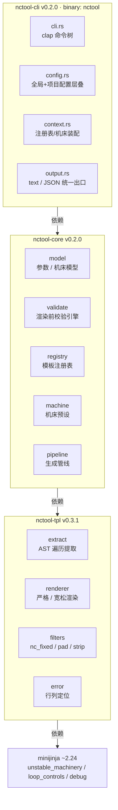
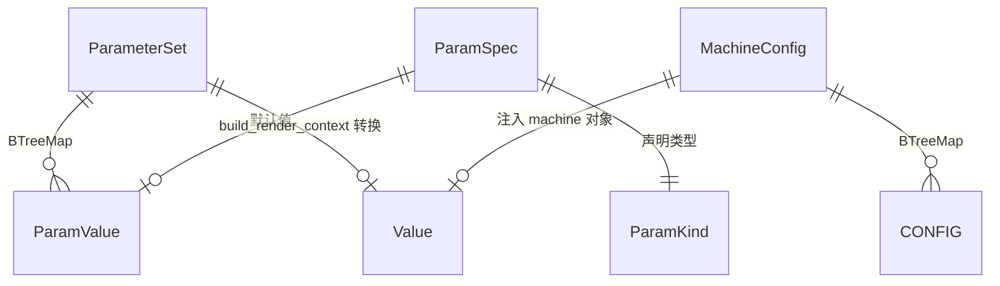
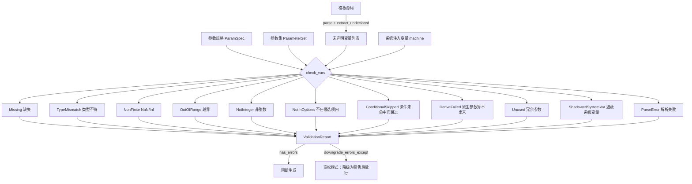
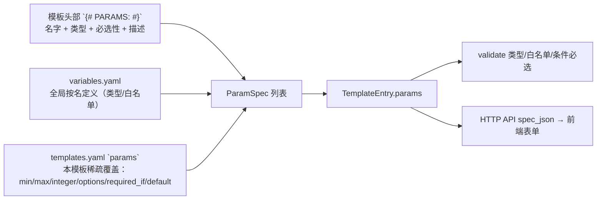
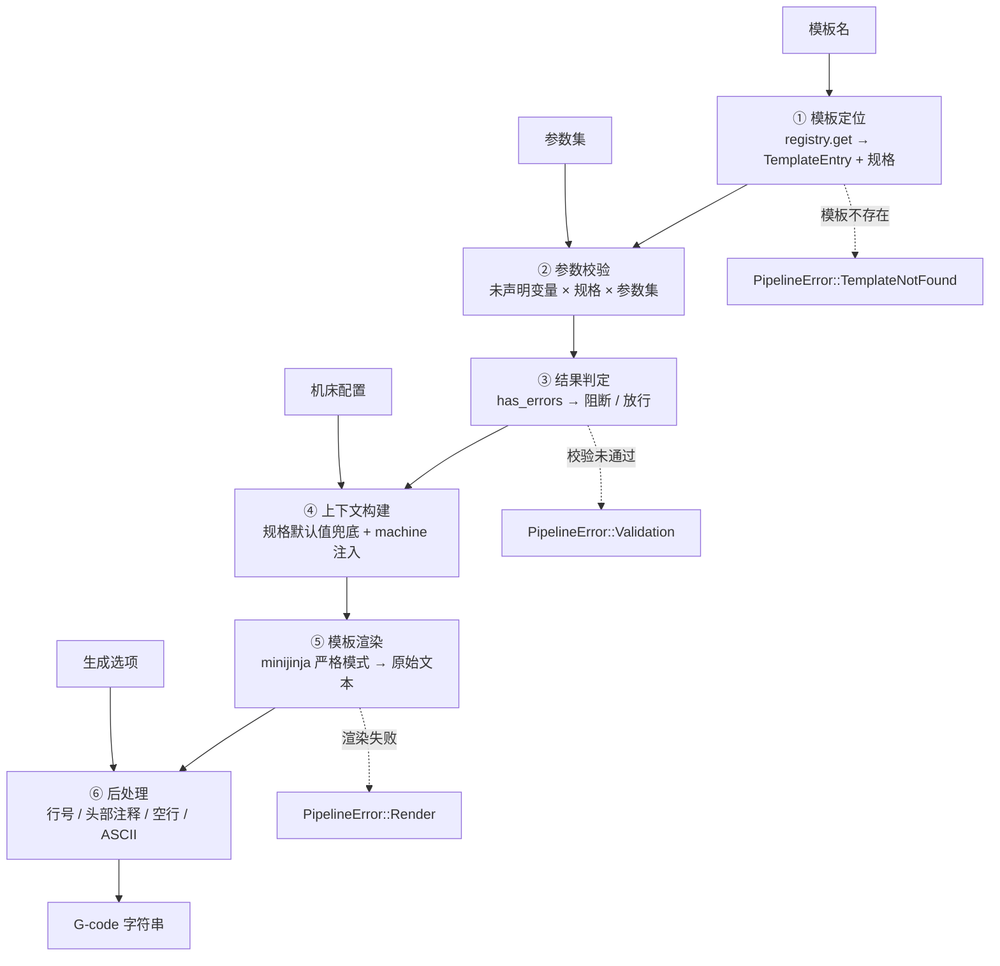

# nctool 系统架构与设计说明

> 版本：v1.0 · 2026-09-03
> 范围：`nctool-tpl` / `nctool-core` / `nctool-cli` 三个 crate 的架构总览、核心模块职责、数据流与设计决策。
> 读者：本仓库的贡献者，以及需要基于本库做二次开发的下游用户。

---

## 1. 系统定位

nctool 是一套**面向数控加工（CNC）的 G-code 模板工具链**：用 Jinja2 语法描述加工程序片段，
在渲染前自动推导出模板需要哪些参数、哪些必填，校验参数合法性，最后渲染并后处理成可直接上机的 G-code。

它解决的是一个具体工程问题：**G-code 是发给机床的指令，写错一个坐标就是撞刀**。
因此整个架构围绕一条主线设计 —— **渲染前可发现错误**。参数缺失、类型不符、越界、NaN/Inf
这些致命问题全部在渲染前拦截，而不是在生成出一段残缺的 G-code 之后才暴露。

### 1.1 当前状态

| 项 | 状态 |
| --- | --- |
| workspace | `nctool-tpl` v0.3.1（根包）、`nctool-core` v0.2.0、`nctool-cli` v0.2.0 |
| 测试 | 272 项全部通过（单元 206 / 集成 65 / 文档测试 1） |
| CLI | 已完成：templates / inspect / validate / render / generate / machine / config / completion |
| Web UI | 前端单文件 `ui/index.html` 已设计完毕（`nctool ui` 命令占位，规划于阶段 2） |
| 零件级批量生成 | `nctool part` 命令占位，规划于阶段 4 |

---

## 2. 架构总览

### 2.1 分层与依赖方向



依赖**严格单向向下**：`cli → core → tpl → minijinja`。不存在反向依赖，也不存在跨层依赖。
所有真实业务逻辑（校验、渲染、后处理）都在 `nctool-core`，CLI 与未来的 Web UI 只是**两个输入/展示面**，
不复制任何业务逻辑 —— 这是保证 `nctool render` 与 Web UI 输出逐字节一致的前提。

### 2.2 Crate 职责矩阵

| Crate | 定位 | 对外承诺 | 不负责 |
| --- | --- | --- | --- |
| `nctool-tpl` | 通用模板引擎封装 | Jinja2 解析、变量提取、NC 数值过滤器、渲染 | 不懂 G-code 语义、不做参数校验 |
| `nctool-core` | G-code 领域层 | 参数模型、校验引擎、模板注册表、机床适配、生成管线 | 不感知命令行、不感知终端输出 |
| `nctool-cli` | 交付面 | 命令解析、配置层叠、结果渲染、退出码 | 不含任何校验 / 渲染逻辑 |

### 2.3 源码规模分布

| 模块 | 文件 | 行数 | 说明 |
| --- | --- | --- | --- |
| `nctool-tpl` | `lib.rs` | 1821 | 对外 API + 大量行为契约测试 |
| | `extract.rs` | 607 | 变量提取核心（AST 遍历 + 可选/必选判定） |
| | `error.rs` | 393 | 结构化模板错误 + 行列定位 + 根因链/出错表达式 |
| | `renderer.rs` | 236 | minijinja Environment 封装 |
| | `filters.rs` | 142 | NC 数值格式化 + 数学过滤器 |
| `nctool-core` | `manifest.rs` | 1468 | 模板清单 + 头部 `{# PARAMS: #}` 解析 + 参数规格覆盖层 |
| | `validate.rs` | 1432 | 参数校验引擎 |
| | `registry.rs` | 1221 | 模板注册表 + 5 个内置模板 |
| | `model.rs` | 1151 | 参数 / 机床数据模型 |
| | `pipeline.rs` | 998 | 生成管线 + 后处理 |
| | `machine.rs` | 455 | 机床预设 |
| | `variables.rs` | 379 | 变量库（`variables.yaml`，全局按名定义） |
| | `derive.rs` | 300 | 参数派生（Rust 侧查表计算后注入） |
| `nctool-cli` | `server.rs` | 853 | HTTP API（Web UI 后端）+ `spec_json` 单一来源 |
| | `args.rs` | 445 | `--param k=v` 按规格归一（先白名单后类型） |
| | `cli.rs` | 341 | clap 命令树 |
| | `commands/inspect.rs` | 224 | 参数规格展示（四桶分组） |
| | `context.rs` | 321 | 命令执行上下文 + 模板目录加载 |
| | `config.rs` | 240 | 配置层叠加载 |
| | `output.rs` | 181 | 统一错误与双通道输出 |

---

## 3. 核心模块详解

### 3.1 `nctool-tpl` —— 模板解析层

**对外 API 只有五个**：`parse` / `extract_variables` / `extract_undeclared` /
`extract_template_refs` / `Renderer`，加上 `Variable` / `Ast` / `TplError` / `Value` 四个类型。
`Ast` 内部字段已私有化，`TplError` 标注 `#[non_exhaustive]`，为未来扩展留出空间而不破坏下游。

#### `extract.rs` —— 可选 / 必选判定（本层最有价值的部分）

对标 Python `jinja2.meta.find_undeclared_variables`，但补上了 jinja2 没有的能力：
**区分可选参数与必选参数**。

判定规则（见 `Variable::optional`）：

| 模板写法 | 判定 | 原因 |
| --- | --- | --- |
| `{{ x }}` | 必选 | 裸引用，缺失即渲染失败 |
| `{{ x \| default(0.15) }}` | 可选 | 兜底上下文，缺失可渲染 |
| `` | 可选 | 同上 |
| `{{ x \| nc_fixed(3) }}` | 必选 | 过滤器需要具体值求值，无法以空串替代 |
| `{{ (a+b) \| default(1) }}` | `a`/`b` 均**必选** | **兜底不向下传播** |
| `{{ a.b \| default(1) }}` | `a` **必选** | 同上，取属性先于 default 求值 |

"兜底不向下传播"是这里最容易写错的地方。minijinja 会先对子表达式求值，
undefined 参与运算或取属性就会直接报错，`default` 根本来不及兜底。
若此处误判为可选，上层校验放行后，严格模式渲染依然会失败 —— **把一个渲染期崩溃推迟成崩溃**。

同时排除引擎内置名 `loop` / `self` / `super` / `caller`，以及 `debug` feature 注入的全局
（`range` / `dict` / `debug` 等），避免把引擎自己的东西误报成"你需要提供的参数"。

#### `filters.rs` —— NC 数值格式化

| 过滤器 | 作用 | 示例 |
| --- | --- | --- |
| `nc_fixed(N)` | 固定小数位 | `21` → `21.000` |
| `nc_strip` | 去尾零 | `21.0` → `21` |
| `nc_pad(N)` | 前导零填充 | `1` → `0001` |

所有过滤器（含 `sin`/`sqrt`/`pow` 等 13 个数学过滤器）都对结果做**有限性校验**：
一旦产生 NaN/Inf（`sqrt(-1)`、`ln(0)`），渲染立即失败。宽度参数均有上界
（`MAX_NC_FIXED_DECIMALS = 32`、`MAX_NC_PAD_WIDTH = 1024`），防止用户配置一个巨大宽度拖垮内存。

注意边界：**该防线只覆盖本 crate 注册的过滤器**。裸 `{{ x }}` 输出、minijinja 内建运算
产生的 NaN/Inf 不在保护范围内，需由上层校验拦截 —— 这正是 `nctool-core` 存在的理由之一。

#### `error.rs` —— 结构化错误

`TplError` 六个变体：`Parse`（带 line/col）、`TemplateNotFound`、`UndefinedVariable`、
`UnknownFilter`、`UnknownTest`、`Render`。后三者会**从 minijinja 的错误详情里反解出
变量名 / 过滤器名 / 测试名**，并尽力从源码字节偏移恢复标识符，让错误信息直接指到出问题的名字上。

**错误消息的可诊断性**（两条补强，都是实测中"信息被吞掉"的案例）：

| 场景 | 问题 | 处理 |
| --- | --- | --- |
| 嵌套 `` 失败 | minijinja 只给外层 `could not render include: error in "sub.j2" (in main.j2:2)`，**根因被吞** | 沿 `std::error::Error::source()` 链收集各层描述，以 ` ← ` 追加；末段即根本原因（含子模板名与行号） |
| 无 `detail` 的错误 | 消息退化成 `invalid operation (in x.j2:83)`，不知错在哪句 | `detail` 为空且错误发生在所传源码对应模板时，用 `range()` 取出**出错表达式片段**（实测 `-U_A`）附在消息后 |

两条都**不改外层 `TplError` 变体与 `name`**——既有调用方（与测试）按"嵌套错误 ⇒ `Render` +
`name` = 主模板 + 消息含子模板名"的契约判断，补强只发生在 `message` 内部。

---

### 3.2 `nctool-core` —— G-code 领域层

#### `model.rs` —— 数据模型



- **`ParamValue`**：`Number(f64)` / `Integer(i64)` / `String` / `Bool` / `List(Vec<ParamValue>)`
- **`ParamSpec`**：参数规格 —— 类型、`required`、默认值、`min`/`max`、`integer` 约束、
  `options` 候选项白名单、`required_if` 条件必选、单位、说明
- **`ParamKind`**：`Number` / `Integer` / `String` / `Bool` / `List` / `Choice`（枚举）/
  `Any`（已声明但未标注类型，不做类型检查）
- **`ParameterSet`**：`BTreeMap<String, ParamValue>`，保证顺序稳定可序列化
- **`MachineConfig`**：`id` / `vendor` / `model` + 键值均为字符串的 `config` 表

关键函数：
- `apply_spec_defaults()` —— 规格默认值兜底，**校验层与渲染层共用**，保证"校验通过 ⇒ 渲染不因缺参失败"
- `build_render_context()` —— 参数以**裸值**注入 + `machine` 对象注入；数值不经 JSON 中间层，
  因此 NaN/Inf 不会被静默篡改（反正校验层已拒绝它们进入管线）

#### `validate.rs` —— 参数校验引擎

输入三元组：**模板引用的变量** × **参数规格** × **用户参数集**，输出 `ValidationReport`。



**`IssueKind` 结构化类别**是这里的关键设计。调用方按**类别**而非消息文本做程序化决策 ——
宽松模式要拦截 NaN/Inf，靠 `message.contains("NaN")` 这种文本匹配是脆弱且易失效的，
正确写法是 `report.has_kind(IssueKind::NonFinite)`。

检查项（按执行顺序）：
0. **派生参数** —— 声明了 `derive` 的参数先由 [`derive`] 算出（详见下节）；
   派生失败报 `DeriveFailed`（Error），且不再对同一参数叠报"缺失"
1. **规格默认值自洽性** —— `spec.default` 自己违反**类型**/区间/整数/候选项约束时报错。这类错误只源于
   模板作者，且会在渲染前被静默注入上下文，导致用户提供的合法值反而用不上，必须在校验阶段暴露
2. **有限性** —— NaN/Inf 拒绝生成
3. **类型匹配** —— `ParamKind::matches`
4. **候选项白名单** —— `spec.options`（见下），非法值报 `NotInOptions`
5. **取值区间** —— `min`/`max`，含边界
6. **整数约束** —— 规格标记 `integer` 但值带小数
7. **规格自洽（`SpecInert`）** —— 规格里的声明永不生效时报警告：参数名模板未引用，
   或 `min`/`max`/`integer` 声明在 `String`/`Bool`/`List` 上（数值约束对非数值永不执行）
8. **缺失** —— 模板引用、无 `default` 兜底、参数集未提供；若声明了 `required_if`
   则先按控制参数取值判定（条件未命中 → 报 `ConditionalSkipped`（提示级）而非 `Missing`）
9. **冗余参数** —— 参数集提供了模板未引用的参数（警告级，可能是参数名拼错）

> **为什么白名单检查必须独立于 `check_value_constraints()`**：后者对非数值类型在
> `as_f64()` 处直接返回，而字符串枚举（`闭口 / 左开口 / 右开口`）恰恰是白名单的
> 主要用途。塞进区间检查内部等于永不执行。因此拆出 `check_value_options()`，
> 由"逐变量检查"与"规格默认值自洽性"两个调用点显式调用，且**排在区间/整数检查之前**。

**候选项白名单（`ParamSpec::options`）**：

| 项 | 约定 |
| --- | --- |
| 声明形式 | `options: Option<Vec<ParamValue>>`，`None`/空列表 = 不约束（旧规格行为不变） |
| 生效范围 | **所有类型**，不只 `ParamKind::Choice`：`Number + options` 表达数值枚举 |
| 类型匹配 | `ParamKind::Choice` 有意放宽为"任意标量"，真正的约束是白名单而非类型 |
| 成员比较 | 同变体同值；**数值/整数跨变体按数值相等**（`Integer(8)` ≡ `Number(8.0)`） |
| 文本 vs 数值 | `"8"` 与 `8` 是**不同**候选项，不做隐式归一化 |
| 非法值处理 | 报 `Error`，**不降级、不替换为默认值或首个候选项**（否则产出与图纸不符的 G-code） |

**条件必选（`ParamSpec::required_if`）**：

互斥分支参数（同一时刻只有一个分支可达）在静态变量提取下会被判为"全部必选"。
`required_if` 把"哪个分支用到哪个参数"显式声明出来，一处声明全局受益：

| 项 | 约定 |
| --- | --- |
| 声明形式 | `RequiredIf { param, values }`（`required_when(param, values)` builder） |
| 判定 | 控制参数生效取值命中 `values` → 必选；未命中 → 可缺失（报 `ConditionalSkipped`，提示级） |
| 生效取值 | 用户提供值 **>** 规格 `default`（与 `apply_spec_defaults` 的渲染期口径一致） |
| 不可判定 | 控制参数未提供且无规格默认值 → **保守判必选**（分支可能被走到，宁可多要参数） |
| 已知边界 | 控制参数若靠**模板内联** `\| default(...)` 兜底，其取值无法静态求得，同样落到"保守判必选" |

**参数规格的来源（三级，与元数据回退一致）**：



| 来源 | 作用域 | 能表达 | 说明 |
| --- | --- | --- | --- |
| 头部 `{# PARAMS: #}` | 本模板 | 名字、类型、必选性、描述 | 两种写法：`name 必选 描述` 与 `name type required 描述`；类型可省（记为 `Any`） |
| `variables.yaml` | **全局（按变量名）** | 类型、候选值、`min`/`max`/`integer` | 同一变量在多模板含义一致时只写一次；**只对模板确实引用了的变量生效** |
| 清单 `params` | 本模板 | 全部约束 | **稀疏覆盖**：只写要改的字段（`ParamOverride` 字段全为 `Option`，能区分"没写"与"写成默认值"） |

**优先级：清单 `params` > `variables.yaml` > 头部 `{# PARAMS: #}`**（越靠后越具体）。
三者都复用同一套稀疏覆盖机制（`ParamOverride` + `merge_params`），因此"只写要改的字段"
这一约定在三个层级上完全一致。

解析失败的行会 `eprintln!("warning: …")` 而非静默跳过——静默丢一行等于静默少一条参数约束。
变量库里**同名重复定义直接报错**（后者静默覆盖前者会让"改了定义却不生效"变成难查的问题）。

**派生参数（`core/src/derive.rs`）**：把**查表型换算**从模板搬到规格，落实
「模板只做变量替换，计算在 Rust 侧完成」这条核心原则。

| 项 | 约定 |
| --- | --- |
| 声明 | `ParamSpec.derive: DeriveRule { from, table, fallback }`（YAML 见 `templates/variables.yaml`） |
| 求值时机 | **校验前**（`check_vars` 内）与**渲染前**（`pipeline`），两处口径一致 |
| 顺序 | 先派生、再 `apply_spec_defaults`——派生依赖源参数取值，而源参数可能靠默认值兜底才存在 |
| 系统注入 | 派生参数**不要求调用方提供**；提供了则**派生值恒胜**并报 `ShadowedSystemVar` 警告 |
| 失败 | 源缺失/未命中且无 `fallback` → `DeriveFailed`（Error）。**不取 0**：中心孔深度取 0 会让 `I_R9[80]` 顶紧位置算错 |
| 派生值 | 照常过类型/白名单/区间检查——派生不是绕过校验的后门 |
| 键比较 | 走 `ParamValue::matches_option`（数值/整数跨变体按数值相等），表键写 `8` 也能命中 `8.0` |

首个用例：`machines/index_g420/dg_cal_ir9.j2` 的 `tip_model → tip_depth`（12 项表，
回退 29.61 = DM24）。此前表写在模板里（`` +
`map[k] | default(v)`，为绕开 minijinja 的 map 无方法限制），现在数据表只此一份。

#### `registry.rs` —— 模板注册表

模板的**单一权威来源**，内部持有 `Renderer`（复用编译缓存）。三种来源：

| 来源 | 注册方法 | 用途 |
| --- | --- | --- |
| `Builtin` | 构造时自动安装 | 5 个内置子程序 |
| `File` | `add_file()` | 模板目录下的 `*.j2` |
| `Memory` | `add_memory()` | 测试与动态模板 |

内置模板库（可被用户模板 `` 复用）：

| 模板名 | 分类 | 必选参数 | 说明 |
| --- | --- | --- | --- |
| `program_header` | 通用 | `prog` | 纸带起始符 + 程序号 + 注释头 + 单位/坐标系初始化 |
| `program_footer` | 通用 | — | 主轴冷却关闭 + 取消循环 + 程序结束 |
| `tool_change` | 通用 | `tool_num`、`spindle_speed` | 换刀 + 刀长补偿 + 启动主轴与冷却 |
| `safe_move` | 通用 | `x`、`y` | 抬刀到安全高度 + 定位 |
| `drill_cycle` | 钻孔 | `x`、`y`、`depth`、`feed` | G81 标准钻孔循环 |

**穿透 `` / `` 的校验**是注册表的核心能力：被引用且已注册的模板，
其必选参数同样参与检查，避免组合模板的参数缺失只能在渲染阶段才暴露。同名变量的必选性取"或"
（任一处非兜底引用即必选），环引用由 `visited` 集合防护。

#### `machine.rs` —— 机床适配层

内建三个预设：`generic` / `wfl_m65`（WFL M65 车铣复合）/ `index_ms40`（INDEX MS40）。
机床配置在渲染时作为 `machine` 变量注入，模板通过 `{{ machine.xxx }}` 引用，
实现"一套模板适配多种机床"。

相关键：
- `program_prefix` / `program_digits` —— 程序号格式（`O` + 4 位）
- `line_number_prefix` / `line_number_digits` —— 行号格式（`N` + 4 位）
- `rapid` / `spindle_on` / `coolant_on` / `tool_change` / `program_end` —— G/M 代码约定
- `units` / `coordinate_system` / `feed_mode` / `max_spindle_rpm` —— 工艺参数

> 预设中的配置值是**通用编程约定的默认示例**，仅用于模板开发与测试。
> 实际投产前必须按具体机床的操作手册核对，并通过配置文件的自定义 `machine` 表覆盖。

#### `pipeline.rs` —— 生成管线

`GCodeGenerator::generate()` 是端到端入口，见 [§4.1](#41-g-code-生成管线数据流)。

`GenerationOptions` 控制后处理行为：

| 选项 | 默认 | 说明 |
| --- | --- | --- |
| `format` | `Gcode` | `Gcode` 走后处理；`Text` 仅渲染，不 trim / 不编号 / 不清空行 |
| `line_numbers` | `false` | 生成 `N0010 N0020 ...` |
| `line_number_step` | `10` | 步进，`0` 归一化为 `1` |
| `max_line_number` | `9999` | 超过后不再编号，但行内容保留 |
| `add_header_comment` | `false` | 头部注释（含模板名） |
| `strip_blank_lines` | `false` | 删除空行 |
| `ascii_only` | `false` | 非 ASCII 替换为 `?`（许多控制器对中文注释处理不稳定） |

宽松模式（`--lenient`）**不是"跳过校验"**：它跑完整的校验流程，然后把除 `NonFinite` 外的所有
Error 降级为 Warning，规格默认值兜底、机床注入、后处理全部保留，仅放宽"校验阻断"与未定义变量。
早期实现直接跳过 `validate`，导致 `X{{ x }}` 能吐出 `XNaN` —— 参数缺失可以留空，
但非法坐标会让机床走到错误位置，宽松模式没有放行理由。

---

### 3.3 `nctool-cli` —— 命令行交付面

模块流转：

```
main.rs  →  cli.rs (clap 解析)  →  commands::Command::run
                                      ↓
                              context.rs  Ctx::from_global
                                      ↓
                 config.rs 层叠加载 → context.rs 装配注册表/机床 → 子命令执行
                                      ↓
                              output.rs  text / JSON 输出 + 退出码
```

**`Ctx::from_global()`** 是全局装配点，`commands/mod.rs` 会**先分发与配置无关的命令**
（`completion` / `ui` / `part`），避免 CWD 下存在损坏的 `nctool.toml` 时连补全生成都被拦下。

**配置层叠**（`config.rs`）：全局配置（Windows `%APPDATA%\nctool\config.toml`，
Unix `$XDG_CONFIG_HOME/nctool/config.toml`）→ 项目配置（`./nctool.toml`，**从 CWD 向上递归查找**）
→ CLI 参数。损坏的 TOML **降级为空配置 + warning 提示，不阻断命令**，
这样只读命令仍能用内置模板/机床，用户也不会误以为配置已生效。

**参数类型推断**（`args.rs`）：

| 输入 | 推断结果 | 说明 |
| --- | --- | --- |
| `--param x=21` | `Number(21.0)` | 可解析为 f64 |
| `--param x=1e3` | `Number(1000.0)` | 科学计数 |
| `--param x=true` | `Bool(true)` | 大小写不敏感 |
| `--param x=D12` | `String("D12")` | 兜底 |
| `--param x=007` | `String("007")` | **前导零保持字符串**，数值化会静默丢前导零（`T007` → `T7`） |
| `--param x=NaN` | `String("NaN")` | **非有限数不判为数值**，避免文本被误判成数值传入上下文 |
| `--param x:s=007` | `String("007")` | 强制类型后缀 `s`/`n`/`b`，消除歧义 |

---

## 4. 核心数据流

### 4.1 G-code 生成管线数据流



一次 `nctool render` 的完整调用链（含具体函数）：

```
main.rs::main
└─ cli::Cli::parse                                  clap 解析命令树
└─ commands::Command::run
   ├─ context::Ctx::from_global                     读取全局+项目配置层叠
   │  └─ config::load
   ├─ commands::render::run
   │  ├─ resolve_registry                           Ctx::build_registry：内置 + 模板目录 *.j2
   │  ├─ context::build_params                      args::build_parameter_set：类型推断
   │  ├─ Ctx::resolve_machine                       内置预设 → 配置自定义机床 → 报错
   │  ├─ registry::TemplateRegistry::validate       渲染前校验（穿透 include 闭包）
   │  └─ pipeline::GCodeGenerator::generate
   │     ├─ registry.get                            模板定位
   │     ├─ registry.validate                       参数校验
   │     ├─ model::apply_spec_defaults              规格默认值兜底
   │     ├─ model::build_render_context             裸值 + machine 对象
   │     ├─ registry.render_template                minijinja 渲染（严格模式）
   │     └─ pipeline::postprocess                   行号 / 注释 / 空行 / ASCII
   └─ output::OutputStyle::print_ok                 text 或 JSON 输出
```

### 4.2 参数校验数据流

```mermaid
flowchart LR
    subgraph SRC["三个数据源"]
        T[模板源码]
        S[参数规格<br/>registry 提供]
        P[参数集<br/>CLI / JSON / API]
    end

    T -->|parse| AST
    AST -->|extract_undeclared| V[未声明变量 + optional 标记]
    AST -->|extract_template_refs| REF[include 闭包]

    REF -->|递归并入，防环| V
    V --> CHK[check_vars]
    S --> CHK
    P --> CHK
    SYS[system_vars: machine] --> CHK

    CHK --> REP[ValidationReport<br/>issues: ValidationIssue[]]

    REP -->|严格模式| STRICT{has_errors?}
    STRICT -->|是| STOP[阻断，返回 Validation 错误]
    STRICT -->|否| GO[继续渲染]

    REP -->|宽松模式| LENIENT{has_kind NonFinite?}
    LENIENT -->|是| STOP2[硬失败]
    LENIENT -->|否| DOWN[其余 Error 降级为 Warning]
    DOWN --> GO2[继续渲染 + 回传报告供提示]
```

### 4.3 渲染上下文的构造

这是"参数如何变成模板变量"的关键一环：

```
ParameterSet                      MachineConfig
  ├─ x        → Number(21.0)        ├─ id     = "generic"
  ├─ tool_num → Integer(5)          ├─ vendor = "Generic"
  └─ part_name→ String("SHAFT")     ├─ model  = "CNC"
                                    └─ config = { "rapid": "G0", ... }
        ↓ param_to_minijinja              ↓
        ↓（裸值，非带标签对象）            ↓
        └────────────┬───────────────────┘
                     ↓ build_render_context
        minijinja Value（BTreeMap）
                     ↓
        模板中 {{ x }} / {{ tool_num }} / {{ machine.rapid }}
```

两条硬约束：

1. **参数以裸值注入**，不是 serde 的带标签对象 —— 否则模板里得写 `{{ x.value }}`
2. **整数以 `i64` 注入** —— `{{ tool_num }}` 输出 `5` 而非 `5.0`，且能被 `nc_pad`/`nc_strip` 安全格式化

`machine` 被视为**系统注入变量**（`TemplateRegistry::system_vars`，默认 `["machine"]`）：
渲染时由管线注入，校验时视为已提供，不要求参数集提供，也不报缺失。

---

## 5. 错误模型与退出码

### 5.1 三层错误类型

| 层 | 类型 | 特点 |
| --- | --- | --- |
| 模板层 | `TplError` | 6 个变体，带模板名与行列定位，`#[non_exhaustive]` |
| 领域层 | `RegistryError` / `PipelineError` | 均 `#[non_exhaustive]`，保留底层 `source()` |
| CLI 层 | `CliError` | `kind` 字符串分类 + 人类可读 message，决定退出码 |

### 5.2 退出码矩阵（`cli/src/output.rs`）

设计目的是**让脚本与 CI 能精确分支**，而不是只看"非零即失败"。

| 码 | 含义 | `kind` |
| --- | --- | --- |
| 0 | 成功 | — |
| 1 | 参数校验未通过 | `validation` |
| 2 | 参数 / 用法错误（与 clap 一致） | `args` |
| 3 | IO 失败 | `io` |
| 4 | 配置错误 | `config` |
| 5 | 模板 / 机床未找到 | `template_not_found` / `machine_not_found` |
| 6 | 渲染 / 注册表失败 | `render` / `pipeline` / `registry` / `template_duplicate` / `template_empty` / `template_compile` |
| 7 | 功能尚未实现 | `not_implemented` |

---

## 6. 关键设计决策

按重要性排列。每条都写清"为什么"，因为这些都是踩过坑之后的选择。

### D1. `minijinja::Value` 单点再导出

`nctool-tpl` 是 workspace 里唯一声明 `minijinja` 依赖的 crate，并**再导出**其 `Value`；
`nctool-core` 不直接依赖 minijinja，只从 `nctool_tpl::Value` 引用。

原因：渲染上下文是公共签名的一部分（`Renderer::render`）。一旦 core 自己解析到不同版本的
minijinja，两边的 `Value` 就是**两个不同的类型**，拼不到一起。单点持有把"版本漂移导致类型不匹配"
从可能变成不可能。

### D2. 严格模式为默认，宽松为显式 opt-in

`Renderer::new()` 默认 `UndefinedBehavior::Strict`，模板引用缺失变量直接失败。
与 `jinja2.meta` + `StrictUndefined` 的做法一致。宽松模式需要显式 `with_lenient()` 或 `--lenient`。

宁可让不完整的模板报错，也不能静默输出一段残缺的 G-code。

### D3. 校验前置于渲染

整个架构的主线。见 [§1](#1-系统定位)。

### D4. 必选性由"模板实际引用"决定，而非规格声明

`ParamSpec::required` 只是**文档性声明**（用于帮助信息展示），实际必选性由模板引用 + 是否有
`default` 兜底决定。因此 `required` 与 `default` 无互斥约束，可以同时声明
（意为"文档上必选，但缺失时可用默认值兜底"）。

### D5. 兜底不向下传播

`default` 只兜底**直接裸变量**操作数。见 [§3.1](#extractrs--可选--必选判定本层最有价值的部分)。

### D6. `Integer` 作为独立参数类型

程序号、刀具号、刀长补偿号天然为整数。若用 `Number` 承载：
- `tool_num = 5.5` → 输出非法字址 `T5.5`
- `prog = 1.7` → 被 `nc_pad` 静默截断成 `O0001`，**且不报错**

两者都不报错，但都会让机床做错事。独立类型让校验层在入口就拒绝非整数值。
匹配规则：整值浮点数视为合法整数（`5.0` 通过，`5.5` 拒绝），因为 CLI/JSON 常把 `5` 解析成 `5.0`。

### D7. `IssueKind` 结构化类别，禁止按消息文本决策

见 [§3.2](#validaters--参数校验引擎)。

### D8. 宽松模式仍硬失败 NaN/Inf

参数缺失可以留空，但非法坐标会让机床走到错误位置。宽松模式放行的是"参数可缺省"，
不是"参数值非法"。

### D9. include/extends 穿透校验 + 防环

参见 [§3.2](#registryrs--模板注册表)。

### D10. 后处理的所有尺寸参数都夹紧上界

`line_number_digits` 是用户可编辑的字符串。若无上界，配置一个 `1000000000` 会让**每一行**
都去分配 GB 级缓冲 —— 而 Rust 的分配失败是进程 abort，**不可捕获**。
上界取 32（而非对齐 `nc_pad` 的 1024），因为行号前缀作用于**每一行**，
总分配量是 `行数 × 位宽`，1024 位在万行程序上就是 10 MB 的纯前导零。

同理：`line_number_step` 的 `0` 归一化为 `1`（否则产出重复的 `N0000`），
递增用 `checked_add` 防溢出。

### D11. 输出格式语义分离：`Gcode` vs `Text`

`Text` 格式仅渲染，不 trim、不编号、不清空行、不做 ASCII 清洗 —— 保留原始字节。
`Gcode` 才应用全部后处理。这样同一套引擎既能产出可上机的程序，也能用于任意文本生成场景。

### D12. CLI 不复制业务逻辑

`render` 与 `generate` 是同一个实现的两入口（均指向 `commands::render::run`），
上下文构建、规格默认值兜底、宽松渲染全部收编到 core 管线，保证两条路径输出逐字节一致。

### D13. 配置损坏降级为警告而非错误

见 [§3.3](#33-nctool-cli--命令行交付面)。

### D14. 文件路径加载的双层安全校验

`Renderer::set_path_loader` 在 minijinja 的 `safe_join` 之外自加一层：
拒绝空名、含 `:`（Windows 盘符前缀会让 `PathBuf::push` 整体替换 base）、
以 `/` 或 `\` 开头的名字。目录内相对子路径是允许的特性而非漏洞。

> 模板内容视为**可信输入**。请勿将不受信任来源的模板交给本加载器。

---

## 7. 扩展点

| 想做什么 | 改哪里 |
| --- | --- |
| 新增内置模板 | `core/src/registry.rs` 的 `builtin_templates()` |
| 新增用户模板 | 模板目录放 `*.j2`（模板名为完整文件名），或 `add_memory()` / `add_file()` |
| 新增机床 | `core/src/machine.rs` 加 `MachinePreset` 变体，或配置文件 `[machine.<id>]` 表 |
| 新增过滤器 | `src/renderer.rs` 的 `Renderer::new()` 中 `env.add_filter(...)` |
| 新增命令 | `cli/src/cli.rs` 加枚举变体 + `cli/src/commands/` 加实现 + `commands/mod.rs` 分发 |
| 新增校验规则 | `core/src/validate.rs` 的 `check_vars()` + `IssueKind` 新变体 |
| 新增参数类型 | `core/src/model.rs`（`ParamKind` 变体 + `matches()` + `label()`）→ `core/src/validate.rs`（`check_value_constraints()` / `check_value_options()`）→ `cli/src/server.rs::spec_json()`（**该 match 无通配分支，漏改会编译失败**） |
| 新增系统注入变量 | `TemplateRegistry::set_system_vars()` |
| 接 Web UI | `ui/index.html` 已定义 API 契约（`{ ok, data?, error? }`）；服务端实现后替换 `commands/ui.rs` 占位 |
| 零件级批量生成 | `commands/part.rs` 占位，规划于阶段 4 |

---

## 8. 约束与已知边界

1. **minijinja 版本锁定 `~2.24.0`** —— 本库依赖 `unstable_machinery`（不稳定 AST API）与 `debug` feature，
   minor 升级可能破坏编译。升级前需跑全量测试验证。
2. **过滤器只保护自己产生的 NaN/Inf** —— 裸 `{{ x }}` 与 minijinja 内建运算产生的非法值由 core 校验层拦截。
3. **宽松模式下经过滤器引用的未定义变量仍会报错** —— 过滤器需要具体值求值，无法以空串替代。
4. **`MachinePreset` 预设值仅供开发测试** —— 实际投产前必须按机床手册核对。
5. **模板内容视为可信输入** —— 路径加载器防逃逸，但不防恶意模板逻辑。
6. **v0.x 阶段 API 仍可能调整** —— 建议在 `Cargo.toml` 中锁定 minor 版本。

---

## 9. 质量基座

| 项 | 位置 | 数量 |
| --- | --- | --- |
| 单元测试 | `src/lib.rs`、`core/src/`、`cli/src/` | 348 |
| 集成测试 | `tests/`、`core/tests/`、`cli/tests/` | 119 |
| 文档测试 | `src/lib.rs` doctest | 1（另 1 个 ignored） |
| 基准测试 | `benches/bench.rs`（criterion） | — |
| Golden 文件 | `tests/golden/*.nc` | 4 |
| CI | `.github/` | fmt / clippy / test / doc / audit |

集成测试的关键价值：**验证 CLI 的 golden 输出与库管线逐字节一致**，
这是 D12（CLI 不复制业务逻辑）的回归防线。

---

## 附：相关文档

- `README.md` —— 快速上手与 API 示例
- `CHANGELOG.md` —— 版本演进记录
- `docs/DEV_PLAN_CLI_UI.md` —— CLI + Web UI 的分阶段开发计划
- `core/README.md` —— `nctool-core` 独立说明
- `ui/index.html` —— Web UI 单文件前端设计与 API 契约
