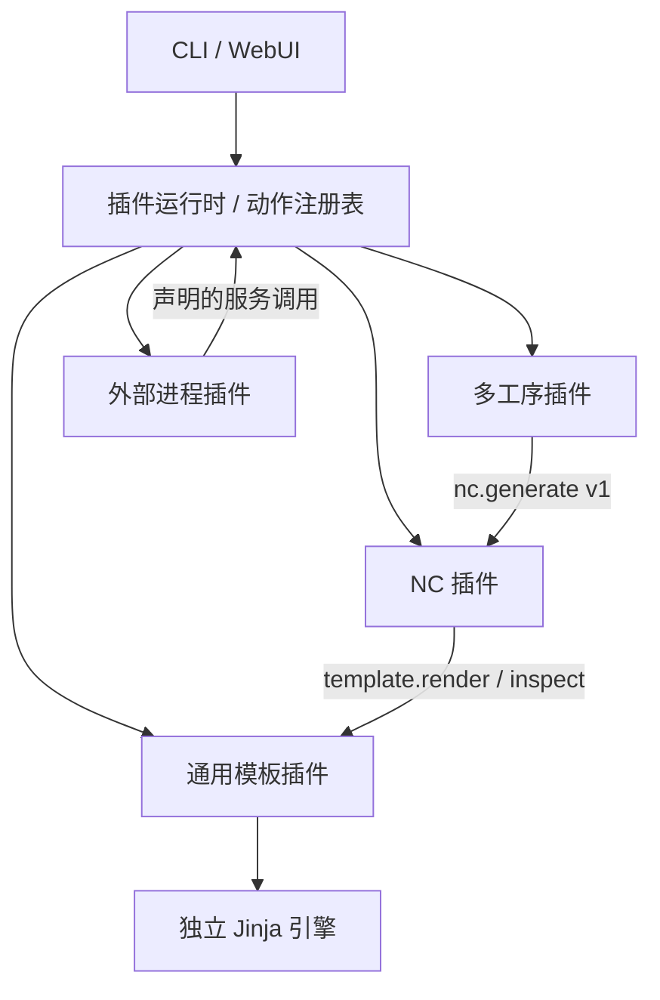

# NCtool 2.0 架构

默认产品是通用 Jinja 模板平台；NC 与多工序是可选能力。借鉴 [DeepSeek Harness](https://github.com/deepseek-ai/deepseek-harness/blob/master/docs/architecture.md) 和 [Cordis](https://github.com/deepseek-ai/deepseek-harness/blob/master/docs/cordis-primer.md) 的服务上下文、依赖声明、作用域注册与可撤销生命周期设计，在 Rust workspace 中实现。

```mermaid
flowchart TB
    Surfaces[CLI / WebUI] --> Runtime[插件运行时 / 动作注册表]
    Runtime --> Template[通用模板插件]
    Template --> Engine[独立 Jinja 引擎]
    Runtime --> NC[NC 插件]
    Runtime --> Process[多工序插件]
    Runtime --> External[外部进程插件]
    NC -->|template.render / inspect| Template
    Process -->|nc.generate v1| NC
    External -->|声明的服务调用| Runtime
```

## 依赖规则

- `nctool-tpl` 只依赖 MiniJinja；不包含领域模型、数学默认扩展、NC 过滤器或加工 lint。
- SDK、运行时、模板服务不依赖 NC 或多工序实现。
- 多工序插件不依赖 NC crate；调用版本化服务。
- CLI 的 `composition` 是唯一装配入口，可选 `nc-bundle` feature 引入内置领域插件；CLI 参数和 HTTP/WebUI 只处理通用动作数据。
- 默认构建不含 math/NC/process 依赖；完整发行包包含这些可选实现，默认配置仍是 `template`。
- 所有业务调用使用显式服务或动作，观测扩展使用 `ActionStarted` / `ActionFinished` 事件。事件不更改正文或吞掉执行错误。

## 渲染数据流

普通渲染：模板资产或源码 + JSON 上下文 → 通用规格/defaults → 显式渲染扩展 → Jinja → 文本/诊断。

NC 生成：领域规格与机床 → 模板引用检查 → 领域校验 → 参数派生和默认值 → 通用渲染服务（显式 math/NC 扩展）→ NC 后处理 → 文本/行号游标/诊断。

多工序：继承公共参数 → 工序覆盖 → 调用所选 NC 服务 → 游标连续传递 → 汇总诊断 → 全部成功后一次交付。

过滤器属于新建的单次渲染环境，不修改全局 Environment。重名扩展、重名过滤器和覆盖 Jinja 内置过滤器都报错。

## 生命周期

启动前验证插件协议、版本、服务绑定、动作 Schema 和全部依赖。拓扑排序后逐个激活，成功后发布动作、服务、过滤器和监听器；失败时释放当前插件及已启动插件。关闭时按依赖逆序停止，注册表和作用域监听器一并释放。

多服务提供方必须通过配置明确选择；动作 ID 使用插件命名空间避免冲突。提供方用不同动作 ID 实现同一个稳定服务 ID，消费者只知道服务接口。

外部进程有独立读写线程。读线程按请求 ID 路由响应，宿主回调在线程中执行，避免等待外部响应时堵住逆向调用。取消、超时或协议错误终止失效进程；下一次调用重新握手，调用结果不自动重试。

## 旧版边界

原 `nctool-core` 已拆分并退出 workspace，旧业务模板与嵌入资产已移除。GUI 保留历史代码；其依赖与接口不属于 2.0 构建支持范围。历史架构快照不是当前接口规范。

## 2.2 WebUI 工作台

独立 React/TypeScript 前端由 Vite 构建，通过编译期静态资源表嵌入 Rust 服务。CodeMirror 提供 Jinja/JSON/输出编辑视图，结构化参数控件按 Schema 递归渲染，数值全程保留原始字面量。浏览器草稿采用隔离的工作区存储。

宿主 Workbench 层负责通用异步任务、取消、工作区标识与记录，不导入 NC 工艺模型。通用模板任务在执行前冻结模板集合，并把实际输入和快照写入记录。任务文件使用原子写入，活动任务持有 OS 文件锁；其他进程启动不会把仍在运行的任务标为中断。任务列表读取单独的轻量索引，避免加载所有历史产物。

插件以 Panel.view 选择已注册的前端视图。NC 生成、机床和多工序视图放在 `ui/src/plugins/NcViews.tsx`，按需载入；未知视图回退到通用 Schema 表单，不运行第三方前端脚本。动作的可选 ui_schema.properties 提供显示提示，document_input 声明文档工作台的输入绑定与元数据匹配；后端校验仍以 input_schema 为准。

配置预检查与启动共用运行时的纯依赖解析函数；预检查读取描述和 Schema，不启动插件进程或创建领域资产。集合导入导出通过描述中的 asset_collections 动作扩展，宿主只调度集合，不导入具体资产类型。内置资产操作用工作区分组锁取得一致的短时快照，执行和渲染不持有整段锁。

NC/多工序服务可返回 replay_input，记录原始模板快照、机床、参数规格和选项。Workbench 重执行优先采用它；提供方没有该字段时使用原始输入。历史差异比较在前端进行，不修改记录。

执行历史页面的列表、详情、差异比较和重执行请求集中在 `ui/src/components/HistoryPage.tsx`；应用壳继续持有共享任务状态与文档恢复逻辑，页面切换保留已选记录及比较状态。

Workbench 在任务创建时记录宿主/插件版本和服务绑定；只读重执行预检查显示差异，新任务另外记录历史来源和实际比较结果。该记录跟踪声明版本，不固定插件二进制或配置。工作区资产包读取、预检查、导入确认和刷新流程集中在 `ui/src/components/WorkspaceImport.tsx`，保留后端集合校验与回滚边界。

## 基线与发布

`scripts/source_baseline.py` 为包含未提交改动的完整源码工作树生成恢复归档、Git 状态/补丁及逐文件校验清单，不修改索引。该本地快照与正式 Git 提交分别追踪；忽略的运行资产需独立备份。

标签发布依赖复用的完整 CI；验证完成后才按明确的 Rust target 构建发行二进制和校验文件。配置的三平台检查需取得实际运行证据，真实控制器验收另行完成。
