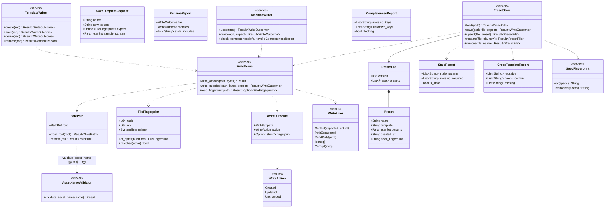
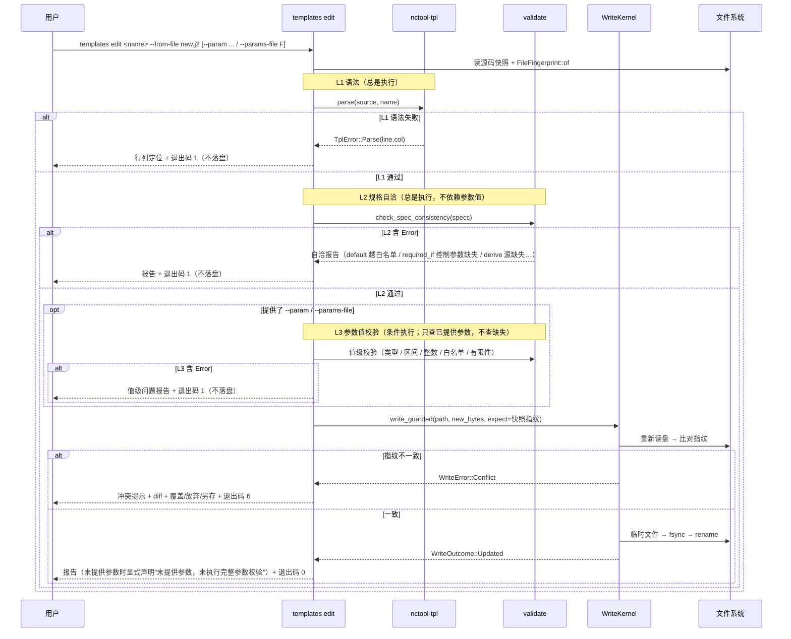
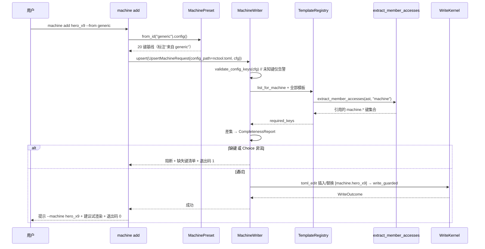
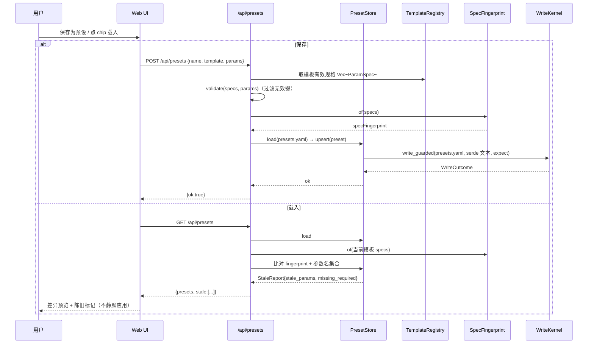
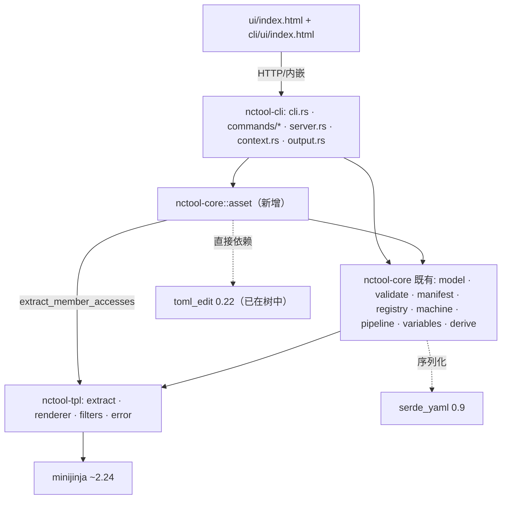

# nctool 三大编辑模块 · 系统架构设计与任务分解

> 版本 v1.1 · 2026-09-20 · 架构师 高见远
> **v1.1 修订说明**：依据 T01「共用写盘底座」的 QA 对抗性验证结论，修订 §7.3（临时文件命名措辞：**前缀 → 中缀**）、§7.5（`specFingerprint` 改**全字段长度前缀编码**——覆盖规范化串的**每一个组成部分**，一次性消除 `None` 记 `-` 的歧义与分隔符注入，属**最后窗口**的规范性变更）、§7.8（名称校验补强为**双层**，并记录"路径防护的两个失败模式"）、§3.1/§3.2（补 `AssetNameValidator::validate_asset_name`，与 §7.8 对齐）；新增 §9.1「已知边界登记」；§9 中 Q1/Q3/Q4/Q6 升级为**已确认**。本轮**仅改文档，未改源码/测试**。
> **（v1.1 追加，2026-09-20 第二轮）**：新增 **§7.15「保存前校验分级（L1/L2/L3）」规范**（主理人拍板），并将 **§4.1 时序图**改为三级校验语义；§3.2 补 `core::validate::check_spec_consistency` 公开入口。第二轮据工程师实现回填三项定案：**L2 三项自检均已实现**（改记 **P4 复用要求**：须复用 `check_spec_defaults`、禁重写、补"两路一致"测试）、**L3 不查缺失**、**JSON 结构化字段**。本轮同样**仅改文档，未改源码/测试**。
> **（v1.1 追加，2026-09-20 第三轮）**：`SYSTEM_DESIGN` **D19 作用域收准**到"**资产**写"（原绝对句"不 `fs::write`/`File::create`"与代码不符），§2.2/§6 与本文 §1.3 矩阵副本同步；**§9.1 补"交付层生产口径文件写入点全枚举 + 分类"**（3 处 `fs::write` 全为非资产写；关键结论：**资产写全部经 `WriteKernel`、D19 规则成立**），并把 `templates new` 行更新为"**已由 T02 闭环**"；**§7.15 补「适用范围细化」**（`new`/`edit`/`derive` 均须 L1+L2；L3 仅限接受参数的命令；级别声明仅落 `edit`/`derive`）；**§7 新增第 16 条「清单定点文本编辑的边界规则」**（缩进须严格大于键行、遇同级/更浅即停，防兄弟条目被吞并产生重复键）。本轮同样**仅改文档，未改源码/测试**。
> 输入：`docs/PRD_EDIT_MODULES.md`(v0.1，**采信其 §0.1 实测更正表**) · `docs/SYSTEM_DESIGN.md`(v2.0，当前权威) · `docs/MACHINE_CONFIG_GUIDE.md` · 实测源码

---

## 0. 阅读结论与实测复核

### 0.1 采信 PRD §0.1 更正（C1–C6 全部复核通过）

模块三（预设）**基线已存在**、模块二（机床）有 demo 级 JSON 编辑器、模块一（模板）有 demo 级内存编辑器；`ui/index.html` 实测 **2735 行**（非 2685）；`templates new` 已有写盘 + `validate_template_name` 先例。三个模块均为**增强**，真缺口 = 「持久化到 CLI 可见位置 + schema 化校验 + 写操作安全 + UI 硬上限落位」。

### 0.2 另行实测到的关键硬事实（影响决策）

| # | 事实 | 证据 | 影响 |
|---|---|---|---|
| F1 | **`toml_edit 0.22.27` 已在依赖树中**（`toml 0.8` 的传递依赖） | `Cargo.lock:802-811`（`toml 0.8.23` 依赖列表含 `toml_edit`）、`Cargo.lock:823` | 把它提为 core 的直接依赖 = **构建图新增 0 个 crate**，是"格式保全"路线的决定性论据 |
| F2 | `exit_code_matrix_in_docs_is_complete`（e2e）**强制 README 退出码表恰好覆盖 0..=7，无缺号无多余** | `cli/tests/cli_e2e.rs:667-702`（`let want: Vec<String> = (0..=7)...`） | **绝不能新增退出码**，否则此测试立即红 |
| F3 | `templates_new_duplicate_exits_6` 只断言 **退出码 6 + stderr 含"模板已存在"**，不钉 kind 串 | `cli/tests/cli_e2e.rs:259` | 新增/复用 kind 串是**加法**，安全 |
| F4 | `output.rs::exit_code_matrix` 单测逐条钉 `kind→code`；未知 kind 兜底 1 | `cli/src/output.rs:235/256` | 新 kind 必须显式进矩阵，否则静默归 1（与"校验失败"撞车） |
| F5 | `core` 已做文件**读**（`TemplateManifest::load` / `VariableLibrary::load` / `add_file`），只是**从不写** | `core/src/registry.rs:389`、`context.rs:161` | "core 不做 IO"不成立；core 拥有资产读写是一致的 |
| F6 | 前后端接口集合有**单一来源** `scripts/api_routes.json` + 后端 `api_routes_are_routable` 测试 + `check_api_parity.mjs` 门禁 | `scripts/api_routes.json`、`cli/tests/cli.rs` | 新增任何 HTTP 端点须同步改三处，漏一处即红 |
| F7 | `resolve_machine`：内置预设优先，再查 `loaded.merged.machine`（项目+全局**合并**，非覆盖） | `cli/src/context.rs:275`、`config.rs:142` | 写项目 `nctool.toml` 即可让 CLI/UI 同时可见，无需动全局 |
| F8 | `nctool.toml` 的 `template_dir`/`default_machine` 在 `config init` 模板里是**被注释掉**的 | `config.rs:155 EXAMPLE_CONFIG` | 任何 serde 往返都会删掉这些注释 → 排除 serde 回写 TOML |

### 0.3 四条设计原则的落地锚点（不新增、不放宽）

| 原则 | 本设计的落实 |
|---|---|
| P1 渲染前可发现错误 | 写前强制 `parse → inspect → validate`，失败**不落盘** |
| P2 计算在 Rust 侧 | 预设**不冻结**派生结果；派生由 Rust 现算；模板只做替换 |
| P3 静默出错零容忍 | 写前校验阻断；乐观锁冲突不静默覆盖；未知键仍仅告警（保留扩展语义）但 Choice/缺键必阻断 |
| P4 单一来源 + 双输入面共用内核 | 唯一写内核 `core::asset`；CLI 与 Web UI 走同一函数 |

---

## 1. 实现方案总览 + 四大难题决策

### 1.1 总方案一句话

新增一个**领域层写入内核 `core::asset`**（原子写 + 乐观锁 + 路径防护 + 统一入口），在其上按格式挂三种"定点编辑策略"，由 CLI 命令面（主）与 Web UI（辅，仅预设走结构化 API）驱动；所有写操作**写前走既有 `validate` 内核**，满足 P4。

### 1.2 难题一：注释保全 —— 决策

**结论：按目标文件分三条策略，但共用同一写内核与同一"写前校验/写后报告"骨架。**

- **`nctool.toml`（TOML）→ 采用 `toml_edit`（格式保全）**。
  - 理由：① 已实测在依赖树中（F1），**构建图零新增 crate**；② `toml_edit` 原生保留注释、空白、被注释掉的 `template_dir`（F8）；③ 支持"插入/替换 `[machine.<id>]` 表"这种**更新**语义（F7 需要 upsert 而非仅 append）；④ 手写 TOML 文本拼接要自己处理 `\` `"` `#` 控制字符转义与插入点定位——**这正是红线 3「静默出错零容忍」最怕的地方**。排除文本拼接用于 TOML。
- **`templates/templates.yaml`（YAML）→ 采用定点文本编辑（零新依赖）**。
  - 理由：① **不存在成熟的注释保全 YAML 写库**（`serde_yaml` 往返丢注释，`yaml-rust2` 亦不保全），故格式保全库路线对 YAML 不成立；② 本模块对清单只有两种操作：**追加一条顶层条目**、**改写一条已存在的键行**（rename），都是行级、可控的；③ 清单是**可选**文件（D13），且模板名 = 相对路径，**即使不写清单条目，模板也能被目录扫描发现**——这给了"定点编辑失败 → 降级为警告 + 提示手补"的退路（PRD F1 第 6 步的 D13 降级哲学）。
- **预设文件（新建）→ 采用 serde 全量读写 + 独立新文件**。
  - 理由：① 预设文件是**工具自有、无人工注释**的新文件，serde 往返无损；② 放**配置目录**（非模板根），满足红线 9；③ 与主配置解耦，永不回写人手编辑的 `nctool.toml`/`templates.yaml`。

**三处是否同一套机制？** —— **同一套内核（原子写/乐观锁/路径防护/统一入口），不同"编辑策略"插件**。即 `asset` 内核 = 格式无关；`template.rs`(YAML 文本) / `machine.rs`(toml_edit) / `preset.rs`(serde) 是三个策略实现。这是"单一入口"（红线 1）与"格式保全"两个目标的同时满足方式。

### 1.3 难题二：写能力放哪个 crate —— 决策

**结论：统一写入内核放 `nctool-core`，新模块 `core::asset`（含子模块）。**

- 理由：① `SYSTEM_DESIGN §2.1` 明写"**所有真实业务逻辑都在 `nctool-core`**"，而"写前校验 + 冲突判定 + 完整性检查"就是业务逻辑；② `nctool-cli` 的职责是"**不含任何校验/渲染逻辑**"——若把写内核放 cli，"写前校验编排"就落在 cli，直接违反职责矩阵；③ `core` 已做资产**读**（F5），做资产**写**是同一职责的自然延伸；④ P4 的"单一来源"由**领域层**保证，比"cli 内部约定"更硬。

**需修订 `SYSTEM_DESIGN.md §2.2` 的 crate 职责矩阵**，新措辞：

| Crate | 定位 | 对外承诺 | 明确不负责 |
|---|---|---|---|
| `nctool-core` | G-code 领域层 | 参数模型、规格解析与合并、校验引擎、模板注册表、机床适配、派生计算、生成管线、**资产写入内核（原子写 / 乐观锁 / 路径防护 / 模板·机床·预设的落盘）** | 不感知命令行、不感知终端输出、不起 HTTP 服务、**不决定写盘目标路径策略（由交付层传入已解析路径与安全根）**、**不打印面向用户的报告** |
| `nctool-cli` | 交付面 | 命令解析、配置层叠、参数归一、结果渲染、退出码、本地 Web 服务、**编辑命令的参数编排与结果/报告呈现** | 不含任何校验/渲染/后处理逻辑、**不持有任何资产（模板 / 机床 / 预设）的文件写入原语** |

**P4 双输入面共用内核的实现**：CLI 的 `commands/{templates,machine,preset}.rs` 与 `server.rs` 的新路由都**只调用 `core::asset::*` 的同一组函数**；`server.rs` 不做任何自己拼文件字节的事。预设是唯一有 HTTP 写端点的模块，其端点同样走 `PresetStore`。

### 1.4 难题三：退出码与命令命名 —— 决策

**退出码：不新增任何码（0–7 冻结，否则 F2 红）。新失败类别全部映射进既有码。**

| 新失败类别 | kind（字符串） | 退出码 | 理由 |
|---|---|---:|---|
| 并发覆盖冲突（乐观锁失败） | **`write_conflict`（新增）** | **6** | 资源状态冲突，与 `template_duplicate` 同族（业务冲突，非 IO/非校验）；6 已有 6 种 kind 同码先例 |
| 名称已存在（模板名/机床 id/预设名） | **`name_conflict`（新增）** | **6** | 与既有 `template_duplicate` 同码；新增更中性的 kind，`template_duplicate` 保留兼容（`templates new` 不改） |
| 目标只读（EACCES/EROFS） | 复用 `io` | 3 | 只读是纯 IO 失败 |
| 预设文件损坏（**写入时**） | 复用 `config` | 4 | 与 `nctool.toml` 损坏同族；**读取时**按 D13 降级为警告（退出码不变） |
| 跨模板不兼容（交集不匹配/缺必选） | 复用 `validation` | 1 | 属校验类问题 |
| 机床缺键阻断 | 复用 `validation` | 1 | 缺键必致严格渲染失败，属渲染前校验 |

**契约变更清单（对 `cli_e2e.rs` 与 CHANGELOG）：**

- `cli_e2e.rs` **无需改**：新增 kind 只改"kind 串→码"的**内部**映射（`output.rs` 单测补行），对外退出码 0–7 与 JSON 包络形状不变；`templates_new_duplicate_exits_6`（F3）仍绿；`exit_code_matrix_in_docs_is_complete`（F2）因码未变仍绿。
- `cli/src/output.rs::exit_code_matrix` **单测补两行**（`write_conflict`→6、`name_conflict`→6）。
- `CHANGELOG.md`：新增子命令、新增 kind、新增 `core::asset`/`preset` 模块、新增依赖 `toml_edit`（直接依赖化）。
- `README.md`：退出码表**不变**；新增"写操作错误 kind"小节（说明 `write_conflict`/`name_conflict` 归 6）。

**命令命名：尊重既有 `templates`（复数）/ `machine`（单数）。**

| 模块 | 最终命令面（新增用 ➕） | 说明 |
|---|---|---|
| 一 模板 | `templates list/show/new`（既有）➕ `templates edit <name> [--from-file F] [--expect-hash H]`、`templates derive <src> <new>`、`templates rename <old> <new>` | 沿用复数 `templates`（既有子命令族，不改名以免破坏 44 用例）；`new` 扩展为"落清单条目" |
| 二 机床 | `machine list/show`（既有）➕ `machine add <id> [--from generic]`、`machine edit <id>`、`machine rm <id>`、`machine test <id> --template <tpl>` | 沿用单数 `machine`；`add/edit/rm` 动词更自然（`machine new` 会与 `machine show` 语义不齐） |
| 三 预设 | ➕ `preset save/list/show/rm/export/import/apply`（全新，单数，对齐 `machine`） | 新增顶层命令 |

> 命名不一致（`templates` 复数 vs `machine`/`preset` 单数）是**既有事实**，统一它会改动既有命令名 → 违反"不得破坏退出码/JSON 契约"与 44 用例。故**保持现状 + 新命令对齐更常见的 `machine` 单数**，并在 `SYSTEM_DESIGN.md §7` 记一笔"命名待 2.0 统一"。

### 1.5 难题四：UI 硬上限 —— 决策

**结论：本次计划走方案 A（CLI 为主，UI 增量 ≤ 145 行，结束 ≈ 2880 < 2900）→ 不触发拆分；但预置方案 B 规格，一旦预计 > 2900 立即切换。**

**逐模块 UI 增量与落位（预算表）：**

| 模块 | UI 增量 | 落位点 | 说明 |
|---|---:|---|---|
| 一 模板 | **+~45** | 源码抽屉 `modalSrc`（`ui/index.html:709`）：把"保存并应用"改为**"在外部编辑器打开"（给出 CLI 命令）+ "重新加载预览"**；模板卡加"派生"按钮 + 轻量命名弹窗 | 不做浏览器内自由文本落盘 |
| 二 机床 | **+~15（或净减）** | 保留只读下拉；`modalCustomMachine`（`:2692`）从"原始 JSON 编辑器"改为**"用 `nctool machine add` 管理"提示**（可删原 demo JSON 编辑器，净减 ~25 行） | 机床编辑 P0 走 CLI，UI 不新增写路径 |
| 三 预设 | **+~85** | 预设 chips（`:2352`）加**陈旧角标**；预设管理弹窗加**差异预览 / 导入 / 导出**按钮；chips 点击前轻量 diff 提示 | 数据经 `/api/presets` 与 CLI 同源 |
| **合计** | **≈ +145** | — | 2735 + 145 = **2880 < 2900 ✓** |

**拆分触发条件（护栏，硬门禁）：** 任一 PR 使 `ui/index.html` 预计 > 2900 行 → **必须先执行方案 B**。

**方案 B 规格（应急，若触发）：**

- **源码拆分**：`ui/src/` 下按序号命名片段：`00_head.part.html`、`10_style.part.html`、`20_body.part.html`、`30_script_data.part.html`、`31_script_api.part.html`、`32_script_ui.part.html`、`90_tail.part.html`。
- **生成脚本**：`scripts/build_ui.mjs`（Node，**已有 CI 依赖**——`check_api_parity.mjs` 已用 Node，无新工具链）。按文件名排序拼接 → **同时写出** `ui/index.html` 与 `cli/ui/index.html`（两份由同一份产物写两次 → 天然字节一致）。支持 `--check`（生成物与提交物不一致即退出非 0）。
- **`include_str!` 不变**：`server.rs:37` 仍是 `include_str!("../ui/index.html")`（读生成物），运行时仍是单文件内嵌。
- **同步测试改造**：`cli/tests/cli.rs::ui_html_copies_stay_in_sync` 升级为**双断言**：① 两份字节一致（原断言保留）；② **在测试内重新拼接 `ui/src/*.part.html` 并与提交的 `ui/index.html` 比对**。如此把"提交物"变成"构建产物"，源真值上移到片段。
- **CI**：quality job 加 `node scripts/build_ui.mjs --check`。
- **行数上限语义迁移**：3000 行上限从"单文件"移到"每个片段文件"→ 约束彻底解除。

---

## 2. 文件列表（新增 ➕ / 修改 ✎）

| 相对路径 | crate | 职责 | 状态 |
|---|---|---|---|
| `core/src/asset/mod.rs` | nctool-core | 写内核门面：`WriteKernel`、统一入口、`WriteOutcome`/`WriteError` | ➕ |
| `core/src/asset/atomic.rs` | nctool-core | 原子写原语（同目录临时文件 + `rename`；Windows 语义注释） | ➕ |
| `core/src/asset/guard.rs` | nctool-core | 乐观锁：`FileFingerprint`（hash+len+mtime）、比对 | ➕ |
| `core/src/asset/path.rs` | nctool-core | 路径穿越防护：`SafePath`（canonicalize + 根包含 + 拒符号链接逃逸，沿用 D14 双层） | ➕ |
| `core/src/asset/template.rs` | nctool-core | 模板写操作：create/save/derive/rename + **`templates.yaml` 定点文本编辑** | ➕ |
| `core/src/asset/machine.rs` | nctool-core | 机床写操作：`nctool.toml` 的 `toml_edit` upsert/rm + 完整性校验 | ➕ |
| `core/src/asset/preset.rs` | nctool-core | 预设模型 + 文件后端 + 陈旧检测 + 交集计算 + 导入导出 | ➕ |
| `core/src/asset/spec_fingerprint.rs` | nctool-core | `SpecFingerprint::of(&[ParamSpec])` 规范化 + FNV-1a64 | ➕ |
| `core/src/lib.rs` | nctool-core | `pub mod asset;` + 再导出 | ✎ |
| `core/Cargo.toml` | nctool-core | 加 `toml_edit` 直接依赖（**构建图零新增 crate**，见 F1） | ✎ |
| `src/extract.rs` | nctool-tpl | `extract_member_accesses(&Ast, root) -> Vec<String>`（收集 `machine.X` 键，供完整性校验） | ✎ |
| `src/lib.rs` | nctool-tpl | 再导出新函数 | ✎ |
| `cli/src/commands/templates.rs` | nctool-cli | 扩展 `edit/derive/rename`；`new` 落清单条目 | ✎ |
| `cli/src/commands/machine.rs` | nctool-cli | 扩展 `add/edit/rm/test` | ✎ |
| `cli/src/commands/preset.rs` | nctool-cli | 全新 `preset` 子命令族 | ➕ |
| `cli/src/commands/mod.rs` | nctool-cli | 注册 `preset` + 分发 | ✎ |
| `cli/src/cli.rs` | nctool-cli | 命令树：`Preset` 顶层 + `TemplatesCommand`/`MachineCommand` 新变体与参数 | ✎ |
| `cli/src/output.rs` | nctool-cli | 新增 kind `write_conflict`/`name_conflict`→6；单测补行 | ✎ |
| `cli/src/server.rs` | nctool-cli | 新增 `/api/presets` 路由（GET/POST/DELETE，**结构化、非自由文本**） | ✎ |
| `cli/src/context.rs` | nctool-cli | `Ctx` 增加"写目标路径解析"辅助（项目 `nctool.toml` 定位、预设目录定位） | ✎ |
| `scripts/api_routes.json` | — | 登记 `/api/presets`（单一来源，F6） | ✎ |
| `ui/index.html` + `cli/ui/index.html` | — | 按 §1.5 预算表的 UI 增量（两份**字节一致**） | ✎ |
| `core/tests/asset_write.rs` | nctool-core | 原子写 / 乐观锁 / 路径穿越 集成测试 | ➕ |
| `core/tests/preset_store.rs` | nctool-core | 预设往返 / 陈旧 / 交集 | ➕ |
| `cli/tests/cli_edit_e2e.rs` | nctool-cli | 编辑命令 E2E（新文件，不碰既有 44 用例） | ➕ |
| `tests/golden/`（新增用例） | — | 机床 `nctool.toml` 合并、预设往返 golden | ➕ |
| `README.md` / `docs/SYSTEM_DESIGN.md` / `docs/MACHINE_CONFIG_GUIDE.md` / `CHANGELOG.md` | — | 契约与文档同步 | ✎ |
| `scripts/build_ui.mjs` + `ui/src/*.part.html` | — | **仅方案 B 触发时**新增 | ⏸ 条件 |

---

## 3. 数据结构与接口

### 3.1 核心类型（classDiagram）



### 3.2 公开 API 清单（`pub` = 进 1.0 API 冻结清单）

**`nctool-core::asset`（全部 `pub`）**

```rust
pub struct WriteKernel;                          // 无状态，方法均为关联函数
impl WriteKernel {
    pub fn write_atomic(path: &Path, bytes: &[u8]) -> Result<(), WriteError>;
    pub fn write_guarded(path: &Path, bytes: &[u8], expect: Option<FileFingerprint>)
        -> Result<WriteOutcome, WriteError>;
    pub fn read_fingerprint(path: &Path) -> Result<Option<FileFingerprint>, WriteError>;
}
pub struct FileFingerprint { pub hash: u64, pub len: u64, pub mtime: SystemTime }
pub struct SafePath { /* 私有字段 */ }
impl SafePath { pub fn from_root(root: &Path) -> Result<Self, WriteError>;
                pub fn resolve(&self, rel: &str) -> Result<PathBuf, WriteError>; }
pub fn validate_asset_name(name: &str) -> Result<(), WriteError>;   // core::asset::path：模板/机床 id/预设名共用（§7.8 双层之第一层）
pub enum WriteAction { Created, Updated, Unchanged }
pub struct WriteOutcome { pub path: PathBuf, pub action: WriteAction, pub fingerprint: Option<String> }
#[non_exhaustive] pub enum WriteError { Conflict{..}, PathEscape{..}, ReadOnly{..}, Io(..), Corrupt(..) }

pub struct TemplateWriter;   // create/save/derive/rename
pub struct MachineWriter;    // upsert/remove/check_completeness
pub struct PresetStore;      // load/save/upsert/rename/remove
pub struct Preset { pub name:String, pub template:String, pub params:ParameterSet,
                    pub created_at:String, pub spec_fingerprint:String }
pub struct PresetFile { pub version:u32, pub presets:Vec<Preset> }
pub struct StaleReport { pub stale_params:Vec<String>, pub missing_required:Vec<String> }
pub struct CrossTemplateReport { pub reusable:Vec<String>, pub needs_confirm:Vec<String>, pub missing:Vec<String> }
pub struct SpecFingerprint;
impl SpecFingerprint { pub fn of(specs:&[ParamSpec]) -> String; }
```

**`nctool-core::validate`（新增 `pub`，进 1.0 冻结清单）**（v1.1 追加）

```rust
/// 不依赖参数值的规格自洽校验（保存前 L2 级）。
/// = 复用 `check_spec_defaults`（`default` 的类型/有限性/区间/整数/白名单判定，**不得重写**）
///   + 两项新检查：`required_if` 控制参数是否在本规格中声明、`derive` 源参数是否在本规格中声明。
/// 返回报告只含 Error 级问题；`has_errors()` 即"是否阻断"。
pub fn check_spec_consistency(specs: &[ParamSpec]) -> ValidationReport;

/// 保存前 L3：只对**已提供**参数做值级校验（类型 / 区间 / 整数 / 白名单 / 有限性），**不查缺失**。
/// **正向集合**入口：遍历已提供参数逐个检查（复用 `check_value_constraints` /
/// `check_value_options` / `check_finite_value`）。**不得**改用"完整 `validate` + 降级 `Missing`"——
/// 那要依赖 `downgrade_errors_except` 的**白名单反向** `keep`，新增 `IssueKind` 会被静默降级。
pub fn check_param_values(specs: &[ParamSpec], params: &ParameterSet) -> ValidationReport;
```

> **落位与复用（P4 单一来源，硬性）**：规格自洽校验属**校验**职责，住 **`core::validate`**——**不**住写模块 `core::asset::template`（后者只**调用**它）。**必须复用** `check_spec_defaults`，**禁止**把 `default` 判定手写第二遍（两份实现会漂移，使同一模板在 `nctool validate` 与 `templates edit` 下判出不同结果）。须补"两路一致"测试（同一规格经 `validate_*` 与经 `check_spec_consistency` 对 `default` 的判定一致，参考既有 `validate_with_vars_agrees`）。
> **现状（T02 回填）**：工程师已在 `core::asset::template` 以 `check_spec_self_consistency` 实现三检，但内含 `default` 判定的**第二份实现**；须按本节**搬迁/改名到 `core::validate::check_spec_consistency` 并复用 `check_spec_defaults`**。

**`nctool-tpl`（`pub`）**：`pub fn extract_member_accesses(ast: &Ast, root: &str) -> Vec<String>;`

**内部 `pub(crate)`**：`atomic.rs`/`guard.rs`/`path.rs` 的辅助函数（不冻结）。

> `WriteError` 标 `#[non_exhaustive]`（与 `TplError`/`RegistryError` 一致，为扩展留空间）。

---

## 4. 程序调用流程

### 4.1 模板保存（三级校验 → 冲突检查 → 原子写 → 报告）

> **（v1.1 追加）** 本时序图已按 §7.15「保存前校验分级」更新为 **L1/L2/L3 三级语义**。原图"`validate`（用当前模板的样例参数）"的单一校验步骤与实际可行的分级语义不符（"样例参数"来源不明，且把"没参数就不校验"当默认），故重绘。



**三级语义要点（v1.1 追加）**：

1. **L1/L2 无条件执行**：即使未提供任何参数，`parse` 与"规格自洽"两步也必须跑；只有 L3 是条件执行（依赖是否给了 `--param`/`--params-file`）。
2. **L2 不是"以空参数调用 `validate`"**：那样每个必选参数都会报 `Missing`，必然阻断、永远无法保存（详见 §7.15 约束 2）。
3. **不得静默降级**：只到 L1/L2 时，成功输出必须显式声明"未提供参数，未执行完整参数校验"（详见 §7.15 约束 1）——否则用户会误以为校验过了，违反 P3。
4. **L3 只查"值"、不查"缺失"**：L3 只对**已提供**参数做值级校验；与 `nctool validate` 命令（含缺失、回答"能不能渲染"）**刻意不同**——L3 回答的是"这份模板是否可保存"（详见 §7.15 约束 3）。


### 4.2 自定义机床落盘（基线 → 完整性 → toml_edit → 原子写）



### 4.3 预设持久化与陈旧检测



---

## 5. 模块之间的关联关系

### 5.1 三者共享的数据与内核

| 共享物 | 位置 | 在三个模块中的作用 |
|---|---|---|
| **写内核** `WriteKernel`（原子写 + 乐观锁 + 路径防护） | `core::asset` | 模板 / 机床 / 预设**唯一**落盘通道（红线 1） |
| **校验内核** `validate` / `IssueKind` | `core::validate`（既有） | 写前强制校验；三者共用同一套 Error/Warning 语义（P4） |
| **参数规格 `ParamSpec`** | `core::model`（既有） | 模板**定义**；预设**消费**（`SpecFingerprint` + 陈旧检测）；机床**间接**（完整性以"模板引用的 `machine.*` 键"为输入） |
| **`MachineConfig`** | `core::model`（既有） | 机床模块**写**；渲染上下文**读** |
| **`ParameterSet`（扁平值模型）** | `core::model`（既有） | 预设存参数值；机床无参；模板校验输入 |
| **`FileFingerprint`** | `core::asset::guard` | 三者的并发防护统一指纹算法 |

### 5.2 编译期/运行期依赖方向（严格单向向下，无新增跨层边）



**方向不变**：`cli → core → tpl → minijinja`。`core::asset` 是 `core` 内部新模块，依赖既有 core 模块，**不新增跨 crate 边**。

### 5.3 与既有模块的接口点

| 既有模块 | 接口点 | 性质 |
|---|---|---|
| `registry` | `list_for_machine` / `get` / `extract_params` / `validate`；**新增**"收集模板引用的 `machine.*` 键" | 读 |
| `manifest` | `ResolvedMeta::resolve` 读；**新增** `templates.yaml` 定点文本编辑 | 读 + 写（文本） |
| `variables` | 不直接写；模板保存后 `variables.yaml` 不变 | — |
| `validate` | `validate_template` / `validate_with_vars` / `spec` 作为写前门 | 读 |
| `machine` | `KNOWN_CONFIG_KEYS` / `validate_config_keys` / `MachinePreset::config()` | 读 |
| `pipeline` | `GCodeGenerator` 试渲染（`machine test`） | 读 |
| `server` | **新增** `/api/presets`（GET/POST/DELETE）；**模板/机床写无 HTTP 端点** | 写（仅预设） |
| `context::Ctx` | 新增"写目标路径解析" | 编排 |

### 5.4 典型组合场景的依赖闭环

- **换机床 → 同一模板重出程序**（二 × 一）：机床完整性校验保证 `machine.*` 不缺键 → 同一模板渲染不因缺键失败。
- **改模板参数 → 预设失效**（一 → 三）：`specFingerprint` 建立可检测的因果链。
- **模板 A 预设用于模板 B**（三 × 一）：交集计算 + 显式告知，不静默丢弃。
- **派生模板 + 派生机床**（一 × 二）：各自独立，不隐式耦合。

---

## 6. 依赖包列表

| crate | 引入方 | 版本 | 为什么 | 可否避免 |
|---|---|---|---|---|
| `toml_edit` | `nctool-core`（新增直接依赖） | `0.22`（与锁定版本一致） | 格式/注释保全地 upsert `[machine.<id>]`；**已在依赖树中（F1），构建图零新增 crate** | 否（手写 TOML 文本更新正是"静默损坏"高发区，违背红线 3） |
| （无其他新增） | — | — | 预设用 `serde` + `serde_yaml`（core 已有）；哈希用零依赖 FNV-1a；UI 生成脚本（若走方案 B）用**已有** Node 工具链 | — |

> 明确**不引入**：`sha2`/`blake3`（指纹非安全用途，FNV-1a64 足够）、`tempfile`（原子写自实现同目录临时文件）、`toml`（core 不需要 serde 版）。

---

## 7. 共享知识（跨文件约定，必须统一）

1. **退出码**：**0–7 冻结**，不新增码（F2）。新 kind `write_conflict`/`name_conflict` 均归 **6**；只读→`io`(3)；预设损坏（写时）→`config`(4)；跨模板不兼容/缺键→`validation`(1)。
2. **JSON 包络**：成功 `{ok:true,data}`、失败 `{ok:false,error:{kind,message}}`，CLI 与 HTTP 同形（沿用）。
3. **原子写实现**：写 `<target>.nctool-tmp-<pid>-<nanos>.tmp` → `flush`/`fsync` → `std::fs::rename` 覆盖（Windows 走替换语义；被占用失败 → `WriteError::ReadOnly`/`Io` → 退出码 3）。临时文件命名中 `.nctool-tmp-` 是**中缀**标记（位于目标文件名之后，非前缀）。命名的**实质要求是三条**：① 与目标**同目录**（保证同分区 `rename` 原子）；② **不被资产发现逻辑收录**（`*.j2` 扫描不会命中，红线 9）；③ **可从名字辨识目标**（便于残留清理与排障）。三者由"`<target>` + 中缀 `.nctool-tmp-<pid>-<nanos>` + 后缀 `.tmp`"同时满足——同目录保证①，`.tmp` 后缀使 `*.j2` 扫描不命中从而保证②，中缀保留目标名从而保证③。实现后由测试断言模板根目录无残留，且 `nctool templates list` 不收录该临时文件。
   （v1.1 修订：原文误称 `.nctool-tmp-` 为"前缀"，与同句给出的 `<target>.nctool-tmp-<pid>-<nanos>` 格式自相矛盾；实际为**中缀**。实现正确，本处仅更正文档措辞。）
4. **乐观锁指纹算法**：`FileFingerprint { hash: FNV-1a64(bytes), len, mtime }`。打开时取快照；写前重读比对；三者任一不同即 `Conflict`。文件不存在 → `expect=None`（要求"写前仍不存在"）。**禁用纯 mtime**（Windows 时间分辨率粗，同秒内改两次会漏检）。
5. **`specFingerprint` 算法**：对**有效 `Vec<ParamSpec>`（按 name 排序）**做规范化串拼接（字段固定序：`name|kind|required|min|max|integer|unit|options|required_if|derive|default`），数值用 `format!("{:?}", f64)`（确定性），`options` / `required_if` 取值 / `derive` 表项**排序后**编码；最后 `fnv1a64` → 输出 `"fnv1a64:<16 hex>"`。**只用于变更检测，非安全用途**。

   **`description` 不参与指纹（理由）**：指纹的用途是检测"预设是否因**规格**变化而失效"，而 `description` 只影响**展示**、不影响参数**合法性**判定；若把它纳入指纹，改一个错别字就会让**全部预设被误判为"陈旧"**（误报）。故字段序中**不含** `description`，与本节 §7.5 字段序一致。

   **全字段长度前缀编码（v1.1 规范性变更，覆盖规范化串的每一个组成部分）**：为彻底消除分隔符注入，**每一个字段值**（不只可选字段）都走同一 `encode`：

   ```
   encode(None)     = "-1:"
   encode(Some(s))  = format!("{}:{}", s.len(), s)      // 长度 = 字节数（Rust str::len()）
   encode(s)        = format!("{}:{}", s.len(), s)      // 非可选字符串同样处理（name / kind / …）
   encode(list)     = 各元素依次 encode                   // 元素自定界，无需计数前缀
   ```

   - 长度一律取**字节数**（与 Rust `str::len()` 一致）。
   - **`encode(list)` 不带计数前缀**：每个元素已是自定界编码 `<字节长>:<内容>`，解码时"读到 `:` 取长度、再取该字节数"即可唯一切分——`["a","b"]`→`1:a1:b`、`["ab"]`→`2:ab`、`[]`→`""`，三者互不相同且都与 `None` 的 `-1:` 不同，故**计数是冗余信息**，省略以简化并避免实现漂移。
   - **数值与布尔字段也走同一个 `encode`**（先 `to_string()` 再编码）。**理由**：彻底消除"哪些类型才安全"的分析负担——将来新增字段不必再逐一判断，也不会因为有人把数值字段改成字符串而重新打开注入面。
   - 外层 `|` 分隔符**保留**：所有组成部分均已带长度前缀，分隔符无法再被注入。
   - **注意区分（避免误读为不一致）**：`ParamValue::List`（参数**值**）用的是**另一套**编码 `l:{n}[{各元素}]`（**含**元素计数），与规格字段的 `encode(list)` **不是同一套**——前者编码参数**值**、后者编码规格**字段**，两者各自自洽，无需强行统一。

   **理由（总）**：长度前缀使**分隔符（`|`、`\n`、`;`）无法被注入**——解码时先读长度、再按长度取值，值内任何字符都不会被误判为字段边界；这比"给值加转义"更彻底，且**不需要新增任何转义逻辑**（无需枚举待转义字符、无需往返正确性测试）。原规定"`None` 记 `-`"存在**歧义缺陷**：`SpecFingerprint::of(&[unit=None])` 与 `of(&[unit=Some("-")])` 会产出**完全相同**的指纹（QA 实测均为 `fnv1a64:64d0fddd41331c2b`），属静默误判；同类风险还包括原规范化串用 `|` 与 `\n` 做分隔且**完全不转义**，字段值（含 `options` 候选值，如 `variables.yaml` 中的中文枚举标签 `"闭口"`/`"ES"`）含这些字符时理论上可构造歧义。**只覆盖可选字段**等于把已证实的缺陷从"必然可构造"降为"条件可构造"，按 P3「静默出错零容忍」口径**不算闭合**（且 `options` 候选值不存在可依赖的字符集约束），故本次一次做干净：长度前缀覆盖**规范化串的全部组成部分**。

   **时间窗口（重要）**：这是改指纹编码的**最后窗口**。T03 预设一旦落盘即带上指纹，此后任何编码变更都会让**所有既有预设被判为"陈旧"**。当前尚未落盘，改动**零成本**，故必须在 T03 之前定稿。

   **契约（保持不变，QA 已验证通过）**：① 同一模板两次计算结果**稳定**；② 参数**名/类型/约束任一变化必变**；③ **顺序无关**（`name` 排序、`options` 排序）——排序规则不变。
6. **预设文件 schema（版本 1）**：

```yaml
version: 1
presets:
  - name: "钻孔 D10×3 深"
    template: "turning/demo_gcode.j2"
    params:
      x: { type: number, value: 21.0 }   # 复用 ParamValue 既有小写标签序列化
    createdAt: "2026-09-20T10:00:00Z"    # ISO 8601 UTC
    specFingerprint: "fnv1a64:0123456789abcdef"
```

   未知 `version` → 读时降级警告（D13）；写时拒绝覆盖未知版本（→`config`/4）。

7. **新持久化文件位置**：预设默认落**配置目录**（`%APPDATA%\nctool\presets.yaml` / `$XDG_CONFIG_HOME/nctool/presets.yaml`），**永不落模板根**（红线 9）。若用户显式要求项目内，须校验目标目录 ≠ 模板目录（否则拒绝）。
8. **名称校验单一来源（v1.1 补强为双层，对应既有设计决策 D14「文件路径加载做双层安全校验」）**：`validate_template_name` 提升为 `core::asset::path::validate_asset_name`，模板/机床 id/预设名共用；CLI 侧旧函数改为转发（保留单测）。校验分**两层**，缺一不可：

   - **第一层（名字层）`validate_asset_name`**：要求名字**有且仅有一个路径组件，且该组件必须是 `Component::Normal`**。实现上用**同一个 `match`** 把非法情形一并拒掉：空串、`.`、`..`、含路径分隔符（`/`、`\`）、以及**带盘符/设备前缀的 `Component::Prefix`**（如 `"Z:"`、`"C:"`）全部拒绝；此外**拒绝控制字符**（`char::is_control()`，防 `\0`、`\n` 等注入）。**不得只数组件个数**——`Path::new("Z:").components().count() == 1` 会放行盘符前缀，这正是 P1 逃逸的入口。
   - **第二层（路径层）`SafePath::resolve`**：**返回前必须断言最终返回路径在根内**。`candidate`（`root.join(rel)`）**存在**时用 `canonicalize` 后的路径断言 `starts_with(&root)`；**不存在**时用拼接路径断言 `starts_with(&root)`。**不得只校验 `anchor`**——原缺陷正是 `candidate` 不存在时回退 `anchor = root`，再对 `anchor`（=根自身）做包含校验，等于没校验。`SafePath::from_root` 亦须校验**根是已存在的目录**。

   > **设计教训：路径防护的两个失败模式**（供 T02–T04 写路径实现者对照，避免重蹈）
   >
   > **失败模式 A —— 只数组件、不看组件类型。** `validate_asset_name` 只校验 `Path::new(name).components().count() == 1`，而 `"Z:"` 恰好只有 1 个 `Component::Prefix` 组件，被放行。
   >
   > **失败模式 B —— 校验了根自身，而不是校验候选路径。** 完整的 P1 逃逸根因链：
   > 1. `validate_asset_name("Z:")` 放行（只数了组件数，见失败模式 A）；
   > 2. `root.join("Z:")` 因 RHS 带前缀而**整体替换**根 → `candidate == "Z:"`（带前缀/绝对路径的 `join` 语义）；
   > 3. `candidate` 不存在 → 代码回退 `anchor = root`；
   > 4. 根包含校验查的是 **`anchor`（root 自身）** 而非 `candidate` → 必然通过 → **逃逸成立**。
   >
   > **两条教训**：① 名字层必须**同时**约束"唯一组件"与"组件类型为 `Normal`"；② 路径层必须校验**最终返回的那个路径**（`candidate` / canonicalize 结果）在根内，**绝不能退而校验根自身**。两层任一缺失，都会让另一层形同虚设。
9. **参数是扁平值模型**：预设 params 与机床 config 均不引入嵌套对象；JSON 对象被拒（沿用）。
10. **`machine.*` 键提取约定**：仅收集**点访问** `machine.<key>` 与**常量字符串下标** `machine["<key>"]`；动态下标不收集（记已知边界）。系统注入变量名以 `registry.system_vars()` 为单一来源。
11. **报告与 G-code 分道**：报告走 stderr，G-code 走 stdout（沿用）；`--format json` 时成功/失败均走 stdout 包络。
12. **开发环境约定**：Windows；`cargo` 一律带 `--workspace`（根目录既是 workspace 根又是 package，漏了会**静默跳过子 crate**）；改完必跑 `cargo doc --workspace --no-deps`（CI `RUSTDOCFLAGS="-D warnings"`）。
13. **安全提示不可弱化**：`machine test` 试渲染、预设应用界面**必须保留**"未经真实工艺评审、上机前须复核"文案（R-8）。
14. **golden 不自动改**：写操作**不**自动刷新 golden；仅提示人工 `NCTOOL_UPDATE_GOLDEN` + diff 复核（R-6）。

15. **保存前校验分级（L1/L2/L3）——「保存前强制校验」的语义规范（v1.1 追加，主理人拍板；第二/三轮据实现回填）**：**内容写**操作（`templates new` / `edit` / `derive` 等**改动模板正文**的命令）在落盘前**必须**执行校验；**任一级出现 Error 级问题即阻断落盘（退出码 1）**。仅改元数据的 `templates rename`（不动模板正文）不属此列。

    **适用范围细化（v1.1 第三轮收准）**：

    - `templates new` / `edit` / `derive` 均为内容写，落盘前**必须执行 L1 + L2**。
    - **L3 只适用于接受用户参数的命令**（`edit` / `derive` 的 `--param` / `--params-file`）；`templates new` **不接受参数**，**L3 对它不适用**（无参数可校验）。
    - **"级别声明"义务的范围**：仅落在**接受用户内容 / 参数**的命令上（`edit` / `derive`）——其目的是防止用户误以为"完整校验已通过"。`templates new` 的正文由**工具生成**、无用户输入可被误解，故**不要求**它输出级别声明，也**不应**给它增加输出行（避免扰动既有对外契约，如 `cli_e2e::templates_new_creates_scaffold` 对其输出的断言）。
    - **`templates new` 仍须执行 L1+L2 的理由**：让契约成真，并在**骨架模板将来演进**时拦住"生成的骨架本身不合法"的回归。

    | 级别 | 触发条件 | 阻断规则 |
    |---|---|---|
    | **L1 语法** | **总是执行** | `parse` 失败 → 阻断（报行列，退出码 1） |
    | **L2 规格自洽** | **总是执行** | 构建 `ParamSpec` 并做**不依赖参数值**的自洽检查（`spec.default` 类型/有限性/区间/整数/白名单、`required_if` 控制参数是否存在、`derive` 源是否存在）→ Error 级 → 阻断 |
    | **L3 参数值校验** | 用户提供 `--param` / `--params-file` 时 | 对**已提供**参数做**值级**校验（类型 / 区间 / 整数 / 白名单 / 有限性），**不查缺失** → Error 级 → 阻断 |

    **三条必须遵守的约束（含理由）**：

    1. **不得静默降级**：只做到 L1/L2（即未提供参数）时，成功输出**必须显式声明**「未提供参数，未执行完整参数校验」。静默跳过违反 **P3「静默出错零容忍」**——用户会误以为"校验过了"，而实际上参数合法性根本没查。
       > **JSON 模式（定案）**：**用结构化字段，不靠消息文本**（D7 明确禁止按消息文本决策）。字段建议 `validationLevels: ["L1","L2"]` 之类，放**成功包络的 `data` 内**；文本通道**同时保留**固定句。`templates edit` 是**新命令**、其 JSON 形状无历史包袱；但**不得改动既有命令的包络形状**（`cli_e2e` 有断言）。
    2. **L2 不得实现为「以空参数调用 `validate`」**：既有 `validate`（`check_vars`）内含**依赖参数值**的缺失检查（`check_missing`），空参数集会让**每个必选参数**都报 `Missing`（Error）→ 必然阻断 → **等于永远无法保存**。L2 只能取"不依赖参数值"的规格自检子集。
    3. **L3 不查缺失（定案，与 `nctool validate` 命令刻意不同）**：L3 **只对用户提供的参数做值级校验**，**不检查缺失**。理由：保存时"缺参数"是**使用期**问题、不是**模板缺陷**——模板该有哪些必选参数由 `inspect` 表达，与"这份模板写得好不好"无关。若 L3 走完整 `validate`（含 `check_missing`），用户只传 `--param x=21` 时其余必选参数全会报 `Missing` 而**阻断**，结果 `--param` 几乎不可用、用户会学会永远不传参数，**L3 就等于不存在**。
       > **与 `nctool validate` 的差异是刻意的**：`validate` 命令仍做**完整校验（含缺失）**——二者判据不同：`validate` 回答"**能不能渲染**"，L3 回答"**这份模板是否可保存**"。

    **L2 的实现锚点（v1.1 追加；第二轮据实现回填）**：三项自检**均已实现**——`spec.default` 判定复用既有 `core::validate::check_spec_defaults`（Error 级），`required_if` 控制参数、`derive` 源参数的"是否在本规格中声明"为新增两项检查（各 Error 级）。

    > **落位与 P4 要求（定案，必须遵守）**：
    > - **归属**：规格自洽校验属**校验**职责，必须住在 **`core::validate`**，**不得**住在写模块 `core::asset::template`——否则"校验逻辑住在写模块里"会与 `SYSTEM_DESIGN §2.2`「core 的校验引擎」的职责划分打架。
    > - **入口**：新增 **`pub fn core::validate::check_spec_consistency(specs: &[ParamSpec]) -> ValidationReport`**（进 **1.0 API 冻结清单**，与 D19 同性质：core 对外面扩大，已接受）。返回报告只含 Error 级问题，`has_errors()` 即"是否阻断"。
    > - **复用（P4 单一来源，硬性）**：**必须复用** `check_spec_defaults`，**禁止**把 `default` 那一套判定手写第二遍——两份实现会**漂移**，使同一模板在 `nctool validate` 与 `templates edit` 下被判出**不同结果**（本项目最忌"同一判定两处各写一份"）。
    > - **测试闸门**：须补一条 **"两路一致"测试**——同一份规格，经 `validate_*` 与经 `check_spec_consistency` 对 `default` 的判定**必须一致**（参考既有 `validate_with_vars_agrees` 的写法）。
    > - **现状（T02 回填）**：工程师已在 `core::asset::template` 以 `check_spec_self_consistency` 实现三检，但**内含 `default` 判定的第二份实现**（与 `check_spec_defaults` 重复）；须按上述**搬迁/改名到 `core::validate::check_spec_consistency` 并复用 `check_spec_defaults`**，`core::asset::template` 改为**调用**它。

    > **L3 的实现约束（定案，必须遵守）**：L3 必须用**正向集合**入口——遍历**已提供**参数逐个做值级检查（复用 `check_value_constraints` / `check_value_options` / `check_finite_value`），**不得**采用"先跑完整 `validate` 再把 `Missing` 降级/剔除"的做法。
    > - **为何禁止降级路线**：剔除 `Missing` 只能借助 `ValidationReport::downgrade_errors_except` 的 **白名单反向** `keep` 列表——该 API 在 `validate.rs` 内已**标注不推荐**（新增 `IssueKind` 变体若未同步进 `keep`，新类别会被**静默降级**，L3 将悄悄放行本该阻断的问题）。正向集合下，新增 `IssueKind` **不可能**改变 L3 行为。
    > - **范式**：本项目为此引入 `IssueKind::is_hard_fail()`（`validate.rs:110`）的**穷尽匹配**范式，新代码一律照此办理。
    > - **入口签名**：`pub fn check_param_values(specs: &[ParamSpec], params: &ParameterSet) -> ValidationReport;`（进 1.0 冻结清单）。

16. **清单（`templates.yaml`）定点文本编辑的边界规则（v1.1 追加）**：清单采用**定点文本编辑**（不引入 YAML 写库，见 §1.2 难题一）。**条目正文的边界**：收集某条目正文时，字段行的缩进必须**严格大于**该键行的缩进；遇到**同级或更浅**缩进的行（兄弟条目键 / 下一个顶层键 / 顶格行）即**停止**。否则会把相邻兄弟条目误当成本条目的字段，复制后产生**重复键**，使整份清单被 YAML 解析器拒绝（**全部元数据静默丢失**）。
    > **实测根因（QA 击穿的 P1）**：`derive` 吞并相邻兄弟条目 → 重复键 → 整份清单被拒。根因即"边界只停在空行/顶格行，**不在同级键行停**"。本规则为设计侧的补丁：边界判定必须**按缩进比较**，不得只认空行/顶格行。

---

## 8. 测试策略

| 层级 | 新增位置 | 覆盖内容 |
|---|---|---|
| 单元 | `core/src/asset/*` 内嵌 `#[cfg(test)]` | 指纹确定性、路径穿越拒绝、临时文件命名、规范化串 |
| 集成 | `core/tests/asset_write.rs` | 原子写（含中断模拟→无半成品）、只读目录→`ReadOnly`、乐观锁冲突、符号链接逃逸 |
| 集成 | `core/tests/preset_store.rs` | 预设往返、陈旧检测、跨模板交集、导入导出 |
| E2E | `cli/tests/cli_edit_e2e.rs`（**新文件**） | `templates edit/derive/rename`、`machine add/edit/rm/test`、`preset *` 的退出码 + JSON 契约 |
| golden | `tests/golden/`（新增用例） | 机床写入后 `nctool.toml` 其余段逐字节不变；预设往返 |
| 前端对拍 | `scripts/check_api_parity.mjs` + `scripts/api_routes.json` | 新增 `/api/presets` 三处同步 |
| 前端同步 | `cli/tests/cli.rs::ui_html_copies_stay_in_sync` | 两份 UI 字节一致（方案 B 触发时升级为"生成物==提交物"双断言） |

**受影响的既有测试**：

- `cli_e2e.rs` 44 用例：**应全绿不变**（退出码 0–7 与 JSON 包络未动）。
- `output.rs::exit_code_matrix` 单测：**补两行**（新 kind）。
- `exit_code_matrix_in_docs_is_complete`：**不变**（README 退出码表不动）。
- `param_parity_cases.json`：**不变**（取值归一逻辑未动）。
- `templates new` 行为增强 → **默认保持其输出文案不变**，清单写入走新增分支。

**覆盖率门（生产口径 ≥ 89%）**：新增代码以"纯函数 + 显式错误分支"为主，单测可全覆盖；`server.rs` 新路由纳入 `route` 纯函数测试；避免把逻辑塞进不可测的 `serve` 粘合层。

---

## 9. 待明确事项 + 默认假设（v1.1：Q1/Q3/Q4/Q6 已拍板 → 状态列升级为「已确认」）

| # | 事项 | 结论 / 默认假设 | 状态 |
|---|---|---|---|
| Q1 | 编辑主入口 | **CLI 为主，UI 为辅**；UI 增量 ≤145 行 | **已确认** |
| Q2 | 是否触发 UI 拆分 | **不触发**（预算 2880 < 2900）；预置方案 B 规格，超 2900 立即切换 | 待确认（默认假设） |
| Q3 | 预设文件默认位置 | **配置目录**（非模板根）；默认只放配置目录 + 允许 `--project` 覆盖（覆盖时校验 ≠ 模板目录） | **已确认** |
| Q4 | 预设是否默认开启文件后端 | **默认开启**（否则 AC-3.2"CLI 可列出"不成立）；localStorage 保留为 demo(file://) 模式后端 | **已确认** |
| Q5 | 机床写入范围 | P0 **只写项目 `nctool.toml`**；全局配置 P2 | 待确认（默认假设） |
| Q6 | 缺键 | **阻断保存**；未知键仍仅告警 | **已确认** |
| Q7 | 跨模板复用 | 允许，但**必须显式交集告知** | 待确认（默认假设） |
| Q8 | 预设 HTTP 写端点 | **允许**（结构化、仅回环、走同一内核）；**模板/机床无 HTTP 写端点** | 待确认（默认假设） |
| Q9 | 派生模板是否标记"派生自 X" | 默认**写入头部注释**（G2 可追溯），用户可关 | 待确认（默认假设） |
| Q10 | `templates rename` 对 include 引用的处置 | 只**警告**并输出待修复清单，**不自动改** | 待确认（默认假设） |

**风险提示**：① 方案 A 的 UI 余量仅 ~20 行（2880 vs 2900 软触发），实现时须严格守预算；② `toml_edit` 提为 core 直接依赖虽零新增 crate，但会**扩大 core 的对外面**（core 首次承担写职责），属架构性变更，需在 `SYSTEM_DESIGN.md` 明确记档；③ 预设服务端 API 是**唯一**新增写端点，须保持"仅回环 + 结构化 + 走内核"三条不破。

### 9.1 已知边界登记（v1.1 新增：有意接受或延后）

以下为 T01 QA 验证暴露、经架构评估后**有意接受或延后**处理的边界，登记备查；除注明"须在 T02 闭环"者外，均不阻塞当前交付。

| 边界 | 处置与理由 |
|---|---|
| **Windows 保留设备名**（`CON`/`NUL`/`COM1`…）未被 `validate_asset_name` 拦截 | **延后**，作为已知边界登记。当前威胁模型为单用户本地工具，以保留设备名创建资产非现实路径；若后续开放非受信输入再补。 |
| **原子写只对文件 `fsync`，未 `fsync` 父目录** | **符合原设计**（§7.3 只要求文件 fsync）。代价：断电持久性弱一档（`rename` 后的目录元数据未强制落盘）；Windows 无 POSIX 目录 fsync 语义，接受。 |
| **乐观锁"读快照 → 写"之间无文件锁（TOCTOU 窗口）** | **设计既定取舍**。单用户本地工具威胁模型下接受；跨进程并发写同一文件非当前场景。 |
| **`templates new` 的直写路径（R-11）** | **已由 T02 闭环**（v1.1 第三轮更新）：`templates new` 现经 `TemplateWriter::create`（`core::asset::WriteKernel`）落盘（`cli/src/commands/templates.rs:247`），旧 `path.exists()` + `std::fs::write` 的 check-then-write 已消除，享有原子写 + 乐观锁。**待 QA 验证确认后本条可关闭。** |
| **`nctool config init` 的配置引导写未过 `WriteKernel`**（`cli/src/config.rs::init_config`：`path.exists()` + `std::fs::write`） | **登记为已知边界（不在 D19 管辖内）**（v1.1 追加）。D19 管的是**资产**（模板 / 机床 / 预设）落盘；`config init` 是**配置引导**（bootstrap），语义不同——**只在目标不存在时创建** `nctool.toml`、不覆盖既有文件。**但须登记其与 R-11 同类的 TOCTOU 向量**：`exists()` 对**悬空符号链接**返回 false → `fs::write` **会跟随符号链接**写到根外（威胁模型与 R-11 相同：需攻击者先能在该目录放置链接，**非提权**、**边际风险低**）。**迁移判断：本轮不迁移、不扩大 T02 范围**——配置非资产、`init` 为一次性引导，迁移收益低；若将来把"配置"也纳入写内核（届时 D19 的例外随之消除），一并改为 `write_guarded` 并补"行为钉住"用例。 |

**交付层（`nctool-cli`）生产口径文件写入点全枚举（v1.1 追加，QA 全量扫描 `cli/src/`、排除测试）**：

| 位置 | 性质 | 资产写？ |
|---|---|---|
| `cli/src/config.rs:183`（`init_config`） | 配置引导（仅目标不存在时创建 `nctool.toml`） | ❌ 非资产 |
| `cli/src/commands/render.rs:107`（`render --out`） | **渲染产物输出** | ❌ 非资产 |
| `cli/src/commands/templates.rs:557` | `$EDITOR` 临时副本（写**系统临时目录**） | ❌ 非资产 |
| `cli/src/commands/templates.rs:232` / `render.rs:102` | `create_dir_all`（建目录，非文件写） | — |
| `cli/src/commands/templates.rs:569/577` | `fs::remove_file`（清理 `$EDITOR` 临时文件；写内核无"删除"原语） | — |

> **关键结论（QA 全量扫描，这是好消息）**：生产代码**确无**用 `fs::write` / `File::create` 写**模板或清单**的旁路——**资产（模板 / 机床 / 预设）写全部经 `core::asset::WriteKernel`，D19 的规则本身成立**。上表 3 处 `fs::write` **全部为非资产写**，不在 D19 管辖内；`create_dir_all` 与 `remove_file` 均非文件写。**故 D19 的作用域是"资产写"、不是"一切文件写"**——例外清单已分类枚举如上，后来者可据此一眼看出"哪些写不归 D19 管、为什么"。
| **`toml_edit` 在 T01 已加为直接依赖但尚未使用（T02 才用）** | **可接受**。workspace 未启用 `unused_crate_dependencies` lint，不影响门禁；T02 使用后即消除"未使用依赖"观感。 |
