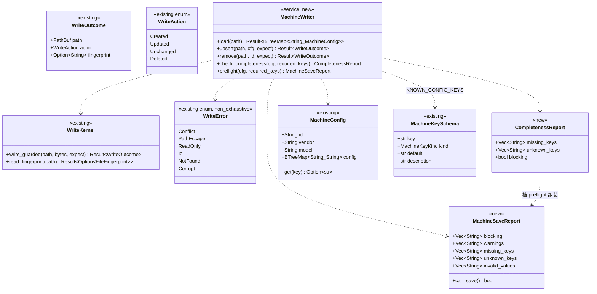
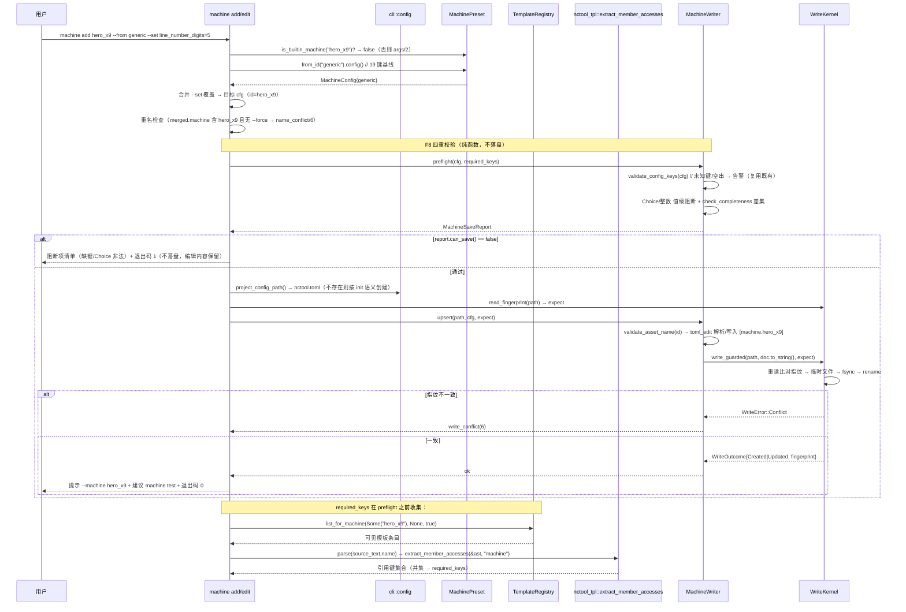
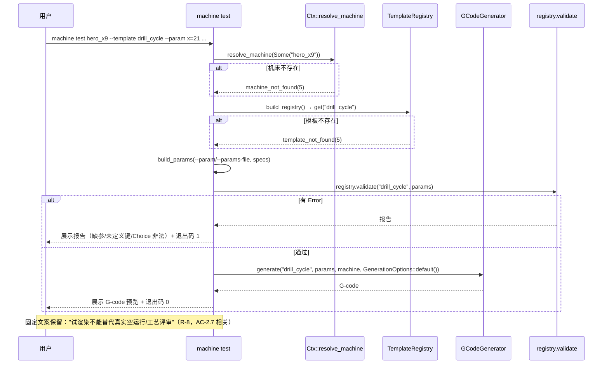
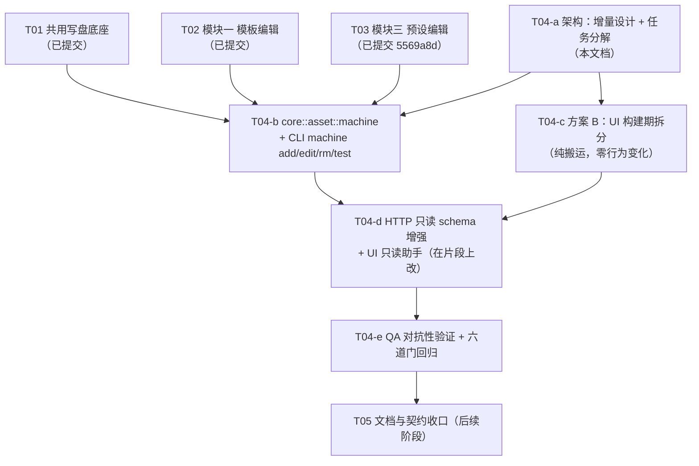

# T04 增量设计 · 模块二：机床配置编辑（`nctool.toml` 的 `toml_edit` 策略）

> 角色：架构师（高见远）｜范围：**仅设计，不写生产代码**｜上游：`ARCH_DESIGN_EDIT_MODULES.md`（主设计）、`PRD_EDIT_MODULES.md` §4、`PROJECT_PLAN_EDIT_MODULES.md`、`SYSTEM_DESIGN.md`（D7/D13/D19）
>
> 本文是**增量**设计：主设计文档已给出模块二的骨架（`core/src/asset/machine.rs`、`MachineWriter`、F7–F10 时序）。T01–T03 落地后**代码实际形态与旧设计有出入**，本文以**实际代码**为准校正，并补齐可直接施工的接口签名、错误映射、任务分解与 UI 预算结论。
>
> 依据文件（均已逐行核对）：`core/src/asset/{mod,template,preset,guard,path}.rs`、`core/src/machine.rs`、`core/src/registry.rs`、`core/src/pipeline.rs`、`cli/src/{config,cli,context,output,server}.rs`、`cli/src/commands/{machine,preset}.rs`、`src/extract.rs`、`ui/index.html`、`scripts/{api_routes.json,check_api_parity.mjs}`。

---

## 修订说明（v1.1，据 team-lead 两项决策定稿）

| 变更 | 内容 |
|---|---|
| **决策 1：维持 Q8（只读）** | 机床**不新增任何 HTTP 写端点**；写操作只在 CLI（`machine add/edit/rm/test`）。UI 只读：schema 展示 + 校验预览 + 试渲染（走既有 `/api/render`）+ CLI 命令助手。**Q8 状态由"待确认默认假设"→ 用户确认**（§1-C12）。 |
| **决策 2：执行方案 B（构建期拆分）** | 用户在看到"T03 已把 `ui/index.html` 推到 2918 行、越过 2900 硬触发线"后**明确选择执行方案 B**。故 v1.0 §6 的"不触发方案 B"结论**作废**；方案 B 作为**有序任务 T04-c** 纳入（§5、§6）。**Q8 不变**——行数约束解除**不**等于加写端点。 |
| **核实 1：`toml_edit` 依赖** | 实测 `cargo tree -p nctool-core -i toml_edit` → `toml_edit v0.22.27 └── nctool-core`；`cargo tree -p nctool-cli -i toml_edit` 显示它**原本**已由 `toml v0.8.23`（cli 直接依赖）引入 → 提为 core 直接依赖 = **零新增 crate**（§9-D12，含命令与输出）。 |
| **核实 2：`KNOWN_CONFIG_KEYS` 键数** | **实测 20 键**（三种独立计数一致），非 brief 所说的 21（§9-D7）。PRD 的"20 键"对 schema 是**对的**，但 AC-2.1"从 generic 复制全部 20 键"**错**（generic 只有 19 键，§9-D6）。 |
| **补充：文档基线更正清单** | §9-D13 列出 `PROJECT_STATUS.md`/`PROJECT_PLAN_EDIT_MODULES.md`/`PRD_EDIT_MODULES.md` 中过期的 UI 基线（2735/2766/265/234）应改之处（**只列不改**，由收口阶段统一处理）。 |
| **v1.2：Q-T04-1 批准** | `machine add` 首次创建 `nctool.toml` **写入 `EXAMPLE_CONFIG` 头注释**；补理由——**AC-2.10 golden 需要"带注释的输入"**才有验证意义（§5-T04-b 实现项 6、§8）。 |
| **v1.2：Q-T04-2 批准** | AC-2.1 更正为「**19 键基线 + `axes` 可选**」；§5-T04-b AC-2.1、§9-D6/D7 措辞统一。 |
| **v1.2：同步测试升级为硬性** | `ui_html_copies_stay_in_sync` 第 2 条断言（**Rust 侧重拼接 == 提交物**）由"建议"提升为**必须项**——它是**唯一**能在本地 `cargo test` 拦住"改了片段忘生成"的机制（§6.3 硬性要求；T04-e 对抗用例 8 钉住）。 |

---

## 0. 一句话结论（供快速决策）

1. **编辑策略**：`nctool.toml` 用 **`toml_edit` 合并式 upsert**（只改 `[machine.<id>]` 段，其余段与注释字节不变）——即 AC-2.10。`toml_edit` 已是 `nctool-core` 直接依赖，**零新增 crate**。
2. **落盘通道**：一律经 `core::asset::WriteKernel`（原子写 + 乐观锁）；`MachineWriter` 是模块二唯一写入口。
3. **退出码 0..=7 冻结**：新失败类别全部映射进既有码（缺键/Choice 非法 → `validation`(1)；重名 → `name_conflict`(6)；要删的机床不存在 → `machine_not_found`(5)；`nctool.toml` 损坏 → `config`(4)）。**不新增码**。
4. **UI 预算结论（定稿 v1.1）**：**执行方案 B（构建期拆分）**——用户明确选择。拆分后行数约束按"**每个片段文件**"计（约束实质解除），但 **Q8 不变**：UI 仍只读，**不因约束解除而加写端点**。方案 B 设计见 §6，任务见 §5-T04-c。
5. **Q8 已由用户确认（v1.1）**：机床**无 HTTP 写端点**（理由：本工具驱动真实机床、写错即撞刀；Q1 已定 CLI 为主）。AC-2.6/2.7 由既有 `GET /api/machines` + `/api/render` 满足。**v1.0 §0.5 的"冲突"已消解**：brief 的 T04-c 标题（写端点+表单）为笔误，不再采纳。

---

## 1. 增量设计说明（相对 `ARCH_DESIGN_EDIT_MODULES.md` 模块二的变更点）

T01–T03 已落地，实际代码形态与旧设计的差异如下（**设计以实际代码为准**）：

| # | 旧设计（ARCH_DESIGN §） | **实际代码** | 对 T04 的影响 |
|---|---|---|---|
| C1 | §3.1 类图 `WriteError` 仅 5 变体（Conflict/PathEscape/ReadOnly/Io/Corrupt） | **6 变体**，多 `NotFound(String)`（`asset/mod.rs:171`） | `machine rm` 删不存在的机床必须用 `WriteError::NotFound`（**不得**塞进 `Corrupt` 靠消息文本分类，D7）；映射 `machine_not_found`(5) |
| C2 | §3.1 类图 `WriteAction` 仅 3 变体 | **4 变体**，多 `Deleted`（`asset/mod.rs:119`） | `machine rm` 的 `WriteOutcome.action` 必须报 `Deleted`（`PresetStore::remove` 已示范：先 `save` 再覆写 action） |
| C3 | §3.2 `MachineWriter { upsert(req), remove(id, expect), check_completeness(cfg, keys) }`（含 `UpsertMachineRequest` 结构体） | 最新范例 `PresetStore` 用**显式参数 + `expect: Option<FileFingerprint>`**（无请求结构体） | **有意偏差**：`MachineWriter` 采用 `upsert(path, cfg, expect)` / `remove(path, id, expect)`，与 `PresetStore` 风格一致，少一层无谓抽象 |
| C4 | §7.1 "预设损坏（写时）→ `config`(4)" | `preset.rs::map_write_err` 把 `WriteError::Corrupt` → **`io`(3)** | 见 D7（文档漂移）；T04 **不照抄** preset 的映射：`nctool.toml` 损坏是**配置**问题 → `config`(4) |
| C5 | §5.3 "`server`：新增 `/api/presets`；**模板/机床写无 HTTP 端点**" | 与代码一致（`server.rs` 无 machine 写臂） | **维持**：T04 不新增机床写端点（与 brief 的 T04-c 冲突，见 §0.5） |
| C6 | §1.5 UI 预算基于 **2735 行**基线、预算 2880<2900 | 实测 **2918 行**（T03 后），对 3000 上限余量 **82** 行 | 见 D5；预算结论按 2918 重算（§6） |
| C7 | §3.2 要求 `check_spec_consistency` 迁至 `core::validate` | **已迁**（`validate.rs:514`，`template.rs:653` 注释确认） | 已闭环；T04 不依赖它（机床无 `ParamSpec`） |
| C8 | §4.2 时序图：`machine add` → `MW.check_completeness(cfg, required_keys)`，`required_keys` 由 `REG` 提供 | `extract_member_accesses(&Ast, root)` 需要 **`&Ast`**，而 `TemplateEntry` 只缓存 `Analysis{variables,refs}`（`Ast` 借用源码，无法自引用存储） | **必须由 CLI 侧 `parse(source_text, name)` 现取 `Ast`** 再调 `extract_member_accesses`；`core::asset` **不依赖注册表**（沿用 `TemplateWriter` 的"写内核不依赖注册表"约定） |
| C9 | §4.2 用 `MachinePreset::config()` 得"20 键基线" | `KNOWN_CONFIG_KEYS` = **20** 键，但 `generic_config()` = **19** 键（`axes` 是扩展键、无通用默认，不在 generic） | 见 D6：**"从 generic 复制"只能得 19 键**；AC-2.1 的"20 键"表述自相矛盾 |
| C10 | §7.8 名称校验双层（`validate_asset_name` + `SafePath::resolve`） | 机床 id **不是文件路径**（它是 TOML 表键 `[machine.<id>]`），不产生路径拼接 | **只用第一层** `validate_asset_name(id)`（拒空/`.`/`..`/分隔符/盘符前缀/控制字符）；**不需要** `SafePath`（无路径可逃逸） |
| C11 | §7.7 预设默认落配置目录、`ensure_outside_template_root` 红线 | `nctool.toml` 是**项目配置**（`find_project_config` 向上递归查找），非资产文件 | **机床不需要** `ensure_outside_template_root`：`nctool.toml` 无 `.j2` 后缀，注册表 `*.j2` 扫描**天然不收录**它（红线 9 不适用）。**不引入**该检查 |
| C12 | §9-Q8"机床无 HTTP 写端点"标为**待确认默认假设** | — | **v1.1 用户确认**：维持只读，机床无写端点。理由：本工具驱动真实机床、写错即撞刀；Q1 已定 CLI 为主。文档 §9-Q8 应升级为"已确认" |
| C13 | §1.5"不触发方案 B"（预算 2880<2900） | T03 后实测 **2918 行**，**已越过 2900 硬触发线** | **v1.1 用户选择执行方案 B**。§1.5 的"不触发"结论作废；方案 B 落地后行数约束按**每片段**计（§6） |

**未变的设计承诺（T04 继续遵守）**：写内核单一入口；`toml_edit` 合并式（AC-2.10）；内置 3 预设不可改（AC-2.2）；缺键阻断（AC-2.4）；退出码 0..=7；D7 禁消息文本决策；`line_number_digits` 夹紧 [1,32] 属 `pipeline::postprocess`（`MAX_LINE_NUMBER_DIGITS=32`）的既有内存安全契约，**写层不得复制该夹紧逻辑**（AC-2.9）。

---

## 2. 文件清单

| 相对路径 | crate | 新建/修改 | 一句话职责 |
|---|---|---|---|
| `core/src/asset/machine.rs` | nctool-core | ➕ 新建 | 机床写策略：`nctool.toml` 的 `toml_edit` 合并式 `upsert`/`remove` + 完整性/值级校验（`MachineWriter`） |
| `core/src/asset/mod.rs` | nctool-core | ✎ 修改 | `mod machine;` + 再导出 `MachineWriter`/`CONFIG_FILE`/`CompletenessReport`/`MachineSaveReport`/`is_builtin_machine` |
| `core/src/lib.rs` | nctool-core | ✎ 修改 | 根再导出上述新 `pub` 项（进 1.0 冻结清单） |
| `cli/src/cli.rs` | nctool-cli | ✎ 修改 | `MachineCommand` 增 `Add/Edit/Rm/Test` 变体 + 参数结构（`MachineAddArgs` 等）；`MachineFileArgs` |
| `cli/src/commands/machine.rs` | nctool-cli | ✎ 修改 | 实现 `add/edit/rm/test`；`required_machine_keys`（模板 → `machine.*` 键）；`machine_path`；`map_write_err` |
| `cli/src/context.rs` | nctool-cli | ✎ 修改 | 新增 `Ctx::project_config_path()`（定位待写 `nctool.toml`，复用 `config::find_project_config`） |
| `cli/src/config.rs` | nctool-cli | ✎ 修改 | `find_project_config` 提为 `pub(crate)`（供 `Ctx` 调用） |
| `cli/src/output.rs` | nctool-cli | ✎ 修改 | 新增共享 `CliError::from_write_error(err, not_found_kind)`（消 preset/machine 两份映射漂移）；`exit_code` 矩阵补注释（**不新增码**） |
| `cli/src/commands/preset.rs` | nctool-cli | ✎ 修改 | `map_write_err` 改为**委托** `output::from_write_error`（保持行为不变，消除第二份映射） |
| `cli/src/server.rs` | nctool-cli | ✎ 修改 | `GET /api/machines` 响应增 `schema` 字段（`KNOWN_CONFIG_KEYS` 序列化，只读，供 UI 展示"键含义/类型"）；**不新增路由** |
| `cli/src/commands/mod.rs` | nctool-cli | — 不变 | `machine` 已注册 |
| `ui/src/*.part.html`（7 片段） | — | ➕ 新建（T04-c 方案 B） | 前端源码真值：`00_head`/`10_style`/`20_body`/`30_script_data`/`31_script_api`/`32_script_ui`/`90_tail` |
| `scripts/build_ui.mjs` | — | ➕ 新建（T04-c 方案 B） | 按文件名升序拼接片段 → **同一份 buf 写两份**（`ui/index.html` + `cli/ui/index.html`，天然字节一致）；`--check` 比对生成物与提交物 |
| `ui/index.html` + `cli/ui/index.html` | — | ✎ 修改（**降级为构建产物**） | 由 `build_ui.mjs` 生成；T04-d 在**片段上**删除 demo-only `modalCustomMachine` 写入路径、改只读"机床配置查看 + CLI 命令助手"弹窗 |
| `core/tests/machine_write.rs` | nctool-core | ➕ 新建 | 集成：`toml_edit` 合并式写入（其余段逐字节不变）、`rm`、`preflight`、内置保护 |
| `cli/tests/cli_machine_e2e.rs` | nctool-cli | ➕ 新建 | E2E：`machine add/edit/rm/test` 退出码 + JSON 契约 + AC-2.1~2.10（**不碰既有 `cli_e2e.rs` 44 用例**） |
| `tests/golden/machine/` | — | ➕ 新建 | golden：写入前后 `nctool.toml` 其它段逐字节不变 |
| `README.md` / `docs/MACHINE_CONFIG_GUIDE.md` / `docs/SYSTEM_DESIGN.md` / `CHANGELOG.md` | — | ✎ 修改（T05） | 契约与文档同步（含本文 D 系列漂移回填） |

**不新增文件（明确排除）**：`scripts/api_routes.json`、`scripts/check_param_parity.mjs`（本设计**不新增路由**，无需改；若走附录 B 才需改）。`ui/src/*.part.html` 与 `scripts/build_ui.mjs` **v1.1 起纳入**（方案 B 已由用户确认执行）。

---

## 3. 数据结构与接口

### 3.1 类图（增量：仅列 T04 新增/变更部分）



### 3.2 `core::asset::machine` 完整公开签名（进 1.0 冻结清单）

```rust
/// 项目配置文件默认文件名（写目标 = 项目根 `nctool.toml`）。
pub const CONFIG_FILE: &str = "nctool.toml";

/// 内置预设判定（`generic`/`wfl_m65`/`index_ms40`）——不可改（AC-2.2）。
/// 转发 `MachinePreset::from_id(id).is_some()`，避免 CLI/UI/core 各写一份清单。
pub fn is_builtin_machine(id: &str) -> bool;

/// 完整性报告：模板引用的 `machine.*` 键集合 vs 配置键集合之差集。
#[derive(Debug, Clone, Default, serde::Serialize)]
#[serde(rename_all = "camelCase")]
pub struct CompletenessReport {
    /// 模板引用但配置缺失 → **阻断**（AC-2.4）。
    pub missing_keys: Vec<String>,
    /// 配置里有、schema 里没有 → **仅告警**（扩展键语义，AC-2.8）。
    pub unknown_keys: Vec<String>,
    /// = `!missing_keys.is_empty()`。
    pub blocking: bool,
}

/// 保存前总校验报告（值级阻断 + 完整性阻断 + 未知键告警）。
///
/// 结构化字段与 `blocking`/`warnings` 文本**并存**：文本供人读，结构化供消费方
/// 分支（**D7：禁止用消息文本做决策**）。
#[derive(Debug, Clone, Default, serde::Serialize)]
#[serde(rename_all = "camelCase")]
pub struct MachineSaveReport {
    /// 人类可读阻断原因（缺键 / Choice 非法 / 整数键非法）。
    pub blocking: Vec<String>,
    /// 仅告警（未知键 / 空串 / `line_number_digits` 将被夹紧的提示）。
    pub warnings: Vec<String>,
    /// 结构化：缺失的 `machine.*` 键。
    pub missing_keys: Vec<String>,
    /// 结构化：未知键。
    pub unknown_keys: Vec<String>,
    /// 结构化：值非法的键名（Choice 越界 / 整数键不可解析）。
    pub invalid_values: Vec<String>,
}

impl MachineSaveReport {
    /// 是否可落盘（`blocking` 为空）。
    pub fn can_save(&self) -> bool;
}

/// 机床写操作（模块二）唯一入口。无状态，全部关联函数。
pub struct MachineWriter;

impl MachineWriter {
    /// 读全部自定义机床（`[machine.<id>]`）。
    ///
    /// - 文件不存在 → 空表（**非**错误）；
    /// - 解析失败 → [`WriteError::Corrupt`]（**不静默返回空**——调用方据此拒绝覆盖）。
    ///
    /// 注：CLI 的**只读**命令（`machine list/show`）仍走 `config::load()`（serde `toml`，
    /// D13 降级哲学）；本函数服务**写路径**的自身读取与测试。
    pub fn load(path: &Path) -> Result<BTreeMap<String, MachineConfig>, WriteError>;

    /// 合并式 upsert：只改 `[machine.<id>]` 段，其余段与注释**字节不变**（AC-2.10）。
    ///
    /// 步骤：① `validate_asset_name(id)`；② 读现有文本（缺 → 空文档）；
    /// ③ `toml_edit::DocumentMut` 解析（失败 → `Corrupt`）；④ 写入 `[machine.<id>]`
    /// （`id`/`vendor`/`model` + `config` 子表）；⑤ `WriteKernel::write_guarded(path, doc.to_string(), expect)`。
    ///
    /// `expect`：`None` = 要求写前**文件不存在**；`Some(fp)` = 要求指纹一致。
    /// 调用方通常传 `WriteKernel::read_fingerprint(path)?`（`--expect-hash` 时改用显式指纹）。
    pub fn upsert(
        path: &Path,
        cfg: &MachineConfig,
        expect: Option<FileFingerprint>,
    ) -> Result<WriteOutcome, WriteError>;

    /// 删除 `[machine.<id>]` 段。
    ///
    /// 段不存在 → [`WriteError::NotFound`]（→ `machine_not_found`(5)）。
    /// 返回的 `WriteOutcome.action` 覆写为 [`WriteAction::Deleted`]（同 `PresetStore::remove`）。
    pub fn remove(
        path: &Path,
        id: &str,
        expect: Option<FileFingerprint>,
    ) -> Result<WriteOutcome, WriteError>;

    /// 纯函数：完整性差集（**不落盘**、**不读盘**）。
    ///
    /// `required_keys` 由调用方（CLI）从注册表收集（见 §3.4）。
    pub fn check_completeness(
        cfg: &MachineConfig,
        required_keys: &BTreeSet<String>,
    ) -> CompletenessReport;

    /// 纯函数：保存前总校验。
    ///
    /// = `validate_config_keys(cfg)`（未知键/空串告警，**复用既有**）
    ///   + **值级阻断**（Choice 越界 / 整数键不可解析）
    ///   + `check_completeness(cfg, required_keys)`（缺键阻断）。
    ///
    /// `line_number_digits` **超大值不阻断**（夹紧在 `pipeline::postprocess`，
    /// AC-2.9）——只产生一条"将被夹紧到 32"的 warning。
    pub fn preflight(
        cfg: &MachineConfig,
        required_keys: &BTreeSet<String>,
    ) -> MachineSaveReport;
}
```

> **`upsert` 是否 `force` 覆盖**：`MachineWriter` **不做**"重名拒绝"——那是 CLI 的策略（`machine add` 默认拒绝重名、`--force` 才覆盖）。理由：与 `PresetStore::upsert`（按名替换）保持一致的**写语义**，把"要不要覆盖"留给命令层，便于 `edit` 复用同一写函数。

### 3.3 错误类型与映射（**退出码 0..=7 冻结**）

`WriteError` 为 `#[non_exhaustive]`：`match` **必须带 `_` 兜底**（编译器不会提醒新增变体）。

**共享映射入口（新增于 `output.rs`，消除 preset/machine 两份漂移）**：

```rust
impl CliError {
    /// 写内核错误 → CLI 错误。`not_found_kind` 由调用方指定
    /// （preset → "preset_not_found"；machine → "machine_not_found"）。
    pub fn from_write_error(err: nctool_core::asset::WriteError, not_found_kind: &'static str) -> CliError;
}
```

**`machine` 命令的分类矩阵**（`not_found_kind = "machine_not_found"`）：

| 来源 | `CliError.kind` | 退出码 | 备注 |
|---|---|---|---|
| `WriteError::Conflict` | `write_conflict` | 6 | 乐观锁失败，不覆盖 |
| `WriteError::PathEscape`（reason 含"已存在"） | `name_conflict` | 6 | 重名 |
| `WriteError::PathEscape`（其余） | `args` | 2 | id 非法（越界/控制字符） |
| `WriteError::NotFound` | `machine_not_found` | 5 | 删/改不存在的机床 |
| `WriteError::Corrupt` | **`config`** | 4 | `nctool.toml` 损坏 → 拒绝覆盖（**有意区别于 preset 的 io(3)**，见 C4/D7） |
| `WriteError::ReadOnly` | `io` | 3 | 只读/无权限 |
| `WriteError::Io` | `io` | 3 | 其它 IO |
| `_`（未来变体） | `io` | 3 | 兜底 |
| 命令层：内置 id（`is_builtin_machine`） | `args` | 2 | AC-2.2：内置不可改 |
| 命令层：重名且无 `--force` | `name_conflict` | 6 | 与 preset 同语义 |
| 命令层：`preflight` 阻断 | `validation` | 1 | 缺键 / Choice 非法 / 整数非法 |
| 命令层：`machine rm` 无 `--yes` | `args` | 2 | 破坏性操作二次确认 |
| 命令层：`machine test` 模板不存在 | `template_not_found` | 5 | 与 `render` 同 |

> `output.rs::exit_code` 的 kind 矩阵**不改**（不新增 kind）；只补注释说明 machine 复用 `config`(4) 的判据。

### 3.4 完整性所需键的收集（CLI 侧，**不在 core**）

`core::asset` **不依赖注册表**（沿用 `TemplateWriter` 的约定）。收集逻辑住 `cli/src/commands/machine.rs`：

```rust
/// 收集"该机床可见的全部模板"引用的 `machine.*` 键。
///
/// 返回 `(keys, warnings)`：模板解析失败只记 warning、**不阻断**
/// （否则一个无关模板的语法错误会让整台机床无法保存）。
///
/// 口径（单一来源）：
/// - 模板集合 = `registry.list_for_machine(Some(id), None, /*include_hidden=*/true)`
///   —— 即"通用模板（`machine=None`）+ 归属本机床的模板"。新建机床 id 尚无模板归属，
///   故实际为全部通用模板；隐藏模板也纳入（它们可被 `include`/程序调用）。
/// - 根名 = `registry.system_vars()` 里匹配到的注入变量名（默认 `"machine"`），
///   **不硬编码**（§7.10：系统注入变量名以 `system_vars()` 为单一来源）。
/// - 每个模板：`nctool_tpl::parse(&e.source_text, &e.name)` →
///   `nctool_tpl::extract_member_accesses(&ast, root)`（返回键按出现顺序去重）。
pub(crate) fn required_machine_keys(
    ctx: &Ctx,
    machine_id: &str,
) -> Result<(BTreeSet<String>, Vec<String>), CliError>;
```

> **为何不展开 `include` 闭包**：被 `include` 的片段本身也是注册表条目；若它对本机床可见（`machine=None`），已被上面的并集覆盖；若它绑定别的机床，则**任何**机床都渲染不了它——属模板设计问题，不由机床保存兜底。此边界登记于 §10。

### 3.5 CLI 参数结构（`cli/src/cli.rs`）

```rust
#[derive(Debug, Subcommand)]
pub enum MachineCommand {
    List,
    Show(MachineShowArgs),
    /// 新建自定义机床（默认以 generic 为基线）
    Add(MachineAddArgs),
    /// 编辑既有自定义机床（合并式 upsert）
    Edit(MachineEditArgs),
    /// 删除自定义机床
    Rm(MachineRmArgs),
    /// 试渲染验证（该机床 + 目标模板）
    Test(MachineTestArgs),
}

/// machine 子命令共用的目标文件参数（默认：项目 `nctool.toml`）。
#[derive(Debug, Args)]
pub struct MachineFileArgs {
    /// 目标配置文件路径（默认：向上查找的项目 nctool.toml）
    #[arg(long, value_name = "FILE")]
    pub file: Option<PathBuf>,
}

#[derive(Debug, Args)]
pub struct MachineAddArgs {
    /// 新机床 id（内置 id 被拒：generic/wfl_m65/index_ms40）
    pub id: String,
    /// 基线预设（默认 generic）
    #[arg(long, value_name = "ID", default_value = "generic")]
    pub from: String,
    #[arg(long)]
    pub vendor: Option<String>,
    #[arg(long)]
    pub model: Option<String>,
    /// 覆盖单个配置键 k=v（可多次）
    #[arg(long = "set", value_name = "K=V")]
    pub set: Vec<String>,
    /// 覆盖已存在的同名自定义机床（默认拒绝）
    #[arg(long)]
    pub force: bool,
    /// 期望的当前文件指纹（fnv1a64:<16hex>）；不一致即并发冲突
    #[arg(long, value_name = "HASH")]
    pub expect_hash: Option<String>,
    #[command(flatten)]
    pub file: MachineFileArgs,
}

#[derive(Debug, Args)]
pub struct MachineEditArgs {
    pub id: String,
    #[arg(long)]
    pub vendor: Option<String>,
    #[arg(long)]
    pub model: Option<String>,
    #[arg(long = "set", value_name = "K=V")]
    pub set: Vec<String>,
    /// 删除配置键（可多次）
    #[arg(long = "unset", value_name = "KEY")]
    pub unset: Vec<String>,
    #[arg(long, value_name = "HASH")]
    pub expect_hash: Option<String>,
    #[command(flatten)]
    pub file: MachineFileArgs,
}

#[derive(Debug, Args)]
pub struct MachineRmArgs {
    pub id: String,
    /// 跳过二次确认（脚本场景）
    #[arg(long)]
    pub yes: bool,
    #[arg(long, value_name = "HASH")]
    pub expect_hash: Option<String>,
    #[command(flatten)]
    pub file: MachineFileArgs,
}

#[derive(Debug, Args)]
pub struct MachineTestArgs {
    pub id: String,
    /// 目标模板（注册表逻辑名）
    #[arg(long, value_name = "TEMPLATE")]
    pub template: String,
    #[command(flatten)]
    pub params: ParamInputArgs,   // 复用既有：--param k=v / --params-file
}
```

> **向后兼容**：`MachineCommand` 仅**新增**变体，`List`/`Show` 不动 → `cli_e2e.rs` 既有用例零回归。

### 3.6 HTTP 接口（**结论：不新增写端点**）

| 端点 | 变更 | 说明 |
|---|---|---|
| `GET /api/machines` | ✎ **响应增字段** | 在既有 `{machines:[...]}` 上增 `schema: [{key,kind,default,description}]`（由 `KNOWN_CONFIG_KEYS` 序列化，只读）。供 UI 展示"键含义/类型"（US-2.2），**无需新路由**。 |
| 机床写端点 | ❌ **不新增** | 维持 Q8。AC-2.6（CLI/UI 都能选到）由既有 `GET /api/machines` 读同一份 `nctool.toml` 满足；AC-2.7（试渲染一致）由既有 `/api/render` 满足。 |

> `scripts/api_routes.json` / `check_api_parity.mjs`：**本设计无需改动**（fixture 校验的是**路径集合**，增响应字段不改变路径）。若走附录 B（新增 `POST /api/machines`），则必须**同时改三处**（后端路由臂 + fixture + 前端 `API` 封装）。

---

## 4. 关键流程（F7/F8/F9/F10）

### 4.1 F7+F8+F9：新建/编辑 → 四重校验 → `toml_edit` 合并式落盘



**F8 四重校验的判据（逐条对齐 PRD §4.3 / AC）**：

| 校验 | 判据 | 处置 |
|---|---|---|
| a. 键名 | 对 `KNOWN_CONFIG_KEYS`（**20 键**）比对 | 未知键 → **告警不阻断**（AC-2.8，扩展键合法） |
| b. Choice | `units ∈ {metric, imperial}`、`feed_mode ∈ {G94, G95}`（**取自 schema 的 `MachineKeyKind::Choice`，不硬编码**） | 非法 → **阻断**（AC-2.3） |
| c. 整数 | `MachineKeyKind::Integer` 键（`program_digits`/`line_number_digits`/`max_spindle_rpm`）须可解析为整数 | 不可解析 → **阻断**；`line_number_digits` 超大值 → 仅 warning（AC-2.9，夹紧在 pipeline） |
| d. 完整性 | `required_keys − cfg.config.keys()` 差集 | 缺键 → **阻断** + 列出缺失键（AC-2.4） |

> **b/c 的单一来源**：`preflight` **必须**遍历 `KNOWN_CONFIG_KEYS` 并按其 `MachineKeyKind` 判定，**不得**在 `machine.rs` 里再抄一份"`units`/`feed_mode` 白名单"（否则 schema 加一个 Choice 键就要改两处）。`validate_config_keys` 是**只读命令**的告警入口（不阻断），`preflight` 是**写命令**的阻断入口——二者对同一 schema 表判定，语义分层（告警 vs 阻断），**不是**两份实现。

### 4.2 F10：试渲染验证（`machine test`）



**AC-2.7「与 CLI `render --machine` 逐字节一致」的实现约束**：`machine test` **必须**走与 `commands::render` **同一条管线调用**（`gen.generate(...)` + `GenerationOptions::default()`），**不得**自行拼装后处理。验收测试对同一模板/参数分别跑 `machine test <id> --template T --param ...` 与 `render T --machine <id> --param ...`，断言 stdout G-code **逐字节相等**。

---

## 5. 任务列表（有序，含依赖与验收判据）——**定稿 v1.1**

> 共 **4 个工程/QA 任务**（≤5 上限；本设计文档为 `T04-a`，不占工程任务）。
> **执行顺序 = T04-b → T04-c → T04-d → T04-e**（T04-c 可并行于 T04-b 启动，但**必须先于 T04-d 完成**）。
>
> **任务板重映射（供 team-lead 更新）**：旧 `#7`→`T04-b`（不变）；**新增 `T04-c` = 方案 B 拆分**；旧 `#8`（HTTP+UI）→ **`T04-d`**（去掉写端点、改为只读）；旧 `#9`（QA）→ **`T04-e`**。

### T04-b · core 写策略 + CLI 子命令（P0，依赖：T01/T02/T03；可与 T04-c 并行）

**改哪些文件**
- ➕ `core/src/asset/machine.rs`
- ✎ `core/src/asset/mod.rs`、`core/src/lib.rs`
- ✎ `cli/src/cli.rs`、`cli/src/commands/machine.rs`、`cli/src/context.rs`、`cli/src/config.rs`、`cli/src/output.rs`、`cli/src/commands/preset.rs`
- ➕ `core/tests/machine_write.rs`、`cli/tests/cli_machine_e2e.rs`
- ➕ `tests/golden/machine/`

**实现什么**
1. `core::asset::machine`：`MachineWriter`（`load`/`upsert`/`remove`/`check_completeness`/`preflight`）+ `CompletenessReport`/`MachineSaveReport`/`CONFIG_FILE`/`is_builtin_machine`；`upsert` 用 `toml_edit::DocumentMut` 合并式写入（只改 `[machine.<id>]`）；`remove` 用 `WriteError::NotFound` + `WriteAction::Deleted`。
2. `preflight` 遍历 `KNOWN_CONFIG_KEYS` 做 Choice/整数判定（单一来源）；`line_number_digits` 超大值仅 warning。
3. `output.rs`：新增 `CliError::from_write_error(err, not_found_kind)`；`preset.rs::map_write_err` 改为委托（行为不变）。
4. `cli.rs`：`MachineCommand` 增 `Add/Edit/Rm/Test` + 参数结构；`config.rs` 的 `find_project_config` 提 `pub(crate)`；`context.rs` 增 `Ctx::project_config_path()`。
5. `commands/machine.rs`：`add/edit/rm/test` + `required_machine_keys`（registry + `parse` + `extract_member_accesses`，根名取 `system_vars()`）+ 内置保护 + 重名策略 + `machine_path`。
6. **首次创建 `nctool.toml` 时写入 `EXAMPLE_CONFIG` 头注释**（Q-T04-1 = 是）：`machine add` 在目标文件不存在时，先以 `EXAMPLE_CONFIG`（`cli/src/config.rs`）为初始内容，再经 `toml_edit` upsert `[machine.<id>]`。**理由（两条）**：① 与 `config init` 产物一致（同一份示例）；② **AC-2.10 的 golden 测试需要一份"带注释"的 `nctool.toml`** 才能证明"其余段与注释字节不变"——若初始文件无注释，该验收等于没有输入（无注释可验）。

**验收判据**
- AC-2.1（**定稿措辞，已按代码事实更正**）：`machine add hero_x9` 默认以 generic 为基线预填 **19 键**（`axes` 为**可选扩展键、不预填**，需 `--set` 显式给）；输出标注"来自 generic"。PRD 原文"全部 20 键"更正为「**19 键基线 + `axes` 可选**」（§9-D6/D7）。
- AC-2.2：`machine add/edit/rm generic`（及 wfl_m65/index_ms40）→ `args`(2)，不落盘。
- AC-2.3：`--set units=inch` → `validation`(1)，不落盘。
- AC-2.4：删掉某必被引用键 → `validation`(1) + 列出缺失键。
- AC-2.5：保存后 `machine show hero_x9` 显示完整键值、无告警。
- AC-2.8：`--set my_ext=1` → 成功（仅告警）。
- AC-2.9：`--set line_number_digits=1000000000` → 成功（warning 提示夹紧 32）；`render` 输出仍被夹紧（既有 `pipeline` 测试保持绿）。
- AC-2.10：golden —— 写入 `[machine.hero_x9]` 后，`nctool.toml` 其余段（含 `EXAMPLE_CONFIG` 的注释）**逐字节不变**。
- AC-2.7：`machine test` 输出与 `render --machine` 逐字节一致。
- 回归：`cargo test --workspace` 全绿；`cli_e2e.rs` 44 用例不变；`Cargo.lock` **零新增 crate**（§9-D12 已实测）。

### T04-c · **方案 B：UI 构建期拆分（纯搬运，零行为变化）**（P0，无新依赖；**必须先于 T04-d**）

**改哪些文件**
- ➕ `ui/src/00_head.part.html`、`10_style.part.html`、`20_body.part.html`、`30_script_data.part.html`、`31_script_api.part.html`、`32_script_ui.part.html`、`90_tail.part.html`
- ➕ `scripts/build_ui.mjs`
- ✎ `cli/tests/cli.rs`（`ui_html_copies_stay_in_sync` 升级为**双断言**）
- ✎ `.github/workflows/*`（quality job 加 `node scripts/build_ui.mjs --check`）
- ✎（生成物，内容不变）`ui/index.html`、`cli/ui/index.html`

**实现什么**：见 §6（片段划分 / 拼装逻辑 / 字节一致 / CI 接线 / 顺序风险）。要点：按文件名升序**逐字节**拼接 → 同一份 buf 写两份 → `--check` 比对提交物。

**验收判据**
- **纯搬运**：`node scripts/build_ui.mjs --check` 对**拆分前提交物**通过；生成物 md5 **仍为** `cd6dc6861543556eb7db8e06c3461747`，行数仍 **2918**；两副本 md5 相同。
- **【硬性】** `ui_html_copies_stay_in_sync` **双断言**绿，且**第 2 条（Rust 侧重拼接 == 提交的 `ui/index.html`）必须在 `cli/tests/cli.rs` 内实现**（§6.3 硬性要求）：① 两副本相等；② 源片段重拼接 == 提交物。验证：人为改一个片段而不重生成 → `cargo test` **必红**（不依赖 `node`/CI）。
- 其余全部既有测试（含 `cli_e2e` 44 用例）**零回归**。
- 行数约束迁移为"每片段 ≤ 3000"（最大片段 `32_script_ui` ≈ 1117 行）。
- **不新增任何 UI 功能、不新增写端点**（Q8 不变）。

### T04-d · HTTP 只读增强 + UI 只读助手（在片段上改）（P0，依赖：T04-b、T04-c）

**改哪些文件**
- ✎ `cli/src/server.rs`（`GET /api/machines` 增 `schema` 字段；**不新增路由**）
- ✎ `ui/src/20_body.part.html`（新增只读"机床配置"弹窗 HTML）
- ✎ `ui/src/32_script_ui.part.html`（`customMachineBtn` → 打开只读弹窗；删 `loadCustomMachine`）
- ✎ `ui/src/90_tail.part.html`（**删除** `modalCustomMachine` + 第二 `<script>` 块）
- ✎ 重新生成 `ui/index.html` + `cli/ui/index.html`（`node scripts/build_ui.mjs`）
- ✎ `cli/src/server.rs` 内联测试（或 `cli/tests/cli.rs`）断言 schema 字段

**实现什么**
1. `machines_list` 响应增 `schema`（`KNOWN_CONFIG_KEYS` → `[{key,kind,default,description}]`；`kind` 序列化为 `"String"/"Integer"/"Choice"`，`Choice` 附候选）。
2. UI **只读**：删除 demo-only `modalCustomMachine` 写入路径（`customSaveBtn`/`customResetBtn`/`localStorage`）；`customMachineBtn` 打开只读"机床配置"弹窗 —— 当前机床键值 + schema（键/类型/含义）+ **可复制的 `nctool machine add/edit <id> ...` 命令**；试渲染复用既有 `/api/render`。
3. 两份 UI 由 `build_ui.mjs` 生成（天然一致）。

**验收判据**
- AC-2.6：`machine add` 保存后，`GET /api/machines` 立即返回该机床（读同一份 `nctool.toml`），UI 下拉可选。
- `route(&ctx,"GET","/api/machines",...)` 返回 200 且 `data.schema` 非空、含 `program_prefix` 等键。
- **无任何机床写端点**（`route` 无 `POST /api/machines`）；`check_api_parity.mjs` 仍绿（无新增 `/api/` 路径字面量）。
- 生成物两副本字节一致；`build_ui.mjs --check` 绿。

### T04-e · QA 独立对抗性验证 + 六道门回归（P0，依赖：T04-b、T04-c、T04-d）

**改哪些文件**
- ➕ `core/tests/machine_adversarial.rs`（QA 独立构造）
- ✎ `cli/tests/cli_machine_e2e.rs`（对抗用例）
- ➕ `tests/golden/machine/*`

**实现什么**：独立构造对抗用例，尝试击穿：
1. **AC-2.10 边界**：`nctool.toml` 含 `[template_dir]`/`[machine.other]`/行内注释/CRLF/尾部无换行 → upsert 后其余字节不变；`[machine.<id>]` 段内旧注释被替换（已知可接受）。
2. **id 注入**：`machine add "../evil"`、`"Z:"`、`"a/b"`、`"a\nb"`、`""`、`"generic"` → 全被拒（`args`/2 或 `name_conflict`/6）。
3. **损坏配置**：`nctool.toml` 写坏 TOML → `machine add` → `config`(4)，**原文件不被改动**。
4. **并发**：写前外部改动 → `--expect-hash` 不符 → `write_conflict`(6)。
5. **只读**：目标只读 → `io`(3)，无半成品残留（目录无 `.nctool-tmp-*`）。
6. **缺键误报**：模板不可解析时不阻断保存，仅 warning（边界登记）。
7. **AC-2.7**：`machine test` vs `render --machine` 逐字节对拍（多组参数）。
8. **方案 B 守卫**：`build_ui.mjs --check` 对"人为篡改片段后"必须报错（防"改了片段忘生成"）。

**验收判据**：六道门全绿 —— ① `cargo test --workspace`；② `cargo doc --workspace --no-deps`（`-D warnings`）；③ `node scripts/check_api_parity.mjs`；④ `node scripts/check_param_parity.mjs`；⑤ `cli_e2e.rs` 44 用例 + 退出码 0..=7 文档一致性；⑥ `node scripts/build_ui.mjs --check` + golden 无意外变更（人工 diff 复核）。覆盖率 ≥ 89%（生产口径）。

---

## 6. UI 方案 B 设计（构建期拆分）——**定稿 v1.1：执行**

**事实（实测）**：`ui/index.html` 与 `cli/ui/index.html` 均为 **2918 行**、md5 均 `cd6dc6861543556eb7db8e06c3461747`（`wc -l` / `md5sum`）。硬上限 3000 → 余量 82 行。T03 落地后已**越过 2900 硬触发线**（主设计 §1.5 / PRD §8.3 规定 >2900 必须先执行方案 B）。

**决策（用户拍板）**：**执行方案 B**（构建期拆分）。拆分后行数约束从"单文件"迁移到"**每个片段文件**"（`ARCH_DESIGN_EDIT_MODULES.md:127`）→ 约束实质解除。**Q8 不变**：UI 仍只读，不因约束解除而加写端点。

### 6.1 片段划分（`ui/src/`，按文件名升序拼接）

以当前 2918 行版本为基准（**纯搬运**，行号为拆分时锚点）：

| 片段文件 | 现文件行范围 | 内容 |
|---|---|---|
| `00_head.part.html` | 1–49 | `<!DOCTYPE html>` / `<html>` / `<head>` / meta / `<title>`（`<style>` 之前） |
| `10_style.part.html` | 50–581 | `<style>…</style>` 全部 CSS |
| `20_body.part.html` | 582–835 | `</head>` + `<body>` + 主体标记 + 5 个只读弹窗（`modalSrc`/`modalDerive`/`modalPreset`/`modalBatch`/`modalAbout`） |
| `30_script_data.part.html` | 836–1521 | 主 `<script>` 开标签 + 数据区（`TEMPLATES`/`BASE_CONFIG`/`MACHINE_PRESETS`/mock 注册表与预设数据） |
| `31_script_api.part.html` | 1522–1755 | `const API = {…}` + `const API_MACHINES = {…}`（请求封装与 mock） |
| `32_script_ui.part.html` | 1756–2872 | 渲染 / 事件 / `init`（含 `LS`、`renderSidebar`、`doRender`、`init`）+ `</script>` 闭标签 |
| `90_tail.part.html` | 2873–2918 | 尾部注释 + `modalCustomMachine`（**T04-d 删除**）+ 第二 `<script>` 块 + `</body></html>` |

**拼接规则（硬性）**
1. 顺序 = **文件名升序**（`00_`→`90_`；前缀即序号）。
2. **逐字节**拼接，片段间**不加**任何分隔符 / 换行 / trim / normalize（否则破坏字节一致）。
3. 以 UTF-8 读写；不改换行符。
4. 允许标签跨片段（`<script>` 在 `30_`、`</script>` 在 `32_`，拼接后闭合）；但**单个片段不保证**是合法 HTML —— 只有拼装产物是。
5. **拼接结果必须逐字节等于拆分前的 `ui/index.html`**（md5 `cd6dc6861543556eb7db8e06c3461747`）。

### 6.2 `scripts/build_ui.mjs`（拼装逻辑）

```
用法：node scripts/build_ui.mjs [--check]
逻辑：
  1. readdir('ui/src') → 过滤 *.part.html → 按文件名升序排序
  2. 逐个 readFileSync(utf8) → 依次 push_str 到同一个字符串/缓冲 → buf
  3. 若 --check：
       a. 读 ui/index.html 与 cli/ui/index.html（若存在）
       b. 任一与 buf 不等 → stderr 打印首个差异字节偏移 + 上下文 → exit 1
       c. 两副本互不相等 → exit 1
       d. 全部相等 → 打印 "✓ 生成物与提交物一致" → exit 0（不写盘）
     否则（写模式）：
       a. fs.writeFileSync('ui/index.html', buf)
       b. fs.writeFileSync('cli/ui/index.html', buf)   // 同一份 buf 写两次
       c. 读回两份自检相等（防外部篡改）→ 打印 "✓ 已生成两份（N 行，md5 ...）"
```

**字节一致的保证（关键）**：两份由**同一份 `buf`** 写出（**不是**"先写一份再复制"，也**不是**两次独立拼接）→ **天然逐字节一致**；脚本仍读回两份做一次自检。这消除了"两次拼接因排序/编码差异漂移"的可能。

- **Node 已在 CI**（`check_api_parity.mjs` 已用）→ **无新工具链**。
- 使用 `fs.writeFileSync(path, buf)`（不指定编码，`buf` 为 Buffer 时按二进制写出；若用字符串则显式 `"utf8"`，与读取一致）。

### 6.3 运行时与同步测试

- **`include_str!` 不变**：`cli/src/server.rs:38` 仍 `include_str!("../ui/index.html")`（读**生成物**）；运行时仍是单文件内嵌，`nctool ui` 行为不变。
- **`ui/index.html` 降级为构建产物**：源码真值上移到 `ui/src/*.part.html`。
- **同步测试升级**（`cli/tests/cli.rs::ui_html_copies_stay_in_sync`）→ **双断言**：
  1. `cli/ui/index.html` 与 `ui/index.html` **字节相等**（原断言保留）；
  2. 测试内**重新拼接** `ui/src/*.part.html`（`read_dir` + 排序 + `read_to_string` + `push_str`）并与提交的 `ui/index.html` 比对；不等即红。
  - 在 **Rust 侧**实现拼接（零依赖、不依赖 node 是否可用）。

> **【硬性要求（v1.2 提升，非可选项）】** 第 2 条断言（**片段重拼接结果 == 提交的 `ui/index.html`**）是**必须项**，不是建议。
>
> **为什么必须在 Rust 侧（覆盖"--check 只在 CI 跑"的缺口）**：`scripts/build_ui.mjs --check` **只在 CI** 执行。本地开发若有人改了 `ui/src/32_script_ui.part.html` 而**忘了**跑生成脚本，则 `ui/index.html` 会**陈旧**——此时：
> - `--check` 本地不跑 → 不报警；
> - 第 1 条断言（两副本相等）**照样通过**（两份都陈旧，彼此仍相等）→ **也拦不住**。
>
> 因此**唯一**能在本地 `cargo test` 阶段拦住"改了片段忘生成"的，就是第 2 条：它**直接**比对"源片段重拼接"与"提交的生成物"。只要两者不等，`cargo test` 即红——**无需**运行 `node`。故该断言**必须**存在于 Rust 测试中（不得只在 `build_ui.mjs --check` 里实现）。
>
> **验收钉住**：T04-e 对抗用例 8 专项验证——人为改一个片段（如往 `32_script_ui.part.html` 加一行）而**不**重生成，`cargo test` **必须红**。

### 6.4 CI 接线

- quality job **新增** `node scripts/build_ui.mjs --check`（与 `node scripts/check_api_parity.mjs` 同 job）。
- 语义：生成物与提交物不一致 → 非 0 → 门禁红（防"改了片段忘生成"或"直接手改生成物"）。

### 6.5 顺序风险（**明确建议：先拆分，再改功能**）

**建议：T04-c（纯搬运拆分）先做，且独立成一个 commit；T04-d（只读助手功能改动）在其后进行。**

**理由**
1. **唯一正确性判据**：构建脚本是否正确的**唯一判据**是"拼接产物 == 拆分前的提交文件"。只有**纯搬运**才能断言这一点（md5 不变）；若同时改功能，产物差异**无法归因**——是拆错了还是功能改动？调试成本陡增。
2. **可评审 / 可回滚**：纯搬运 commit 的 `git diff` 只体现"新增片段 + 生成物内容不变"，评审成本最低；功能改动 commit 的 diff 局部化在 `20_body`/`32_script_ui`/`90_tail`，评审聚焦。
3. **风险隔离**：方案 B 引入构建步骤（改开发流程），本身有风险；与功能改动分离后，若拆分出问题可单独回滚而不丢功能。

**如何验证"拆分本身没引入行为变化"**
- ① `node scripts/build_ui.mjs --check` 对**拆分前**提交文件**通过**（md5 仍 `cd6dc686…`，行数仍 2918）；
- ② 两副本 md5 相同；
- ③ `cli/tests/cli.rs` 全部（含升级后的双断言）绿；
- ④ `cli_e2e.rs`（含 UI 相关）绿；
- ⑤ 人工 `git diff --stat ui/index.html cli/ui/index.html` 确认**无实质改动**（理想为空 diff）；
- ⑥ 提交前 `git status` 确认只有新增片段 + 脚本 + 测试改动。

### 6.6 行数约束迁移

- 3000 行上限从"单文件"改为"**每个片段文件**"→ 约束实质解除（最大片段 `32_script_ui` ≈ 1117 行，远低于 3000）。
- **Q8 不变**：约束解除**不**意味着加写端点；T04-d 的 UI 仍为只读。

---

## 7. 共享知识（跨文件约定，必须统一）

1. **退出码 0..=7 冻结**：machine 复用既有 kind（`validation`/`args`/`io`/`config`/`machine_not_found`/`write_conflict`/`name_conflict`）；**不新增码**（`cli/tests/cli_e2e.rs:697` 断言 `0..=7` 连续，README 矩阵同步）。
2. **JSON 包络**：成功 `{ok:true,data}`、失败 `{ok:false,error:{kind,message}}`（CLI 与 HTTP 同形）。
3. **结构化优先（D7）**：缺键/未知键/非法值以**结构化字段**给出（`missingKeys`/`unknownKeys`/`invalidValues`），**禁止**消费方靠解析消息文本分支。
4. **原子写**：一律 `WriteKernel::write_guarded`（同目录临时文件 `<target>.nctool-tmp-<pid>-<nanos>.tmp` → fsync → rename）；**唯一例外**是 `rename` 删除旧文件（无删除原语）。机床写**无**删除文件需求（只改段）。
5. **乐观锁**：`FileFingerprint{hash, len, mtime}`；写前重读比对，任一不同即 `Conflict`。**禁用纯 mtime**。
6. **`toml_edit` 合并式（AC-2.10）**：只改 `[machine.<id>]` 段；`doc.to_string()` 由 `toml_edit` 保格式重放，**其余段与注释字节不变**；目标段内的旧注释可能被替换（可接受）。
7. **名称校验**：机床 id 走 `validate_asset_name`（唯一 `Component::Normal`；拒空/`.`/`..`/分隔符/盘符前缀/控制字符）。**不需要 `SafePath`**（id 不成为文件路径）。
8. **内置不可改（AC-2.2）**：`is_builtin_machine(id)` 为单一判据；CLI 拒、UI 无入口、`MachinePreset` 仍 `Copy` 不可变。
9. **schema 单一来源**：`KNOWN_CONFIG_KEYS`（**20 键**）是键名/类型/默认/说明的唯一来源；CLI/HTTP/UI 均从中派生，**禁止**在别处再抄白名单（`units`/`feed_mode`）。
10. **`machine.*` 键提取**：仅收集点访问 `machine.<key>` 与常量字符串下标 `machine["<key>"]`；根名取 `registry.system_vars()`；动态下标不收集（已知边界）。
11. **`line_number_digits` 夹紧**：`[1,32]` 由 `pipeline::postprocess`（`MAX_LINE_NUMBER_DIGITS=32`）执行；**写层不得复制**该逻辑，只提示。
12. **安全文案不可弱化（R-8）**：`machine test` 输出**必须**保留"试渲染不能替代真实空运行/工艺评审"。
13. **golden 不自动改（R-6）**：写操作不刷新 golden；人工 `NCTOOL_UPDATE_GOLDEN` + diff 复核。
14. **UI 生成物与源片段（方案 B）**：源码真值在 `ui/src/*.part.html`；`ui/index.html` 与 `cli/ui/index.html` 是**构建产物**，由 `scripts/build_ui.mjs` 从**同一份 buf** 写出（天然字节一致）。改 UI 必须**改片段 + 重新生成**，禁止直接手改生成物（`build_ui.mjs --check` + `ui_html_copies_stay_in_sync` 双断言守卫）。
15. **开发环境**：Windows；`cargo` 一律带 `--workspace`；改完跑 `cargo doc --workspace --no-deps`；改 UI 后跑 `node scripts/build_ui.mjs`（或 `--check`）。
16. **方案 B 行数约束**：3000 行上限按**每个片段文件**计（不再按单文件）。**Q8 不变**：约束解除不等于加写端点。

---

## 8. 风险与待明确事项

| # | 事项 | 风险 | 处置 / 建议 |
|---|---|---|---|
| R1 | ~~brief 的 T04-c 标题与 Q8 冲突~~ | — | **已消解（v1.1）**：Q8 由用户确认维持只读；brief 标题为笔误，不采纳。机床**无 HTTP 写端点** |
| R2 | **方案 B 引入构建步骤**（改开发流程） | 中 | 先做**纯搬运拆分**（独立 commit，md5 不变）→ 再改功能（§6.5）；`build_ui.mjs --check` 进 CI 门禁；同步测试升级为双断言 |
| R2b | **"改了片段忘生成"** 或"直接手改生成物" | 中 | `build_ui.mjs --check` 门禁 + Rust 侧重拼接断言（T04-e 对抗用例 8 专项验证） |
| R3 | 机床 id 是 TOML 表键，`toml_edit` 对含 `"`/`.`/空格的键需引号 | 中 | `validate_asset_name` 已拒分隔符/控制字符；`toml_edit` 自动对需引号的键加引号。**补测试**：`--set "weird key"=1` 的行为（键名本身来自 schema，正常不含空格） |
| R4 | `preflight` 的 Choice/整数判定与只读 `validate_config_keys` 语义分层 | 中 | 二者**共用同一 schema 表**，非两份实现；补"同一 cfg 两入口判定一致"测试（参考 `validate_with_vars_agrees`） |
| R5 | 模板不可解析时不阻断保存（完整性可能漏键） | 低 | 边界登记（§10）；保存后 `machine test` 会暴露；不阻断优先（避免无关模板语法错误锁死机床保存） |
| R6 | `nctool.toml` 不存在时 `machine add` 的"创建"语义 | 中 | 复用 `config init` 等价流程：`upsert` 对不存在文件 `expect=None` 创建；**建议写入 `EXAMPLE_CONFIG` 头注释**（保持与 `config init` 产物一致）——待明确 |
| R7 | 两个 TOML 读取器（cli 的 serde `toml` vs core 的 `toml_edit`） | 低 | 读路径仍 serde（D13 降级），写路径 `toml_edit`（保注释）；**有意分层**，登记 |
| R8 | `--expect-hash` 与自动 `read_fingerprint` 的优先级 | 低 | `--expect-hash` 显式给出时**以它为准**（不再自动读）；需解析 `fnv1a64:<16hex>` 格式，非法格式 → `args`(2) |
| R9 | `machine edit` 对**内置 id** 的处置 | 低 | `edit generic` → `args`(2)（AC-2.2）；提示"派生一份自定义机床"（`machine add <new> --from generic`） |

### 待明确（需 team-lead / 产品确认）
- ~~**Q-T04-1**：`machine add` 首次创建 `nctool.toml` 是否写入 `EXAMPLE_CONFIG` 头注释？~~ **已决（v1.2）：是。** 理由：① 与 `config init` 产物一致；② **AC-2.10 golden 需要一份带注释的 `nctool.toml` 才有输入可验**（见 §5-T04-b 实现项 6）。
- ~~**Q-T04-2**：AC-2.1 的"20 键"是否改为"19 键基线 + `axes` 可选"？~~ **已决（v1.2）：是。** 按代码事实更正（§5-T04-b AC-2.1、§9-D6/D7 措辞已统一）。
- ~~**Q-T04-3**：是否采纳只读 UI 方案 / 是否触发方案 B？~~ **已决（v1.1）**：维持只读（Q8 确认）+ **执行方案 B**。

---

## 9. 文档漂移清单（核查中发现的"文档说的 ≠ 代码实际"）

| # | 文档 | 文档说 | 代码实际 | 建议 |
|---|---|---|---|---|
| **D1** | `ARCH_DESIGN_EDIT_MODULES.md` §3.1 类图 | `WriteError` 5 变体（Conflict/PathEscape/ReadOnly/Io/Corrupt） | **6 变体**，多 `NotFound(String)`（`asset/mod.rs:171`） | 回填类图 |
| **D2** | 同上 §3.1 类图 | `WriteAction` 3 变体 | **4 变体**，多 `Deleted`（`asset/mod.rs:119`） | 回填类图 |
| **D3** | 同上 §3.2 | `MachineWriter{upsert(req), remove(id,expect), check_completeness(cfg,keys)}`（`UpsertMachineRequest`） | 实际采用 `upsert(path,cfg,expect)` 风格（对齐 `PresetStore`） | 回填为本文 §3.2 |
| **D4** | 同上 §7.1 | "预设损坏（写时）→ `config`(4)" | `preset.rs::map_write_err` 把 `Corrupt` → **`io`(3)** | 回填或改实现（本文 T04 用 `config`(4) 于机床，**不**统一 preset） |
| **D5** | 同上 §1.5 + `PROJECT_PLAN` §1/§3.1 | UI 基线 2735 行、预算 2880<2900、余量 265 行 | 实测 **2918 行**，对 3000 余量 **82 行** | 回填预算表 |
| **D6** | `PRD_EDIT_MODULES.md` §4.1 / AC-2.1；`PROJECT_PLAN` §3.4；`ARCH_DESIGN` §4.2 | "预填**全部 20 键**（从 generic 复制）" | `KNOWN_CONFIG_KEYS` = **20 键**，但 `generic_config()` = **19 键**（`axes` 无通用默认、不在 generic）→ "从 generic 复制"只能得 **19 键** | 表述改为"19 键基线 + `axes` 可选" |
| **D7** | **team-lead brief** | "`KNOWN_CONFIG_KEYS`（**实测 21 个键**）" | **实测 20 键**（三种独立计数一致：`MachineKeySchema{` 块 = 20、`key:` 行 = 20、编号列表 1..20；命令与输出见 D12 同款方法） | 更正 brief 的 21 → **20**；PRD 的"20 键"对 **schema** 是**对的**（错的是 AC-2.1 的"从 generic 复制 20 键"，见 D6） |
| **D8** | `ARCH_DESIGN_EDIT_MODULES.md` §1.5 | 改 `modalCustomMachine`（`:2692`） | `modalCustomMachine` 实际在 **2874–2916**；`:2692` 是机床下拉 change 处理器 | 更正行号 |
| **D9** | `ARCH_DESIGN` §3.2 "现状（T02 回填）" | "`check_spec_consistency` 仍在 `core::asset::template`（`check_spec_self_consistency`），须搬迁" | **已迁至 `core::validate::check_spec_consistency`**（`validate.rs:514`；`template.rs:653` 注释确认） | 删除过期"现状"注 |
| **D10** | `PROJECT_PLAN` §T04（315 行）| UI 增量 "+15 或净减" | 与 brief 的 T04-c"UI schema 表单"**冲突** | **已消解（v1.1）**：Q8 维持只读 + 执行方案 B；§T04 应改为"UI 只读 + 方案 B 拆分" |
| **D11** | `ARCH_DESIGN` §4.2 时序图 | `REG->>MW: required_keys`（注册表直接给写内核） | `extract_member_accesses` 需 `&Ast`，`TemplateEntry` 只缓存 `Analysis`；`core::asset` 不依赖注册表 → **必须由 CLI 收集** | 更正时序图参与者 |
| **D12** | 本文 v1.0 §0 / brief 疑问 | "`toml_edit` 未直连验证依赖树" | **实测已确认**（见下方"实测证据"）：`toml_edit` 是 `nctool-core` 直接依赖，且**原本**已由 cli 的 `toml 0.8` 传递引入 → **零新增 crate** | 已核实，登记 |
| **D13** | `PROJECT_STATUS.md` / `PROJECT_PLAN_EDIT_MODULES.md` / `PRD_EDIT_MODULES.md` | UI 基线 2735 / 2766 行、余量 265 / 234 行、md5 `a45f60cb…` | 实测 **2918 行**、余量 **82 行**、md5 **`cd6dc6861543556eb7db8e06c3461747`** | 见下方"更正清单"（**只列不改**，收口阶段统一处理） |

### D12 实测证据（依赖树与键数）

```
$ cargo tree -p nctool-core -i toml_edit
toml_edit v0.22.27
└── nctool-core v0.3.0 (D:\Desktop\nctool\rustjinja\core)

$ cargo tree -p nctool-cli -i toml_edit
toml_edit v0.22.27
├── nctool-core v0.3.0 (D:\Desktop\nctool\rustjinja\core)
│   └── nctool-cli v0.3.0 (D:\Desktop\nctool\rustjinja\cli)
└── toml v0.8.23
    └── nctool-cli v0.3.0 (D:\Desktop\nctool\rustjinja\cli)

# Cargo.lock：toml 0.8.23 的 dependencies 含 toml_edit（即 toml_edit 本就在树中）
$ grep -n -A8 '^name = "toml"$' Cargo.lock   # → toml 0.8.23 → deps: serde, serde_spanned, toml_datetime, toml_edit

# 键数（三法一致 = 20）
$ awk '/pub const KNOWN_CONFIG_KEYS/,/^\];/' core/src/machine.rs | grep -c 'MachineKeySchema {'   # 20
$ awk '/pub const KNOWN_CONFIG_KEYS/,/^\];/' core/src/machine.rs | grep -c 'key: "'            # 20
$ awk '/fn generic_config/,/^}/' core/src/machine.rs | grep -c '^\s*("'                        # 19
```

**结论**：① `toml_edit` 是 core 直接依赖，**且提为直接依赖不新增任何 crate**（原本经 `toml` 已在树中）；② `KNOWN_CONFIG_KEYS` = **20 键**，`generic_config()` = **19 键**。

### D13 更正清单（**只列应改之处，不改文档**；由收口阶段统一处理）

| 文档 : 行 | 现记（过期） | 应改为 |
|---|---|---|
| `PROJECT_STATUS.md:37` | "**2766 行** … 余量 234 行"（md5 `a45f60cb…`） | "**2918 行**，余量 82 行"（md5 `cd6dc686…`） |
| `PROJECT_STATUS.md:40,47` | "UI **2766 行**" | "UI **2918 行**" |
| `PROJECT_STATUS.md:203` | "**2766 行** ×2 副本 … 余量收窄至 **234 行**" | "2918 行 ×2 … 余量 82 行" |
| `PROJECT_STATUS.md:265`（R3） | "2081→2685→**2766 行**（09-20，T02），余量 234 行" | "…→**2918 行**（T03 后），余量 82 行；**已执行方案 B**" |
| `PROJECT_PLAN_EDIT_MODULES.md:19` | "距 3000 行上限**仅 265 行**" | "仅 **82 行**" |
| `PROJECT_PLAN_EDIT_MODULES.md:51` | "实测 **2735 行** … 余量仅 **265 行**" | "实测 **2918 行** … 余量 82 行" |
| `PROJECT_PLAN_EDIT_MODULES.md:335`（D-4） | "2735 → ≈2880 < 2900 → **不触发拆分**" | "T03 后 **2918 行**已越 2900 → **执行方案 B**（用户确认）" |
| `PROJECT_PLAN_EDIT_MODULES.md:391` | "各 **2766 行**（+44/−13）" | "T03 后 **2918 行**" |
| `PROJECT_PLAN_EDIT_MODULES.md:436`（R-7） | ">2900 行硬触发方案 B" | "**已触发并执行**" |
| `PRD_EDIT_MODULES.md:20`（C4） | "实测 **2735 行** … 余量仅 **265 行**" | "实测 **2918 行** … 余量 82 行" |
| `PRD_EDIT_MODULES.md:447` | "当前 **2735 行** … 余量仅 **265 行**" | "当前 **2918 行** … 余量 82 行" |
| `PRD_EDIT_MODULES.md:469-477` | "UI 增量 < 265 行" / ">2900 行 → 必须先执行方案 B" | "**已执行方案 B**（P2→已采纳）" |
| `PRD_EDIT_MODULES.md:517`（Q1） | "UI 增量 < 265 行" | "UI 只读 + 方案 B 拆分" |
| `ARCH_DESIGN_EDIT_MODULES.md:107,116,118,684` | 2735 基线 / 2880<2900 / "不触发" | "2918 基线 / **执行方案 B**" |
| `ARCH_DESIGN_EDIT_MODULES.md:690`（Q8） | "待确认默认假设" | "**已确认**：机床无 HTTP 写端点" |

---

## 10. 已知边界登记（有意接受/延后）

| 边界 | 处置与理由 |
|---|---|
| **模板不可解析时完整性漏检** | 该类模板只记 warning、不阻断机床保存。理由：一个无关模板的语法错误不应锁死机床编辑；保存后 `machine test` 会暴露真实渲染失败。 |
| **`include` 闭包内的机床键不展开** | 被 `include` 片段若对本机床可见，已被"通用模板并集"覆盖；若绑定别的机床则任何机床都渲染不了它（模板设计问题）。 |
| **`[machine.<id>]` 段内旧注释被替换** | `toml_edit` 替换目标子表会丢弃该段内的手写注释；**其余段不受影响**（AC-2.10 只要求"其它段不变"）。 |
| **`upsert` 的读-改-写 TOCTOU 窗口** | 沿用设计既定取舍（单用户本地工具，跨进程并发写同一文件非当前场景）；`--expect-hash` 可显式加固。 |
| **Windows 保留设备名**（`CON`/`NUL`/`COM1`） | 沿用 T01 登记：`validate_asset_name` 未拦截；机床 id 是 TOML 键而非文件名，威胁更低。延后。 |
| **`machine add` 首次创建的 `nctool.toml` 含 `EXAMPLE_CONFIG` 头注释、`template_dir` 仍为注释** | 已定（**Q-T04-1 = 是**）：首次创建以 `EXAMPLE_CONFIG` 为初始内容（与 `config init` 一致），**同时为 AC-2.10 golden 提供"带注释的输入"**——否则"其余段与注释字节不变"无输入可验。`template_dir` 保持注释状态，不影响机床功能。 |

---

## 11. 附录 B（**不采纳，仅留档**）："HTTP 机床写端点 + UI schema 表单"

> **状态（v1.1）：不采纳。** 用户已拍板维持 Q8（机床无 HTTP 写端点）+ 执行方案 B（只读 UI）。本附录**仅留档**，供将来若改判 Q8 时参考；**当前实现不要做**。
>
> 原说明：此方案**与 Q8 冲突**、**必然越过 UI 3000 行上限**（触发方案 B）。

1. **新增路由**（`server.rs::route`）：`POST /api/machines`（保存/覆盖，体 `{id,vendor,model,config,force}`）、`POST /api/machines/delete`（体 `{id}`）。校验链与 `machine add/edit` **逐条一致**（内置保护 → 重名 → `preflight` 阻断 → `MachineWriter::upsert`）。
2. **三处同步（硬要求）**：`scripts/api_routes.json` 增两条 `routes`；前端 `API.saveMachine/deleteMachine` 封装；`server.rs` 路由臂 + `api_routes_are_routable` 消费。
3. **错误状态码**（沿用 `write_error_resp` 口径，注意 kind 与 machine 对齐）：`name_conflict`→409、`write_conflict`→409、缺键/Choice→400 `validation`、`machine_not_found`→404、`config`(损坏)→500、只读→500。
4. **UI**：schema 表单（`GET /api/machines` 的 `schema` 驱动）+ 保存/删除按钮。预计 **+180~250 行** → **触发方案 B**（拆分 `ui/src/*.part.html` + `build_ui.mjs` + 同步测试升级）。
5. **安全**：仍须"仅回环 + 跨站防护 + 走 `WriteKernel`"三条不破；`machine` 写端点扩大攻击面，需在 `SYSTEM_DESIGN.md` 记档并显式改判 Q8。

---

## 12. 任务依赖图（定稿 v1.1）



> 顺序约束：`T04-c`（拆分）**必须先于** `T04-d`（功能改动），理由见 §6.5。`T04-b` 与 `T04-c` 可并行。

---

## 13. 交付物索引

- 本文：`docs/ARCH_DESIGN_T04_MACHINE.md`（定稿 v1.1）
- 类图：`docs/t04-class-diagram.mermaid`（`MachineWriter` 增量类图）
- 时序图：`docs/t04-sequence-diagram.mermaid`（F7–F10）
- 定稿变更：Q8 确认只读；方案 B 转为执行（T04-c）；`toml_edit` 依赖与键数实测证据（§9-D12）；文档基线更正清单（§9-D13）
