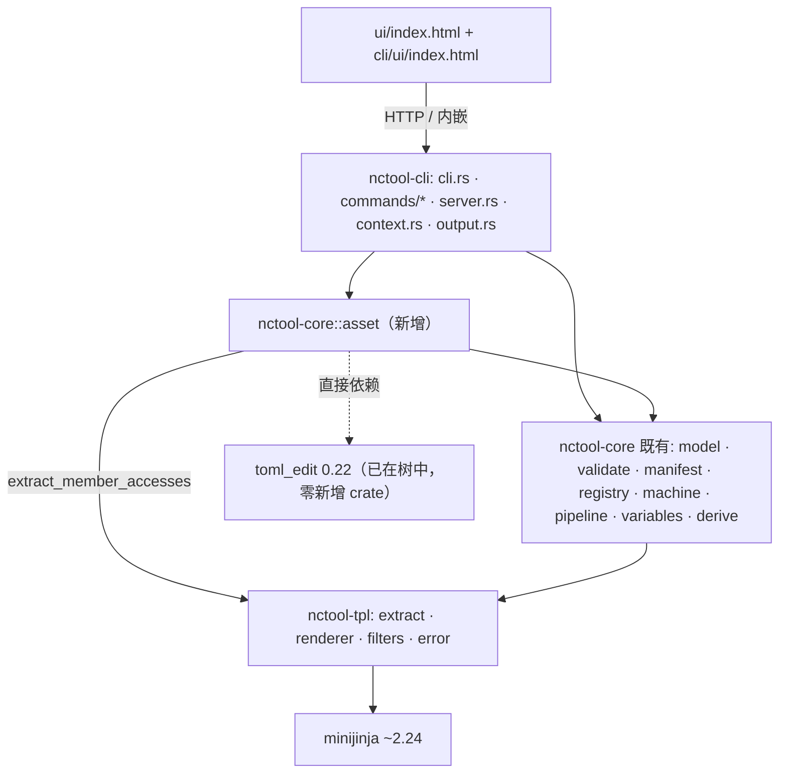
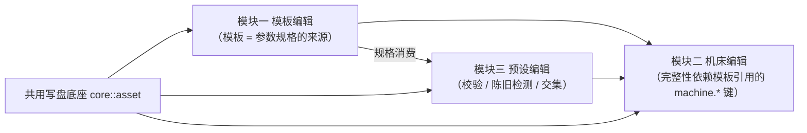
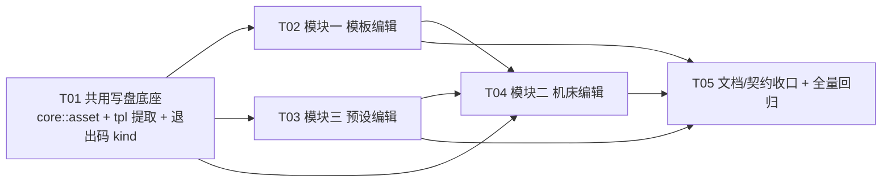

# nctool 三大编辑模块 · 项目计划

> 版本 v1.0 · 2026-09-20 · 编制：软件开发团队（主理人 齐活林 / PM 许清楚 / 架构师 高见远）
> 目标：实现**模板编辑**、**机床配置编辑**、**预设参数编辑**三个核心功能模块
> 配套文档：[`PRD_EDIT_MODULES.md`](PRD_EDIT_MODULES.md)（需求）· [`ARCH_DESIGN_EDIT_MODULES.md`](ARCH_DESIGN_EDIT_MODULES.md)（架构与任务分解）

---

## 0. 一页速览（TL;DR）

| 项 | 结论 |
|---|---|
| **要做什么** | 把 nctool 从「能用的渲染器」补齐为「能维护资产的模板工作台」——模板 / 机床 / 参数集三份资产都能在工具内**创建、修改、复用**，且所有写入都受与渲染**同源的校验**保护 |
| **真实起点** | ⚠️ **三个模块都不是从零开始**。预设编辑前端**已完整实现**（localStorage）；机床/模板编辑在**演示模式**已有界面，但在服务模式被显式禁用。真缺口 = **持久化到 CLI 可见的位置 + schema 化校验 + 写操作安全 + UI 硬上限落位** |
| **后端现状** | `cli/src/server.rs` 的 **7 条路由全部只读**，**没有任何写端点** |
| **核心风险** | 写操作 = 全新攻击面（路径穿越 / 并发覆盖 / 半成品写入），而这是**给机床发指令的工具**，静默写错即撞刀 |
| **方案骨架** | 新增领域层**唯一写内核 `core::asset`**（原子写 + 乐观锁 + 路径防护），按格式挂三种编辑策略；**CLI 为主入口，UI 为辅** |
| **规模** | 5 个阶段（T01 底座 → T02 模块一 → T03 模块三 → T04 模块二 → T05 收口），新增 8 个源文件 + 3 个测试文件，**零新增第三方 crate** |
| **硬约束** | 退出码 0–7 **冻结**（有测试强制）；`ui/index.html` 距 3000 行上限**仅 265 行**；golden 基线 21+3 不得自动改 |
| **执行进度** | **T01 共用写盘底座已完成并通过 QA 独立验证**（路由 NoOne；641 测试全绿、覆盖率 89.35%、零新增 crate）。T02–T05 待启动。详见 §6.7 |
| **已拍板决策** | Q1 编辑主入口 = **CLI 为主、UI 为辅**；Q2 预设持久化 = **文件后端默认启用、落配置目录**；Q4 机床缺键 = **阻断保存** |

---

## 1. 现状基线（全部为实测，非文档转抄）

### 1.1 已有能力

| 层 | 状态 |
|---|---|
| **消费链路** | ✅ 完整：「选模板 → 填参数 → 校验 → 渲染 → 导出」已打通，Web UI 人工验收 37/37 通过 |
| **模板** | 只读浏览（`templates list/show`、UI 列表/详情/源码）+ 骨架生成（`templates new`，含路径穿越防护） |
| **机床** | 3 个内置预设（`generic`/`wfl_m65`/`index_ms40`，**刻意不可改**）+ 20 键 schema + `nctool.toml` 手写自定义 |
| **预设** | 前端 `localStorage["nctool.presets"]` **已完整实现**：保存（`⌘/Ctrl+S`）/ 载入（模板卡 chips + 参数区 chips）/ 删除 / 列表 |
| **质量基座** | 536 项测试全绿；覆盖率生产口径 90.34%（门禁 ≥ 89%）；CI 三平台矩阵 + 覆盖率门 + 前后端对拍门 |

### 1.2 缺口（本计划的靶子）

| 模块 | 演示模式 | 服务模式 | 真缺口 |
|---|---|---|---|
| 模板编辑 | 有源码抽屉 + 保存（仅写内存，重启还原） | **被显式禁用**（`ui/index.html:2548`） | **写 API + 落盘 + 并发防护**全缺 |
| 机床配置编辑 | 有自定义机床抽屉（**原始 JSON 文本框** → localStorage） | **被显式禁用**（`:2598`） | 无 schema 表单、无键名/Choice 校验、无完整性检查、**CLI 看不到** |
| 预设参数编辑 | ✅ 已完整实现 | 未加守卫，两模式都能用 | **只存浏览器**：换机即丢、CLI 不可见、无陈旧检测、无导入导出 |

### 1.3 三条决定方案形态的硬事实

| # | 事实 | 证据 | 影响 |
|---|---|---|---|
| 1 | **`toml_edit 0.22.27` 已在依赖树中**（`toml 0.8` 的传递依赖） | `Cargo.lock:802-811, 823` | 提为直接依赖 = **构建图零新增 crate**，使「注释保全」成为免费方案 |
| 2 | **退出码矩阵被测试强制恰好覆盖 0..=7** | `cli/tests/cli_e2e.rs:697`（`let want = (0..=7)...`） | **绝不能新增退出码**，新失败类别必须映射进既有码 |
| 3 | **`ui/index.html` 实测 2735 行**（两份 md5 一致），上限 3000 | `wc -l` / `md5sum` | 余量仅 **265 行** → 任何加界面方案都必须先算账 |

> ⚠️ 另有两处**文档漂移**需随本计划一并修正：`docs/PROJECT_STATUS.md` 记「UI 2685 行」与「XSS P1-1 未修」，二者均已过时（后者已按 `CODE_REVIEW_2026-09-19.md` 修复）。

---

## 2. 各功能模块的范围

### 2.1 模块一 · 模板编辑

**做**

- 工具内**新建**模板：骨架 + 落清单条目 + 可选目录分类，且新建后**立即可渲染**
- 工具内**修改**已有模板源码并**安全保存**（写回 `.j2`）
- **复用/派生**：以现有模板为蓝本另存为新模板（含清单条目复制）
- **重命名**（含清单键同步 + `include` 引用警告）
- 保存前**强制校验**（`parse → inspect → validate`），不通过**不得静默保存**
- 头部 `{# PARAMS: #}` 参数表的结构化编辑（P1）

**明确不做**

- ❌ **删除模板**（破坏性、影响 golden 与清单一致性 → P2，需 `--force` + 二次确认）
- ❌ **目录/分类的新建与移动**（移动会改变注册键 → 影响清单与 golden → P2）
- ❌ **`include` 片段可视化管理**（需独立依赖图能力 → P2）
- ❌ **浏览器内自由文本落盘**（走 CLI 写盘，UI 只做入口）
- ❌ **在线协同 / 多用户编辑 / 版本控制**（定位是本地开发工具）

### 2.2 模块二 · 机床配置编辑

**做**

- **录入**：新建自定义机床，**默认从 `generic` 复制全部 20 键**为基线（避免漏键）
- **调整**：按 20 键 schema 逐键编辑；`Choice` 键用枚举控件；整数键校验类型与上界
- **保存**：落到项目 `nctool.toml`，使 **CLI 与 UI 共用同一份**
- **校验**：键名（对 `KNOWN_CONFIG_KEYS`）、`Choice` 合法性、**完整性**（模板引用的键是否齐）
- **试渲染验证**：用目标模板 + 该机床渲染一次
- **派生语义**：内置预设不可改，要改就派生一份自定义机床

**明确不做**

- ❌ 修改 3 个内置预设（**这是刻意语义，不是缺口**）
- ❌ 对扩展键做强校验（未知键仍**告警不阻断**——自定义机床合法可带扩展键）
- ❌ P0 从 UI 改**全局配置**（`%APPDATA%` / XDG）——只写项目 `nctool.toml`
- ❌ 机床预设的"工艺正确性背书"

### 2.3 模块三 · 预设参数编辑

**做**（在既有 localStorage 基线之上）

- 保存参数集为预设（新增：保存前校验 + **只存有效参数**）
- **命名与重命名**（新增重命名 + 重名处理）
- **快速应用**（沿用 chips；新增应用前**差异预览**）
- 删除（沿用；新增二次确认）
- **导入 / 导出**（新增）
- **陈旧预设处理**（新增：模板演进后失效参数的识别与处置）
- **持久化边界**（新增：localStorage 之外提供**文件后端**，使 CLI 可见、可备份、可进版本控制）
- **跨模板复用**（新增：参数名交集计算 + 显式告知）

**明确不做**

- ❌ 云端同步 / 多用户共享
- ❌ 预设内嵌派生结果（派生由 Rust 侧现算，冻结会与源参数不一致 → 违反 P2）
- ❌ 用预设绕过校验（预设值必须与手填值走**同一套校验**）

### 2.4 三个模块的 P0 需求清单

| 优先级 | 需求 | 模块 |
|---|---|---|
| **P0** | 安全写盘底座：路径穿越防护 + 原子写 + 并发覆盖（乐观锁） | 全局 |
| **P0** | 模板：修改并保存（含保存前强制校验） | 一 |
| **P0** | 模板：新建（骨架 + 落清单 + 可立即渲染） | 一 |
| **P0** | 机床：新建自定义机床（默认从 generic 派生 20 键） | 二 |
| **P0** | 机床：Choice 合法性 + **缺键阻断保存** | 二 |
| **P0** | 机床：保存落 `nctool.toml`，CLI/UI 同源 | 二 |
| **P0** | 预设：文件后端（使 CLI 可见、可备份） | 三 |
| **P0** | 预设：与规格默认值/派生值的优先级规则 | 三 |
| **P0** | 预设：陈旧检测（`specFingerprint`） | 三 |

> P1 / P2 完整清单见 [`PRD_EDIT_MODULES.md`](PRD_EDIT_MODULES.md) §7。

---

## 3. 关键操作流程

> 每条流程含**正常路径 + 失败/回退路径**。统一骨架：**校验 → 冲突检查 → 原子写 → 报告**。

### 3.1 模板：新建（F1）

1. 用户给出模板名 + 可选分类
2. 校验模板名合法性（复用既有 `validate_template_name`：拒路径穿越、拒非法字符）
3. 同名已存在 → **中止**（不覆盖）；分类目录不存在 → 创建
4. 生成骨架源码（含 `{# NAME/DESCRIPTION/PARAMS #}` 头部占位）
5. **原子写**（同目录临时文件 → `fsync` → `rename`）
6. 追加清单条目到 `templates.yaml`（**定点文本编辑**，不碰其它字节）；清单写入失败 → **降级为警告** + 提示手补（沿用 D13）
7. 自动 `inspect` 展示参数表，提示填参

**失败/回退**：写盘失败（只读/权限）→ 报错 + 退出码 **3**，**不留半成品**

### 3.2 模板：修改并保存（F2 / F5）

1. 选择模板 → 展示源码 + 当前参数规格，同时记录**文件指纹快照**（hash + len + mtime）
2. 用户编辑（CLI 调 `$EDITOR` 或 `--from-file`）
3. **写前校验**（三重，任一失败即阻断保存）：
   - a. `parse` → 语法错误：报**行列**并中止
   - b. `inspect` → 展示必选/可选/条件必选变化
   - c. `validate`（用样例参数或最近一次参数）→ 有 Error 即**阻断**并展示报告
4. **并发覆盖防护**：写前重读文件比对指纹。不一致 → 中止 + 提示"文件已被外部修改" + 给 diff，让用户选 **覆盖 / 放弃 / 另存**
5. 原子写回
6. 写后自动 `validate` + 提示是否刷新 golden（**人工复核**）

**失败/回退**：校验失败 → 编辑内容保留在内存/临时文件，可继续改；冲突 → 不覆盖，提供另存分支

### 3.3 模板：复用派生（F3）与重命名（F4）

- **派生**：复制源码 + 复制源模板清单条目（含 `params` 覆盖层）→ 改写清单键 → 更新头部 `{# NAME #}` 并标注"派生自 X"（可追溯，G2）→ 走写前校验 + 写盘
  - **语义**：派生**不自动同步**后续源模板变更（避免隐式耦合）
- **重命名**：校验新名 + 目标不存在 → 重命名文件 + 同步清单键 → **扫描并警告**所有 `` 了旧名的模板（**不自动改**，`include` 是显式全路径，自动改易误伤）→ 走写前校验

### 3.4 机床：录入 / 调整 / 保存 / 试渲染（F7–F10）

1. 用户输入机床 `id`（`vendor`/`model` 可选）；校验合法且不与内置预设/现有自定义重名
2. **以 `generic` 为基线预填全部 20 键**，标注每键来源
3. 用户逐项调整
4. **四重校验**：
   - a. **键名**：对 `KNOWN_CONFIG_KEYS` 比对，未知键 → **告警**（不阻断）
   - b. **Choice**：`units ∈ {metric, imperial}`、`feed_mode ∈ {G94, G95}` → 非法值**阻断**（比现状"仅警告"更严，因为是新录入面）
   - c. **整数键**：`program_digits`/`line_number_digits`/`max_spindle_rpm` 必须整数；`line_number_digits` 提示会被夹紧到 `[1,32]`
   - d. **完整性（关键）**：收集"该机床被选中时可见模板"引用的全部 `{{ machine.<key> }}` 键，求差集；**缺键 → 阻断保存**并列出缺失键
     - 理由：模板对 `machine.xxx` 是**裸引用无 default 兜底**，缺键会让严格渲染**直接失败**（刻意防线，不改）
5. `toml_edit` upsert `[machine.<id>]` → 原子写 `nctool.toml`（**只改目标段，其余字节不动**）
6. 保存后 `config show` 的"配置警告"段必须为空
7. **试渲染验证**：用该机床 + 目标模板跑 `validate` + `render`，展示 G-code 或报告
   - **语义**：试渲染**不能替代**真实空运行 / 工艺评审（安全提示必须保留）

### 3.5 预设：保存 / 应用 / 陈旧检测 / 跨模板（F11–F17）

- **保存**：输入名称（重名 → 提示覆盖/改名）→ **保存前校验**（有 Error 默认阻止，允许显式强制）→ **只保存当前模板规格里存在的参数**（过滤 UI 残留无效键）→ 写入预设存储，记 `specFingerprint`
- **快速应用**：点 chip → **先展示差异预览**（将写入哪些参数、将覆盖哪些当前值、是否需切模板）→ 确认后应用 → 应用后跑一次 `validate`
  - **回退**：应用后校验失败 → 展示报告 + 允许"撤销回应用前"
- **陈旧检测**：载入/导入时对比当前模板规格；失效参数名 → **不静默应用**，标记"陈旧"并列出失效项；用户可"清理失效项保留其余"或"放弃"；目标模板**新增必选参数**缺失 → 提示补填
- **跨模板复用**：计算两模板参数名**交集**，明确列出三类——可复用（名与类型一致）/ 需人工确认（名同类型不同，**不静默转换**）/ 目标需要但预设没有；用户确认后才应用
- **导入/导出**：JSON 文件（含 `template` 绑定与 `specFingerprint`）；导入逐条做陈旧检测 → 报告"可导入/需修复/跳过"；有大小上限，**不执行任何脚本**

#### 3.5.1 预设的必答语义（优先级规则）

| 问题 | 决策 |
|---|---|
| **预设值 vs 规格默认值** | **预设值 = 用户显式提供 → 优先级高于规格 `default`**；规格默认值**只在参数未提供时**兜底 |
| **预设值 vs 派生参数** | **派生值恒胜**（沿用现有语义：派生覆盖用户值 + `ShadowedSystemVar` 警告）；预设**不得冻结**派生结果 |
| **预设值 vs 校验** | 照常过全部校验（类型/白名单/区间/有限性）；**预设不是绕过校验的后门** |
| **存储位置** | 三层：① localStorage（零配置，默认可用，**明确标注"仅本浏览器"**）② **文件后端**（默认落配置目录，使 CLI 可见，P0）③ 服务端 API（与文件后端共用同一内核）。**不允许**把"仅 localStorage"当唯一后端 |

---

## 4. 模块之间的关联关系

### 4.1 三者共享的数据与内核

| 共享物 | 位置 | 在三个模块中的作用 |
|---|---|---|
| **写内核** `WriteKernel`（原子写 + 乐观锁 + 路径防护） | `core::asset`（新增） | 模板 / 机床 / 预设**唯一**落盘通道（红线：写路径必须单一入口） |
| **校验内核** `validate` / `IssueKind` | `core::validate`（既有） | 写前强制校验；三者共用同一套 Error/Warning 语义（P4） |
| **参数规格 `ParamSpec`** | `core::model`（既有） | 模板**定义**它；预设**消费**它（指纹 + 陈旧检测）；机床**间接**依赖（完整性以"模板引用的 `machine.*` 键"为输入） |
| **`MachineConfig`** | `core::model`（既有） | 机床模块**写**；渲染上下文**读**（`{{ machine.xxx }}` 系统注入变量） |
| **`ParameterSet`（扁平值模型）** | `core::model`（既有） | 预设存参数值；模板校验输入；机床无参 |
| **`FileFingerprint`** | `core::asset::guard`（新增） | 三者并发防护的**统一**指纹算法 |

### 4.2 依赖方向（严格单向向下，无新增跨 crate 边）

**编译期依赖方向不变**：`cli → core → tpl → minijinja`。`core::asset` 是 core 内部新模块。

### 4.3 模块间依赖（实施顺序的依据）

### 4.4 典型组合场景

| 场景 | 涉及模块 | 说明 |
|---|---|---|
| **换机床 → 同一模板重新出程序** | 二 × 一 | 模板不变、参数可复用，仅 `machine.*` 变化 → 不同编程约定。**要求**：机床完整性校验保证不缺键 |
| **模板 A 的预设用于模板 B** | 三 × 一 | 仅当参数名交集可对齐时可用；`template` 绑定是**默认约束**，跨用需显式操作 |
| **派生模板 + 派生机床** | 一 × 二 | 新零件 + 新机床各自派生，互不隐式耦合 |
| **改模板参数 → 预设失效** | 一 → 三 | `specFingerprint` 建立可检测的因果链 |
| **改机床 → 模板仍可渲染** | 二 → 一 | 机床缺键会直接让严格渲染失败；这是机床完整性校验要提前拦住的事 |

### 4.5 实施顺序的理由

1. **先做共用底座**（写盘内核）：三个模块的共同前置，无它则模块一、二无法安全落地
2. **模块一**：模板是最纯粹的"文件资产"，最适合用来验证写盘底座
3. **模块三**：前端基线已存在，补"持久化 + 陈旧检测 + 跨模板复用"即可较早交付价值
4. **模块二**：最依赖前两者（完整性校验要枚举"模板引用的键"），放最后

---

## 5. 预期的交付成果

| 阶段 | 可验证交付物 | 验收方式 |
|---|---|---|
| **T01 底座** | `core::asset` 内核（原子写 / 乐观锁 / 路径防护）+ `extract_member_accesses` + 两个新 kind | `core/tests/asset_write.rs` 全绿；`cargo test --workspace` 全绿；**`Cargo.lock` 无新增 crate** |
| **T01 底座** | 半成品零残留、只读目录报 3、`../` 与符号链接逃逸被拒 | 集成测试 + `cli_e2e` 回归 |
| **T02 模块一** | `templates edit/derive/rename` + `new` 落清单 | `cli_edit_e2e.rs` 覆盖 AC-1.1~1.11；**`render` 输出与"手改文件后 render"逐字节一致** |
| **T02 模块一** | 保存前强制校验阻断（语法/校验） | 语法错模板保存被拒且给行列；退出码 1 |
| **T03 模块三** | `preset *` 命令 + `/api/presets` + 预设文件后端 | AC-3.1~3.10；`scripts/api_routes.json` 三处同步；`check_api_parity.mjs` 绿 |
| **T03 模块三** | `specFingerprint` 陈旧检测 + 跨模板交集 | `core/tests/preset_store.rs`：往返 / 陈旧 / 交集用例 |
| **T04 模块二** | `machine add/edit/rm/test` + 完整性阻断 | AC-2.1~2.10；`config show` 保存后无警告；CLI/UI 同源可见 |
| **T04 模块二** | `nctool.toml` 合并写入不破坏其它段 | golden：写入后其余段**逐字节不变** |
| **T05 收口** | 文档 / CHANGELOG / README 契约同步 | `exit_code_matrix_in_docs_is_complete` 绿；`cargo doc --workspace --no-deps`（`-D warnings`）绿 |
| **T05 收口** | 覆盖率 ≥ 89%（生产口径）、golden 21+3 基线不动 | `cargo llvm-cov --workspace`；`NCTOOL_UPDATE_GOLDEN` 仅在人工复核后使用 |

---

## 6. 阶段划分

### 6.1 阶段总览

| 阶段 | 名称 | 目标 | 优先级 | 依赖 | 退出条件（可验证） |
|---|---|---|---|---|---|
| **T01** | 共用写盘底座 | 建立唯一写通道与安全护栏 | **P0** | — | 原子写/乐观锁/路径穿越三组测试绿；`Cargo.lock` 无新增 crate；新 kind 单测钉住 |
| **T02** | 模块一 · 模板编辑 | 打通"新建 → 修改 → 派生 → 重命名"闭环 | **P0** | T01 | AC-1.1~1.11 全绿；`render` 逐字节一致；失败不落盘 |
| **T03** | 模块三 · 预设编辑 | 预设持久化 + 陈旧检测 + 跨模板复用 | **P0** | T01 | AC-3.1~3.10；对拍门绿；预设文件不落模板根 |
| **T04** | 模块二 · 机床编辑 | schema 化编辑 + 落 `nctool.toml` + 完整性阻断 | **P0** | T01,T02,T03 | AC-2.1~2.10；缺键阻断；`nctool.toml` 其余段逐字节不变 |
| **T05** | 文档与契约收口 + 全量回归 | 契约同步、文档消漂移、回归 | P1 | T02,T03,T04 | 退出码文档测试绿；`cargo doc` 零警告；覆盖率 ≥ 89% |

### 6.2 阶段依赖图

### 6.3 有序任务列表

| 任务 | 名称 | 主要文件（相对路径） | 依赖 | 优先级 |
|---|---|---|---|---|
| **T01** | **共用写盘底座** | `core/src/asset/{mod,atomic,guard,path,spec_fingerprint}.rs`、`core/src/lib.rs`、`core/Cargo.toml`、`src/extract.rs`、`src/lib.rs`、`cli/src/output.rs`、`core/tests/asset_write.rs` | — | P0 |
| **T02** | **模块一 · 模板编辑** | `core/src/asset/template.rs`、`cli/src/commands/templates.rs`、`cli/src/cli.rs`、`cli/tests/cli_edit_e2e.rs`、`ui/index.html` + `cli/ui/index.html`（+45 行） | T01 | P0 |
| **T03** | **模块三 · 预设编辑** | `core/src/asset/preset.rs`、`cli/src/commands/preset.rs`、`cli/src/commands/mod.rs`、`cli/src/cli.rs`、`cli/src/server.rs`、`scripts/api_routes.json`、`core/tests/preset_store.rs`、两份 UI（+85 行） | T01 | P0 |
| **T04** | **模块二 · 机床编辑** | `core/src/asset/machine.rs`、`cli/src/commands/machine.rs`、`cli/src/cli.rs`、`ui/index.html` + `cli/ui/index.html`（+15 或净减）、`tests/golden/*` | T01,T02,T03 | P0 |
| **T05** | **文档与契约收口 + 全量回归** | `docs/SYSTEM_DESIGN.md`、`docs/MACHINE_CONFIG_GUIDE.md`、`docs/PROJECT_STATUS.md`、`README.md`、`CHANGELOG.md` | T02,T03,T04 | P1 |

### 6.4 命令面（最终）

| 模块 | 命令 |
|---|---|
| 一 模板 | `templates list/show/new`（既有）➕ `templates edit <name> [--from-file F]`、`templates derive <src> <new>`、`templates rename <old> <new>` |
| 二 机床 | `machine list/show`（既有）➕ `machine add <id> [--from generic]`、`machine edit <id>`、`machine rm <id>`、`machine test <id> --template <tpl>` |
| 三 预设 | ➕ `preset save/list/show/rm/export/import/apply` |

> 命名保留既有 `templates`（复数）/ `machine`（单数）的现状——统一它会改动既有命令名，违反"不得破坏退出码/JSON 契约"与 44 个 E2E 用例。

### 6.5 关键设计决策（四条）

| # | 决策 | 理由 |
|---|---|---|
| **D-1** | **注释保全分三策略，共用同一内核**：`nctool.toml` 用 `toml_edit`；`templates.yaml` 用**定点文本编辑**（无成熟注释保全 YAML 写库）；预设文件用 serde 全量读写（工具自有新文件、无人工注释） | serde 版 `toml`/`serde_yaml` 往返会**删掉用户注释**（`EXAMPLE_CONFIG` 通篇是注释，`templates.yaml` 头 24 行是注释）；而手写 TOML 文本拼接正是"静默损坏"高发区 |
| **D-2** | **写内核放 `nctool-core`（新模块 `core::asset`）** | `SYSTEM_DESIGN` 明写"所有真实业务逻辑都在 core"，而 cli"不含任何校验逻辑"；写前校验编排属业务逻辑。**需修订 crate 职责矩阵** |
| **D-3** | **退出码 0–7 冻结，新失败类别全部映射进既有码** | 有测试强制 README 矩阵恰好覆盖 0..=7。`write_conflict`/`name_conflict` → **6**；只读 → **3**；预设损坏（写时）→ **4**；跨模板不兼容 / 缺键 → **1** |
| **D-4** | **UI 走方案 A（CLI 为主）**，增量预算 ≤ 145 行（2735 → ≈2880 < 2900）→ **不触发拆分**；预置拆分方案 B 规格，一旦预计 > 2900 立即切换 | 余量仅 265 行；编辑器是低频高风险操作，不值得为它撑爆单文件；写操作走本地文件权限模型，**不引入新的 HTTP 写端点** |

### 6.6 依赖包

| crate | 引入方 | 说明 |
|---|---|---|
| `toml_edit 0.22` | `nctool-core`（新增**直接**依赖） | **已在依赖树中**（`toml 0.8` 的传递依赖）→ **构建图零新增 crate** |
| 其他 | — | **无新增**。预设用 core 已有 `serde` + `serde_yaml`；指纹用零依赖 FNV-1a64 |

明确**不引入**：`sha2`/`blake3`（指纹非安全用途）、`tempfile`（原子写自实现）、`toml`（core 不需要 serde 版）。

### 6.7 T01 执行记录（2026-09-20，已通过）

**结论**：T01 完成并通过 QA 第 2 轮独立验证，路由判定 **NoOne**（全部通过）。

| 项 | 实测值 |
|---|---|
| 六道质量门 | fmt / clippy `-D warnings` / test / doctest / rustdoc `-D warnings` / 覆盖率 **全部 RC=0** |
| 测试 | **641 passed / 0 failed / 2 ignored**（T01 新增 40 + QA 对抗性 27） |
| 覆盖率（生产口径） | **89.35% ≥ 89%** |
| `Cargo.lock` | **112 → 112**，零新增 crate |
| 契约 | 退出码 0–7 未变、golden 45 文件无变更、`cli_e2e` 44/44 绿 |

**交付物**：`core/src/asset/{mod,atomic,guard,path,spec_fingerprint}.rs`、`core/tests/asset_write.rs`、`core/tests/asset_adversarial.rs`（QA）、`tests/member_accesses_adversarial.rs`（QA）、`nctool_tpl::extract_member_accesses`、`output.rs` 新增 kind `write_conflict`/`name_conflict`（→6）。

**QA 在验证中击穿并已修复的 2 个缺陷（这是本阶段最有价值的产出）**：

1. **P1 路径逃逸**：`SafePath::resolve("Z:")` 返回**根外路径**。根因是"注释里的假设没被代码强制"——`validate_asset_name` 的注释写着"恰为一个**普通**组件"，实现却只数 `components().count() == 1`，而 Windows 上 `"Z:"` 恰好是 1 个 `Prefix` 组件；`root.join("Z:")` 因 RHS 带前缀而**整体替换**根，随后根包含校验查的是 `anchor`（根自身）而非 `candidate`，等于没校验。**修复为两层**：名称校验要求唯一 `Component::Normal` + `resolve` 对 `candidate` 断言根包含。
2. **P2 指纹歧义**：`specFingerprint` 的 `None` 记 `-` 与真实值 `"-"` 撞车（同一指纹）。**修复为全字段长度前缀编码**（`None`→`-1:`、`Some(s)`→`<字节长>:<s>`），使 `|`/`\n`/`;` 均无法注入。**这是改编码的最后窗口**——T03 预设落盘后改编码会让既有预设全部被误判为"陈旧"。

**新增的 T02 约束（由本轮验证推导，T02 必须处理）**：

> **`templates new` 的写路径必须在 T02 迁移到 `write_guarded`，且这不是"整洁性"问题而是安全项。**
> 该路径目前是 `path.exists()` 检查后直接 `std::fs::write`：
> - **非原子**：写到一半失败会留下半成品模板；
> - **无乐观锁**：并发覆盖不报冲突；
> - **`fs::write` 会跟随符号链接**——而 `SafePath::resolve` 在**悬空（dangling）符号链接**（`exists()` 返回 false，故跳过 canonicalize）这一情形下会放行该路径。
>
> 对比：`WriteKernel::write_atomic` **不受此向量影响**——它是"写同目录临时文件 + `rename`"，而 `rename` 替换的是**目录项本身、不跟随目标符号链接**，所以结果是符号链接被普通文件取代，写入不会落到根外。
> **换言之：内核是安全的，遗留的直写路径才是缺口**——这正是设计 §9.1 已登记的"须在 T02 显式闭环"一项，本轮补上了它的具体机理。
>
> 注：该向量需攻击者**先在模板根内放置一个悬空符号链接**，而能写模板目录者本就可直接投放恶意模板，故**边际风险低、非提权**；但按 P3「静默出错零容忍」，仍应在 T02 随迁移一并闭合，并补一个"行为钉住"用例。

**验证未能覆盖的项（如实记录）**：本机无法创建真正的文件符号链接（`symlink_dir` 返回 `Ok(())` 却不创建；无开发者模式/特权），故悬空链接场景**未实测**，上述结论系**代码推演**。已改用 junction 验证"指向根外**已存在**目标"的逃逸被正确拒绝（通过）。

### 6.8 T02 执行记录（2026-09-20，已通过）

**结论**：T02 完成并通过 QA **两轮**独立验证，最终路由判定 **NoOne**。

| 项 | 实测值 |
|---|---|
| 六道质量门 | fmt / clippy `-D warnings` / test / doctest / rustdoc `-D warnings` / 覆盖率 **全部 RC=0** |
| 测试 | **733 passed / 2 ignored / 0 failed** |
| 覆盖率（生产口径） | **89.52% ≥ 89%** |
| `Cargo.lock` | **112 包**，零新增 crate |
| 契约 | 退出码 0–7 未变、golden 45 文件无变更、`cli_e2e` 44/44 绿 |
| UI | 两份 md5 一致（`a45f60cba1db266b26056bdeb696842d`）、各 2766 行（+44/−13，在 +45 预算内） |

**交付物**：`core/src/asset/template.rs`（`TemplateWriter` + `templates.yaml` 定点文本编辑）；`core/src/validate.rs` 新增两个 `pub` 入口 `check_spec_consistency` / `check_param_values`；`cli/src/commands/templates.rs` 新增 `edit`/`derive`/`rename` 且 `new` 迁移写内核 + 落清单；`cli/tests/cli_edit_e2e.rs`；两份 `ui/index.html`。

**新规范：保存前校验分级 L1/L2/L3**（详见 `docs/ARCH_DESIGN_EDIT_MODULES.md` §7 第 15 条）

| 级别 | 触发 | 阻断 |
|---|---|---|
| L1 语法 | 总是 | `parse` 失败 → 退出码 1（报行列） |
| L2 规格自洽 | 总是 | **不依赖参数值**的检查 → 退出码 1 |
| L3 参数值校验 | 提供 `--param`/`--params-file` 时 | 只校验**已提供**参数的值，**不查缺失** → 退出码 1 |

**QA 击穿并已修复的缺陷（按性质分类，这类问题在本轮反复出现）**

| 类型 | 实例 |
|---|---|
| **真缺陷（静默失效）** | **P1**：`manifest_entry_body` 只在空行/顶格行停、**不在同级键行停** → `derive` 吞并相邻兄弟条目 → 重复键 → `serde_yaml` 拒收**整份清单** → **全部模板元数据静默丢失**。仓库自带清单用空行分隔故 CI 永不触发，**只有用户手写清单会中招** |
| **文档承诺的行为不存在** | **P2-1**：模块文档承诺"清单解析失败 → 降级警告"，但定点编辑是纯文本操作、全链路从不 parse → 非法 YAML 被**无警告改写** |
| **P4 单一来源违规** | `default` 自洽判定被手写两遍（`validate.rs::check_spec_defaults` 已有，`asset/template.rs` 又写一遍）→ 会漂移 → 同一模板在 `nctool validate` 与 `templates edit` 下可能结论不同 |
| **测试把缺陷固化成预期** | 工程师曾写 `entry_body_falls_back_when_field_less_indented_than_key`，**锁住的正是 P1 的错误行为**。**一条钉住缺陷的测试比没有测试更糟**——它让缺陷看起来被验证过。已删除并换成断言正确语义的两条测试 |
| **绝对句被代码证伪** | D19 原文"`nctool-cli` 不 `fs::write`/`File::create`"，而 `config.rs:183`（`config init`）就是 → 作用域收准为**资产写** |
| **假并发保证** | 注释称重名检查已"变为内核原子判定（并发下也不会互相覆盖）"。**不成立**：`write_guarded(expect=None)` 仍是 check-then-write。已改为准确表述 |

### 6.9 已知问题登记（留待 T03/T05，不在 T02 扩大）

| # | 问题 | 处置建议 |
|---|---|---|
| K-1 | **目录占位时的退出码分类**：`templates new x` 当 `x.j2` 是目录 → 退出码 **3**（`WriteError::Corrupt`→`io`），而"名称被占用"语义更接近 **6**。文案已修（不再说"数据损坏"），**退出码未改**（0–7 是稳定契约，且旧行为无法核实） | 待定：是否把该分支映射为 `template_duplicate`(6) |
| K-2 | **`IssueKind` 缺少"来源"维度**：无法区分"来源=规格默认值"还是"来源=用户值"，导致 3 处测试只能断言消息文本（无法结构化）。**注意**：这 3 处属"断言文本内容"，**不违反 D7**（D7 禁的是"用文本做决策"） | 可给 issue 加 `source: SpecDefault \| UserValue`，使这些断言彻底结构化 |
| K-3 | **重名检查非原子**：`write_guarded(expect=None)` 是 check-then-write，并发同名 `new` 可互相覆盖。设计 §9.1 已把该 TOCTOU 窗口登记为**有意接受**（单用户本地工具） | 若需真原子：`create` 走 `OpenOptions::create_new`（`O_EXCL`） |
| K-4 | **`$EDITOR` 交互分支未自动化覆盖**（Windows 无稳定 TTY 自动化）；已证明它与 `--from-file` **共用同一条写路径**（同一校验 + 同一乐观锁），风险低 | 后续若有 Linux CI 可补 |
| K-5 | **悬空符号链接向量未实测**（本机建不出真符号链接）；"防假绿"机制有效（回读 `symlink_metadata` 确认后才 SKIP） | 在具备权限的环境复验 |

---

## 7. 风险登记册

| # | 风险 | 影响 | 缓解 |
|---|---|---|---|
| **R-1** | **路径穿越** | 高 | 复用 `validate_template_name`；写前 `canonicalize` 校验在根内；拒符号链接逃逸（沿用 D14 双层） |
| **R-2** | **并发覆盖** | 高 | 乐观锁（hash+len+mtime 三者比对，**禁用纯 mtime**——Windows 时间分辨率粗会漏检）；冲突时中止 + diff + 另存 |
| **R-3** | **半成品写入** | 中 | 原子写：同目录临时文件（`.nctool-tmp-` 前缀，**不得被注册表发现**）→ `fsync` → `rename` |
| **R-4** | **破坏 golden 基线** | 中 | 写操作**不自动**改 golden；仅提示人工 `NCTOOL_UPDATE_GOLDEN` + diff 复核 |
| **R-5** | **静默出错** | **高** | 写前校验阻断；Choice / 缺键**必须阻断**；未知键仅告警（保留扩展语义） |
| **R-6** | **契约漂移** | 中 | 退出码 0–7 与 JSON 包络不变；`cli_e2e.rs` 44 用例须全绿；`/api/presets` 三处同步（`api_routes.json` + 后端测试 + 对拍脚本） |
| **R-7** | **UI 余量告急** | 中 | 增量预算 ≤145 行；>2900 行硬触发方案 B（构建期拆分，生成物写两份天然一致） |
| **R-8** | **削弱安全提示** | 中 | `machine test` 试渲染、预设应用界面**必须保留**"未经真实工艺评审、上机前须复核"文案，不得折叠或默认隐藏 |
| **R-9** | **持久化文件污染注册表** | 中 | 预设默认落**配置目录**（非模板根）；若用户要求项目内，须校验目标目录 ≠ 模板目录 |
| **R-10** | **core 首次承担写职责** | 中 | 属架构性变更，须在 `SYSTEM_DESIGN.md` 明确记档（crate 职责矩阵新措辞已给出） |
| **R-11** | **遗留直写路径 + 悬空符号链接**（`templates new` 的 `fs::write` 会跟随符号链接，而 `resolve` 对悬空链接跳过 canonicalize） | 低（非提权：需先能写模板根） | **T02 随迁移闭合**：改为 `write_guarded` + 补"行为钉住"用例。详见 §6.7 |
| **R-12** | **指纹编码一旦落盘即固化**（T03 后改编码会让既有预设全部被误判为"陈旧"） | 中 | ✅ **已抓住窗口**：T01 阶段完成全字段长度前缀编码，并已由 QA 断言核对（`e13c` 直接断言 `name`/`kind`/`required`/`integer` 带 `<len>:` 前缀、不出现裸值） |
| **R-13** | **验证依赖环境能力**（本机无法创建真正的文件符号链接，悬空链接向量未实测） | 低 | 如实登记为未验证项；结论标注为"代码推演"。后续若在具备权限的环境（Linux CI）复验，应补此用例 |

### 7.1 研发必须遵守的安全红线

1. **写路径必须经统一入口**，不得各命令各写一套文件 IO（P4）
2. **写前必校验、写中必原子、写后必报告**；校验失败**不得**落盘
3. **模板名 / 机床 id 一律当不可信输入**做路径与字符校验
4. **不得**为省事放宽 `Choice` 合法性、缺键阻断、`line_number_digits` 夹紧等既有防线
5. **不得**新增绕过校验的写入口（P3）
6. **不得**在 UI 引入新的未转义插值点
7. **golden 与退出码契约**：改动若影响，必须走人工复核 + 全量回归
8. **安全提示文案不得因新功能被移除或弱化**
9. 新增持久化文件**不得**落进模板根目录

---

## 8. 待确认问题（每条含默认假设）

| # | 问题 | 默认假设 | 影响面 |
|---|---|---|---|
| **Q1** | 编辑主入口放 **CLI 还是浏览器**？ | **CLI 为主**，UI 增量 ≤145 行 | **决定架构工作量与安全面**（若要求浏览器内富编辑，必须先做 UI 拆分） |
| **Q2** | 预设持久化的**默认后端**与位置？ | 默认**启用文件后端**，落**配置目录**（非模板根）；localStorage 保留为 demo 模式后端 | **决定 AC-3.2「CLI 可列出」是否成立** |
| **Q3** | 是否允许**跨模板复用**预设？ | 允许，但必须**显式交集告知**，不静默丢弃/转换 | 预设模块工作量 |
| **Q4** | 缺键时"阻断"还是"强警告"？ | **阻断**（缺键必致严格渲染失败） | 机床模块 P0 |
| **Q5** | 模板是否支持**删除 / 目录移动**？ | 删除 = P2（`--force` + 二次确认）；目录移动 = P2 | 模块一范围 |
| **Q6** | 机床自定义**写入范围**？ | P0 只写项目 `nctool.toml`；全局配置 P2 | 模块二范围 |
| **Q7** | 预设是否新增 **HTTP 写端点**？ | **允许**（结构化、仅回环、走同一内核）；**模板/机床无 HTTP 写端点** | 攻击面 |
| **Q8** | 三个模块的**推进优先级**？ | 底座 > 模块一 > 模块三 > 模块二 | 排期 |

---

## 9. 计划启动前必须完成的三件事

1. **拍板 Q1 与 Q2** —— 它们分别决定架构工作量/安全面与预设模块的验收标准是否成立
2. **同步修正两处文档漂移** —— `docs/PROJECT_STATUS.md` 的「UI 2685 行」与「XSS P1-1 未修」均已过时
3. **确认 `SYSTEM_DESIGN.md` 的 crate 职责矩阵修订** —— 本计划让 `nctool-core` 首次承担写职责，属架构性变更，需正式记档

---

## 附：文档索引

| 文档 | 用途 |
|---|---|
| **本文** | 三大编辑模块的项目计划（范围 / 流程 / 关联 / 交付 / 阶段） |
| `docs/PRD_EDIT_MODULES.md` | 需求：现状缺口、用户故事、F1–F17 操作流程、AC 验收标准、P0/P1/P2 需求池、安全红线 |
| `docs/ARCH_DESIGN_EDIT_MODULES.md` | 架构：四大难题决策、文件列表、类图/时序图、共享约定、测试策略、任务分解 |
| `docs/SYSTEM_DESIGN.md` | 当前架构权威版（本计划需修订其 §2.2 crate 职责矩阵与 §7 扩展点） |
| `docs/ROADMAP.md` | 既有阶段 A–F 与 Backlog 加权排序（本计划对应 Backlog #2 参数预设 / #4 模板编辑） |
| `docs/MACHINE_CONFIG_GUIDE.md` | 20 键 schema、内置预设、`nctool.toml` 自定义 |
