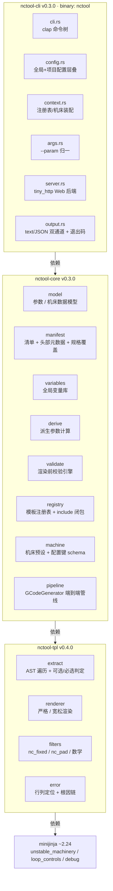
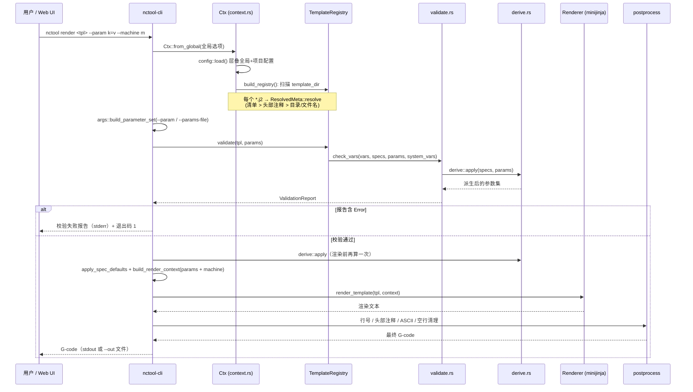
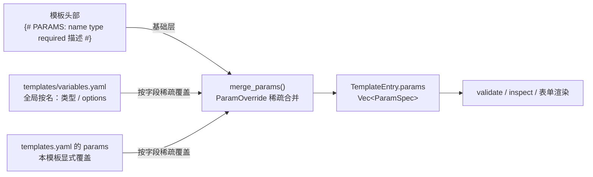
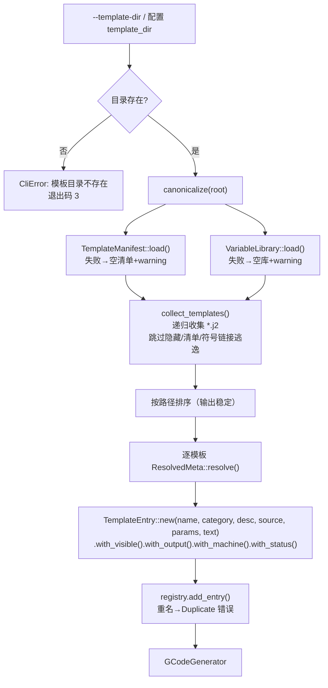

# nctool 系统设计文档

> 版本：v2.0 · 2026-09-15（版本引用 2026-09-18 同步至发版号）
> 对应代码：`nctool-tpl` v0.4.0 / `nctool-core` v0.3.0 / `nctool-cli` v0.3.0（workspace 共 16 139 行 Rust）
> 范围：三个 crate 的分层架构、核心模块职责、数据结构、端到端数据流与设计决策。
> 读者：本仓库贡献者、基于本库二次开发的下游用户。
>
> **与 `docs/ARCHITECTURE.md` 的关系**：`ARCHITECTURE.md` 是 2026-09-03 的 v1.0 快照，
> 缺 `derive` / `variables` / `manifest` 外部化 / Web UI 后端 / 参数规格三来源等后续演进。
> 本文档为当前有效版本（v2.0），两者冲突时以本文档为准。

---

## 1. 系统定位与设计主线

nctool 是一套**面向数控加工（CNC）的 G-code 模板工具链**：用 Jinja2 语法描述加工程序片段，
在渲染前自动推导模板需要哪些参数、哪些必填，校验参数合法性，最后渲染并后处理成可直接上机的 G-code。

它要解决的工程问题很具体：**G-code 是发给机床的指令，写错一个坐标就是撞刀**。
因此整个架构围绕一条主线设计 —— **渲染前可发现错误**。参数缺失、类型不符、越界、
非法枚举值、NaN/Inf 全部在渲染前拦截，而不是在生成出一段"看起来正常"的程序之后才暴露。

### 1.1 四条不可退让的设计原则

| 编号 | 原则 | 违反后的后果 | 落地位置 |
| --- | --- | --- | --- |
| **P1** | **渲染前可发现错误** | 错误推迟到渲染期 → 只能拿到残缺 G-code | `core/src/validate.rs`、`core/src/pipeline.rs` |
| **P2** | **模板只做变量替换，计算在 Rust 侧完成** | 工艺计算散落在模板里，无法测试、无法复用 | `core/src/derive.rs`（查表换算）、`pipeline.rs`（上下文注入） |
| **P3** | **静默出错零容忍，宁可渲染失败** | "渲染成功但结果错误"是撞刀的直接来源 | `src/filters.rs`、`validate.rs` |
| **P4** | **单一来源 + 双输入面共用同一内核** | CLI 与 Web UI 输出不一致 | `ParamValue::display()`、`server::spec_json`、`coerce_param_value` |

P2 决定了 compute-heavy 模板（如 `machines/index_g420/` 下的同步车削类模板）必须先做
「计算上提」再移植：所有中间量（`Z_START` / `D1_CUT` / `ANG_1` 等）由调用方或 `derive`
规则预计算后注入，模板内不写工艺计算逻辑。

### 1.2 当前状态

| 项 | 状态 |
| --- | --- |
| 模板 | 25 个 `.j2`（车削 5 / 切槽 1 / 机床 19），由 `templates/templates.yaml` 清单管理 |
| 变量库 | `templates/variables.yaml`，58 条按名全局规格（源自 NCTool_V3 的 62 个变量） |
| 机床预设 | 3 个内置（`generic` / `wfl_m65` / `index_ms40`）+ 配置文件自定义 |
| 测试 | **459 项**（实测 474 项通过，含参数化与文档测试），`cargo test --workspace` 约 1 分钟 |
| 覆盖率 | 行 **90.75%**、区域 90.52%、函数 90.18%（`cargo llvm-cov --workspace`） |
| CLI | 完整：`templates` / `inspect` / `validate` / `render` / `generate` / `machine` / `config` / `ui` / `completion`；`part` 为占位 |
| Web UI | `nctool ui` 已可用：本地 `tiny_http` 服务 + 只读/渲染 API + 单文件前端 |

---

## 2. 分层架构

### 2.1 分层与依赖方向



依赖**严格单向向下**：`cli → core → tpl → minijinja`，不存在反向依赖与跨层依赖。

所有真实业务逻辑（规格合并、校验、派生、渲染、后处理）都在 `nctool-core`。
CLI 与 Web UI 只是**两个输入/展示面**，不复制任何业务逻辑 ——
这是保证 `nctool render` 与 Web UI 渲染结果**逐字节一致**的前提。

### 2.2 Crate 职责矩阵

| Crate | 定位 | 对外承诺 | 明确不负责 |
| --- | --- | --- | --- |
| `nctool-tpl` | 通用模板引擎封装 | Jinja2 解析、变量提取、NC 数值过滤器、严格/宽松渲染 | 不懂 G-code 语义、不做参数校验、不读文件 |
| `nctool-core` | G-code 领域层 | 参数模型、规格解析与合并、校验引擎、模板注册表、机床适配、派生计算、生成管线 | 不感知命令行、不感知终端输出、不起 HTTP 服务 |
| `nctool-cli` | 交付面 | 命令解析、配置层叠、参数归一、结果渲染、退出码、本地 Web 服务 | 不含任何校验/渲染/后处理逻辑 |

### 2.3 源码规模分布

| Crate | 模块 | 行数 | 说明 |
| --- | --- | ---: | --- |
| `nctool-tpl` | `lib.rs` | 1821 | 对外 API 再导出 + 大量行为契约测试 |
| | `extract.rs` | 607 | 变量提取核心（AST 遍历 + 可选/必选判定） |
| | `error.rs` | 396 | `TplError` 六变体 + 行列定位 + 根因链 |
| | `renderer.rs` | 236 | `minijinja::Environment` 封装（严格/宽松） |
| | `filters.rs` | 142 | NC 数值格式化 + 13 个数学过滤器（含有限性校验） |
| `nctool-core` | `validate.rs` | 1635 | 参数校验引擎（`IssueKind` 15 类） |
| | `manifest.rs` | 1474 | `templates.yaml` + 头部 `{# PARAMS: #}` 解析 + 规格覆盖层 |
| | `registry.rs` | 1374 | 模板注册表 + `include`/`extends` 闭包收集 |
| | `model.rs` | 1213 | 参数/机床数据模型 + 规格构建器 |
| | `pipeline.rs` | 1006 | 端到端生成管线 + 后处理 |
| | `machine.rs` | 455 | 机床预设 + 配置键 schema |
| | `variables.rs` | 379 | 变量库（`variables.yaml`，全局按名定义） |
| | `derive.rs` | 317 | 参数派生（Rust 侧查表计算后注入） |
| `nctool-cli` | `server.rs` | 848 | HTTP API（Web UI 后端）+ `spec_json` 单一来源 |
| | `args.rs` | 445 | `--param k=v` 按规格归一（先白名单后类型） |
| | `cli.rs` | 341 | clap 命令树 |
| | `context.rs` | 563 | 命令上下文 + 模板目录装载 |
| | `commands/templates.rs` | 293 | 模板列表/查看/新建 |
| | `config.rs` | 240 | 配置层叠加载 |
| | `commands/inspect.rs` | 224 | 参数规格展示（四桶分组） |
| | `commands/render.rs` | 202 | 渲染命令 |
| | `output.rs` | 181 | 统一错误 + 双通道输出 + 退出码 |
| | 其余（`core/src/lib.rs` + `main` / `machine` / `config_cmd` / `validate` / `ui` / `part` / `completion` / `mod`） | 469 | 再导出与子命令分发 |
| **合计** | | **14 861** | |

---

## 3. 核心模块详解

### 3.1 `nctool-tpl` —— 模板解析与渲染层

对外 API 只有五个函数 + 四个类型：

```
parse(source, name) -> Ast
extract_variables(&Ast) -> Vec<Variable>
extract_undeclared(&Ast) -> Vec<Variable>
extract_template_refs(&Ast) -> Vec<String>
Renderer::{new, with_lenient, with_strict, render, add_template, set_path_loader, render_template}
```

`Ast` 内部字段已私有化，`TplError` 标注 `#[non_exhaustive]`，为扩展留空间而不破坏下游。

#### `extract.rs` —— 可选 / 必选判定（本层最有价值的部分）

对标 Python `jinja2.meta.find_undeclared_variables`，但补上了 jinja2 没有的能力：
**区分可选参数与必选参数**。

| 模板写法 | 判定 | 原因 |
| --- | --- | --- |
| `{{ x }}` | 必选 | 裸引用，缺失即渲染失败 |
| `{{ x \| default(0.15) }}` | 可选 | 有兜底，缺失仍可渲染 |
| `` | 可选 | 同上 |
| `` | 可选 | 自赋值兜底惯用法（源项目大量使用） |
| `{{ x \| nc_fixed(3) }}` | 必选 | 过滤器需具体值求值，无法以空串替代 |
| `{{ (a+b) \| default(1) }}` | `a`/`b` 均**必选** | **兜底不向下传播** |
| `{{ a.b \| default(1) }}` | `a` **必选** | 同上，取属性先于 `default` 求值 |
| `` | `total` **必选** | RHS 先于目标声明求值，此刻 `total` 还不是局部量 |

「兜底不向下传播」是最容易写错的地方。minijinja 先对子表达式求值，
undefined 参与运算或取属性会直接报错，`default` 来不及兜底。若此处误判为可选，
上层校验放行后严格渲染依然失败 —— **把一个渲染期崩溃推迟成崩溃**，等于没做。

同时排除引擎内置名 `loop` / `self` / `super` / `caller`，以及 `debug` feature 注入的全局
（`range` / `dict` / `debug` 等），避免把引擎自己的东西误报成"你需要提供的参数"。

#### `filters.rs` —— NC 数值格式化与数学过滤器

| 过滤器 | 作用 | 示例 |
| --- | --- | --- |
| `nc_fixed(N)` | 固定小数位 | `21` → `21.000` |
| `nc_strip` | 去尾零 | `21.0` → `21` |
| `nc_pad(N)` | 前导零填充 | `1` → `0001` |
| `nc_signed(N)` | 带符号（仅用于有符号语义的值） | `21` → `+21.000` |
| `sin_d` / `cos_d` / `tan_d` / `asin_d` / `acos_d` / `atan_d` | **度制**三角函数 | `30 \| sin_d` → `0.5` |
| `sin` / `cos` / `tan` / `sqrt` / `pow` / `ln` / `abs` … | 弧度制 / 通用数学 | 与 Rust 标准库一致 |

两条硬约束：

1. **所有过滤器对结果做有限性校验**：一旦产生 NaN/Inf（`sqrt(-1)`、`ln(0)`），渲染立即失败。
2. **宽度参数均有上界**（`MAX_NC_FIXED_DECIMALS = 32`、`MAX_NC_PAD_WIDTH = 1024`），
   防止用户配置一个巨大宽度拖垮内存。
3. `nc_pad` **拒绝小数与负数输入**（`1.7` 会被 `trunc()` 成 `O0001`，程序号写错却不报错；
   负数会拼出 `O-001` 这类非法 G-code）。

> ⚠️ **该防线只覆盖本 crate 注册的过滤器**。裸 `{{ x }}` 输出、minijinja 内建运算
> 产生的 NaN/Inf 不在保护范围内，需由上层校验拦截 —— 这正是 `nctool-core` 存在的理由之一。

> ⚠️ **角度制陷阱**：本库裸 `sin`/`cos`/`tan` 是**弧度制**，度制一律带 `_d` 后缀。
> 迁移 Python/Jinja2 模板时尤其危险：源项目常把 `math.sin(math.radians(x))` 暴露为 `sin`
> （即那个 `sin` 是度制），与本库同名不同义，必须逐处改成 `sin_d`。
> `sin(30)` = -0.988 而 `sin_d(30)` = 0.5，且是**静默**错误 —— 错误坐标写进 G-code 会撞刀。

#### `error.rs` —— 结构化错误与可诊断性

`TplError` 六个变体：`Parse`（带 line/col）、`TemplateNotFound`、`UndefinedVariable`、
`UnknownFilter`、`UnknownTest`、`Render`。后三者会**从 minijinja 的错误详情里反解出**
变量名 / 过滤器名 / 测试名，并尽力从源码字节偏移恢复标识符。

两条实测补强（"信息被吞掉"的案例）：

| 场景 | 问题 | 处理 |
| --- | --- | --- |
| 嵌套 `` 失败 | minijinja 只给外层包装 `could not render include: error in "sub.j2" (in main.j2:2)`，**根因被吞** | 沿 `std::error::Error::source()` 链收集各层描述，以 ` ← ` 追加 |
| 无 `detail` 的错误 | 消息退化成 `invalid operation (in x.j2:83)` | 用 `range()` 取出**出错表达式片段**补上（`（出错表达式：-U_A）`） |

第二条仅在 `detail` 为空且 `err.name() == 所传模板名` 时取 ——
子模板的字节范围不适用于主模板源码，强行取会得到无关片段。

### 3.2 `nctool-core` —— G-code 领域层

#### `model.rs` —— 数据模型

| 类型 | 职责 |
| --- | --- |
| `ParamValue` | 参数值，**扁平值模型**：`Number` / `Integer` / `String` / `Bool` / `List` |
| `ParamKind` | 参数类型：`Number` / `Integer` / `String` / `Bool` / `List` / `Choice` / `Any` |
| `ParamSpec` | 参数规格：类型 + 必选性 + 描述 + `min`/`max` + `unit` + `options` 白名单 + `required_if` + `derive` + `default` |
| `ParameterSet` | 参数集合（`BTreeMap<String, ParamValue>`），`to_minijinja_value()` 转换为渲染上下文 |
| `MachineConfig` | 机床配置（键值字符串表，`get(key)` 读取） |
| `DeriveRule` | 派生规则：源参数名 + 查表 + 回退值 |
| `RequiredIf` | 条件必选：控制参数 + 触发值集合 |

**`ParamValue` 只有扁平类型，JSON 对象被拒绝**（`不支持对象类型`）。需要结构时建模为
「平行列表」（`xs` + `zs` 两个数组），或在模板内用列表元素字段组合表达。

序列化约定：

- 序列化**恒为带标签形式**且标签**小写**（`{type: integer, value: 8}`，与 `ParamKind` 一致）；
- 反序列化**额外接受裸标量**（`options: ["闭口", 8, 12.5]`），手写 YAML 用这个；
- 读取时类型名**大小写不敏感**（兼容历史 PascalCase 载荷）；
- 带标签形式仍做类型自洽校验：`{type: integer, value: 8.5}` 报错而非静默截断。

`ParamValue::display()` 是**参数值渲染的单一来源**，被报错消息、`inspect` 展示、
候选值列表三处共用。

#### `manifest.rs` —— 模板清单与元数据三级回退

元数据优先级：**`templates/templates.yaml` 清单 > 模板头部注释 > 文件名/目录名**。

- 分类默认按目录推断（`turning/` → 车削，`milling/` → 铣削，`drilling/` → 钻孔，
  `grooving/` → 切槽，`machines/` → 机床，`general/` → 通用），清单可覆盖。
  因此**清单只需描述「与默认值不同」的部分**。
- `ResolvedMeta::resolve(rel_path, source, manifest_entry, library)` 是三级回退的汇聚点，
  由 `cli/src/context.rs::build_registry` 逐模板调用。

**头部 `{# NAME: #}` / `{# DESCRIPTION: #}` / `{# PARAMS: #}` 中，只有 `PARAMS` 会生成规格**：

- 两种写法可混用：`name 必选 描述`（类型省略 → `ParamKind::Any`）与
  `name type required 描述`。
- 必选标记：`必选`/`可选`/`条件必选`/`required`/`optional`/`req`/`opt`，
  可带**分支限定词** `可选(ES)`（限定词保留进描述）。
- `NAME`/`DESCRIPTION` 只扫前 10 行，**`PARAMS` 另设 200 行界**（机床模板 18 个参数，
  收尾 `#}` 会落到第 20 行）。
- 解析失败的行**告警**（`warning: <模板>: 第 N 行无法解析…`），不静默跳过 ——
  静默跳过等于静默少一条参数约束。
- 收尾行的 `-#}` 要 `trim_matches('-')` 后再判空，否则会解析出名为 `-` 的假参数。
- **`{# MACHINE: #}` / `{# OUTPUT: #}` 从未实现**，要设机床与输出后缀请用清单字段。

`ParamOverride` + `merge_params` 是**稀疏覆盖机制**：约束字段为 `Option<Option<T>>`，
能区分「没写 → 沿用继承值」「写 `null` → 清空该条继承」「写成值 → 设值」三种意图
（`options` 上 `[]` 与 `null` 等价）；`deny_unknown_fields` 让拼错的字段名直接报错。
少一层 `Option` 就分不出「不改」与「清空」，继承来的 `min` / 白名单 / `derive`
便在**所有**模板上生效且无从解除——某模板确实需要负值或不要派生时只能去改变量库，
那会波及全部模板。

#### `variables.rs` —— 全局变量库（按名生效）

`templates/variables.yaml` 是**按变量名**生效的全局参数规格：同一变量名在多台机床/多个模板上
含义一致时只写一次，避免在 12 个模板里重复声明 `U_Q` 的候选值。

**三条刻意的"不导入"红线**（改这个文件前先读，都是为了不产出"跑得通但错误"的 G-code）：

| 不导入 | 原因 |
| --- | --- |
| `default_value` | 源库默认值是**针对特定样件的预填值**（`U_A = 141.25` 是那根轴的长度）。规格默认值会让缺参**静默通过**，用户少填一个零件尺寸就拿到另一根轴的程序。CNC 零件尺寸没有合理默认值。 |
| `description` | 头部描述更贴近模板上下文；源库描述以 YAML 注释形式保留。 |
| `read_only` 变量的 `options` | 源库 `read_only` 意为"由机床设置/派生计算决定"，其 `options` 是**某次装夹的取值快照**（`U_ANG:[20]`、`R1:[4000]`）。当用户可选集会禁掉合法的换刀/换料调整。**只导入类型。** |

`options` 与类型全量导入。**生效范围**：只对"模板确实引用了"的变量生效
（头部声明 ∪ `extract_undeclared`）—— 否则会注入一堆未引用规格并触发 `SpecUnused` 噪声。
同名重复定义**直接报错**。

#### `derive.rs` —— 派生参数（查表换算不写在模板里）

落实 P2：查表型换算（如 `tip_model → tip_depth`）用 `derive` 规则声明在
`variables.yaml` / 清单 `params`，由 Rust 侧算好注入，模板只写 `{{ tip_depth }}`。

| 情形 | 行为 |
| --- | --- |
| 派生参数未提供 | **不要求调用方提供**（与 `machine` 同属系统注入值） |
| 调用方提供了 | **派生值恒胜** + `ShadowedSystemVar` 警告 |
| 源缺失/未命中且无 `fallback` | `DeriveFailed`（Error），**不取 0** |
| 派生值 | 照常过类型/白名单/区间检查 —— **派生不是绕过校验的后门** |
| 求值时机 | 校验前（`check_vars`）+ 渲染前（pipeline 两条路径） |
| 顺序 | **先派生、再 `apply_spec_defaults`**（源参数可能靠默认值才存在） |
| 表键比较 | `matches_option`（数值/整数跨变体按数值相等） |

首个用例：`machines/index_g420/dg_cal_ir9.j2` 的 `tip_depth`（12 项表，回退 29.61 = DM24），
表已从模板搬到 `variables.yaml`，**数据表只此一份**。

> 刻意**没有**加 `ParamSpec.read_only` 字段：源库 `read_only` 分两类 ——
> 可派生的（用 `derive` 建模）与由调用方预生成的（轨迹段参数，保持普通必选）。
> 不产生行为的字段只会误导。

#### `validate.rs` —— 渲染前校验引擎

对外入口三个：`validate_template`（从源码）、`validate_with_vars`（复用已提取变量）、
`spec`（构造规格）。共享核心是 `check_vars`。

`IssueKind` 结构化类别（**调用方据此做程序化决策，禁止依赖 `message` 文本**）：

| 类别 | 级别 | 含义 |
| --- | --- | --- |
| `Missing` | Error | 必选参数缺失 |
| `TypeMismatch` | Error | 类型不匹配 |
| `NonFinite` | Error | 数值为 NaN / Inf |
| `OutOfRange` | Error | 超出 `min`/`max` 区间 |
| `NotInteger` | Error | 违反整数约束 |
| `NotInOptions` | Error | 不在 `options` 白名单内 |
| `DeriveFailed` | Error | 派生参数无法计算（源缺失/未命中且无回退） |
| `ConditionalSkipped` | Info | 条件必选未命中：该分支本次不可达（**正常情况**） |
| `Unused` | Warning | 参数集提供了模板未引用的参数 |
| `SpecInert` | Warning | 规格中存在**永不生效**的声明（配置侧静默失效） |
| `ShadowedSystemVar` | Warning | 参数与系统注入变量同名 / 派生值覆盖了用户值 |
| `ParseError` | Error | 模板解析失败 |
| `Other` | — | 未分类兜底 |

两处**必须区分**的类别（混用会让统计失去意义）：

- `ConditionalSkipped` ≠ `Missing`：前者是"该分支本次不可达"（正常），
  后者是"生成结果不完整"。混用会让"缺参"统计虚高。
- `SpecInert` ≠ `Unused`：前者是**配置侧**问题（参数名拼错、或 `min`/`max`/`integer`
  声明在 `String`/`Bool` 上永不执行），后者是"用户多传了参数"（无副作用）。

**枚举白名单**（`ParamKind::Choice` + `ParamSpec.options`）的三条约定：

1. `Choice` 的类型匹配有意放宽为"任意标量"（String/Number/Integer/Bool），只有 `List` 被拒。
   真正的约束是白名单而非类型；若只收 `String`，数值枚举（`U_Q` = 0/8/10/12.5）
   会先被类型检查挡掉、永远走不到白名单比较。
   **副作用**：填错类型的标量报 `NotInOptions` 而不是 `TypeMismatch`。
2. `options` 对**所有类型**生效，不只 `Choice`：`Number + options` 表达数值枚举。
   空列表 / `None` = 不约束。
3. **数值/整数跨变体按数值相等**：`Integer(8)` ≡ `Number(8.0)`（CLI/JSON 常把 `8` 解析成
   `8.0`，按变体严格比较是**假拒绝**）。但文本 `"8"` 与数值 `8` 仍是不同候选项。

> **实现位置陷阱**：白名单检查必须是独立的 `check_value_options()`，
> **不能塞进 `check_value_constraints()`** —— 后者对非数值类型在 `as_f64()` 处提前
> `return`，而字符串枚举正是白名单的主要用途，放进去等于永不执行。
> 两个调用点：逐变量检查、规格默认值自洽性检查（`spec.default` 也要过白名单）。

**条件必选 `required_if`** 判定规则：

- 控制参数生效取值（用户提供值 > 规格 `default`）命中触发值 → 必选；
- 未命中 → 可缺失，报**提示级** `ConditionalSkipped`；
- 不可判定（未提供且无规格默认值）→ **保守判必选**；
- **只支持单个控制参数**，表达不了合取（`groove_type==FS && side==Right`），
  故 `turning/undercut.j2` 这类 4 分支完整版不声明 `required_if`。

**不允许用 `| default(0)` 规避互斥参数** —— 那会静默产出 `Z0`。

#### `registry.rs` —— 模板注册表

统一管理内存模板、文件系统模板与内置模板库。核心能力：

| 方法 | 作用 |
| --- | --- |
| `add_memory` / `add_file` / `add_entry` | 注册模板（重名报 `Duplicate`） |
| `list` / `list_visible` / `list_for_machine` | 列表（按分类/可见性/机床方案包筛选） |
| `extract_params(name)` | 提取**完整参数闭包**（穿透 `include`/`extends`），剔除系统注入变量 |
| `validate(name, params)` | 渲染前校验（同样穿透模板间引用，带环引用防护） |
| `render_template` / `render_template_lenient` | 渲染（应用规格默认值兜底） |
| `system_vars` / `set_system_vars` | 系统注入变量名列表（默认 `["machine"]`） |

`extract_params` 与 `validate` **必须穿透 ``**：否则组合模板会只列出主模板
自身的变量，用户按表填参会渲染失败。被引用但未注册的模板静默跳过（其变量无法静态并入）。

**两级缓存**（都为消除"同一份工作反复重做"）：

| 缓存 | 位置 | 键 / 失效 | 说明 |
| --- | --- | --- | --- |
| 静态分析 `Analysis` | `TemplateEntry::analysis()`（`OnceCell`） | 随条目生命周期 | 缓存「未声明变量 + 模板引用」。`Ast` 借用源码、无法自引用存入条目，故缓存解析**产物**。`extract_params` / `validate` / `include` 闭包共用一份 |
| 宽松渲染器 | `TemplateRegistry::lenient_cache`（`OnceCell`） | `add_entry` 时清空 | 宽松是建 `Environment` 时的标志，无法在同一渲染器上切换，故需第二个环境；惰性构建一次，构建失败原因一并缓存 |

> 严格渲染走 `renderer`（注册时已编译，minijinja 内部缓存），无重复解析。


#### `machine.rs` —— 机床适配

3 个内置预设（`generic` / `wfl_m65` / `index_ms40`），每个是一张 `MachineConfig` 键值表，
实现「换机床即换编程约定」。`KNOWN_CONFIG_KEYS` 是配置键 schema（键名 + 类型 + 说明），
`validate_config_keys` 对未知键给出提示。

#### `pipeline.rs` —— 端到端生成管线

`GCodeGenerator` 持有 `TemplateRegistry`，提供三条入口：

- `generate()` —— 严格模式：任何 Error 级问题都中止
- `generate_lenient()` —— 宽松模式：未定义变量渲染为空，问题降级为警告
- `generate_lenient_with_report()` —— 宽松 + 返回降级后的报告

宽松模式的**唯一硬失败是 `NonFinite`**：参数缺失可以留空，但非法坐标会让机床走到错误位置 ——
这不是"参数可缺省"，而是"参数值非法"，宽松模式没有放行理由。

> 早期实现宽松路径直接跳过 `validate`，导致 `X{{ x }}` 能吐出 `XNaN` ——
> 校验层唯一的"防非法数值写入 G-code"防线在宽松路径上完全失效。现已修正为
> "照常校验 + 仅降级非 `NonFinite` 问题"。

**后处理**（`postprocess`）：

| 项 | Text 格式 | Gcode 格式 |
| --- | --- | --- |
| 行号 | 不做 | 可开启；程序号行（`O` 开头）与已有 `N` 前缀行不重复编号；`step=0` 视为 1 |
| 空行清理 | 不做 | 可开启 |
| 行首尾 trim | 不做 | 每行 trim |
| ASCII 清洗 | 不做 | `ascii_only` 时非 ASCII → `?`（头部注释与模板名同样清洗） |
| 头部注释 | 用户显式开启时生效 | 同左 |

行号前缀/宽度与程序号前缀**来自机床配置**（`line_number_prefix` / `line_number_digits` /
`program_prefix`），实现"换机床即换编程约定"。宽度夹在 `[1, MAX_LINE_NUMBER_DIGITS = 32]`：
机床配置是用户可编辑的字符串，缺失上界则一行就能触发 GB 级分配 ——
而 **Rust 的分配失败是进程 abort，不可捕获**。取 32 而非对齐 `nc_pad` 的 1024，
是因为行号前缀作用于**每一行**，总分配量是 `行数 × 位宽`。

### 3.3 `nctool-cli` —— 命令行交付面

| 模块 | 职责 |
| --- | --- |
| `cli.rs` | clap 命令树 + 全局选项（`--machine` / `--template-dir` / `--format` / `--verbose`） |
| `config.rs` | 配置层叠：全局配置 + 项目 `nctool.toml` 合并；**损坏时降级为空配置 + 警告**，不阻断 |
| `context.rs` | `Ctx`：装配注册表（递归扫描 `template_dir` 的 `*.j2`）、解析机床 |
| `args.rs` | `--param k=v` 归一 + `--params-file` 加载 |
| `output.rs` | `CliError`（分类 + 消息 + 静默标记）、text/JSON 双通道、退出码矩阵 |
| `server.rs` | `tiny_http` 本地 Web 服务 + `spec_json` 单一来源 |
| `commands/*` | 各子命令实现；`Command::run` 统一分发 |

`Command::run` 的分发有两处刻意设计：

- `completion` / `part` **不读配置文件**，避免 CWD 存在损坏的 `nctool.toml` 时
  连补全生成也被拦下；
- `ui` 需要配置层叠（模板目录 / 自定义机床），走正常分支 —— 配置损坏时
  `config::load` 已降级为空配置 + 警告，不会阻断启动。

**`--param` / 表单取值归一顺序**（后端 `args::coerce_param_value` 与前端
`coerceParamValue` 必须同一顺序）：

> **显式后缀 > 白名单命中 > 声明类型 > 启发式**

显式后缀指 `k:s=v`（强制字符串）、`k:n=v`（强制数值）、`k:b=v`（强制布尔）；
另有约定：**前导零的纯数字按字符串处理**（`0008` 是程序号/刀号而非数值 8）。

**UI 有两份文件**（`ui/index.html` 供 `file://` 演示、`cli/ui/index.html` 被
`include_str!` 嵌入二进制），必须同步改，`cli/tests/cli.rs::ui_html_copies_stay_in_sync` 会拦。

---

## 4. 数据流

### 4.1 主数据流：端到端 G-code 生成



要点：

1. **校验前置于渲染**（P1）。校验失败时 `stdout` 不含任何 G-code。
2. **派生在两条路径各算一次**：校验前（让派生值参与校验）+ 渲染前（管线兜底）。
   顺序恒为 **先派生、再 `apply_spec_defaults`** —— 派生依赖源参数取值，
   而源参数可能靠规格默认值兜底才存在（`derive::apply` 内部已对源参数应用一次默认值）。
3. **报告走 stderr，G-code 走 stdout**。错误行只留一句摘要 ——
   把多行报告塞进 `CliError::message` 会让首行被当成摘要，提示行排在最前时
   输出 `error: 提示 …` 这种自相矛盾的结果。

### 4.2 参数规格的解析与合并（三个来源）

**优先级：清单 `params` > `variables.yaml` > 头部 `{# PARAMS: #}`**（越靠后越具体）。



| 来源 | 作用域 | 职责 |
| --- | --- | --- |
| 头部 `{# PARAMS: #}` | 本模板 | 这个模板用哪些参数：名字 / 类型 / 必选性 / 描述 |
| `templates/variables.yaml` | **全局按名** | 同一变量在多模板间的共同类型与候选值 |
| `templates.yaml` 的 `params` | 本模板 | 本模板显式覆盖（最高优先级，补头部表达不了的 `min`/`max`/`integer`/`options`/`required_if`/`default`） |

三者复用同一套稀疏覆盖机制（`ParamOverride` + `merge_params`），
"只写要改的字段"这一约定在三个层级完全一致。

`ParamKind::Any` 是**过渡态**：头部只写 `name 必选 描述` 时类型记为 `Any`
（不查类型，但 `options`/`required_if`/`default` 生效）。19 个 INDEX G420 模板的头部
都是这种写法 —— 已由变量库补上类型，**无需改头部**。

### 4.3 模板装载数据流（`build_registry`）



要点：

- **目录模板以「相对模板目录的路径」为模板名**（如 `turning/undercut.j2`），
  用 `/` 分隔 —— 相对名唯一，不与内置模板的扁平名冲突。
- **先完成整目录遍历再注册**，避免遍历中途发现重名时报错而留下半成品注册表。
- **清单/变量库加载失败不阻断**：都是可选文件，损坏时降级为空并告警，
  这样模板仍可用，用户也能看到问题所在。
- 清单/变量库/头部 `PARAMS` 的解析警告都**逐条 eprintln**，不静默。
- **注册表按目录指纹缓存**（`Ctx::build_registry`）：键是「模板目录 + 目录树最新
  mtime」，命中则复用同一份 `Rc<GCodeGenerator>`。Web UI 每个请求都要用它，
  而构建一次要遍历目录、读取并解析全部模板源码（成本 O(模板数)）。
  **指纹不可省**：无条件长期缓存会让用户改完模板仍拿到旧注册表，渲染出与图纸
  不符的 G-code —— 属于本项目零容忍的"静默产出错误程序"。
  指纹取不到（IO 异常）时放弃缓存，宁可重算。
- 需要**可变**注册表的调用方走 `Ctx::build_registry_fresh`（`render` 注册临时
  文件模板的路径）：缓存中的注册表由所有调用方共享，就地改动会让临时模板
  泄漏进后续调用。

### 4.4 渲染上下文的构造

```
渲染上下文 = 参数集（派生 + 规格默认值兜底后的 effective）
           + machine（机床配置，供 {{ machine.xxx }} 引用）
```

`ParameterSet::to_minijinja_value()` 负责把扁平值模型转成 minijinja 的 `Value`。
`machine` 属**系统注入变量**，在 `registry.system_vars()` 中登记，
校验时视为已提供，不参与缺失/冗余检查。

### 4.5 HTTP 数据流（Web UI）

`nctool ui` 启动 `tiny_http` 服务（**仅绑定回环地址**，本地开发工具定位）：

| 方法 | 路径 | 作用 |
| --- | --- | --- |
| GET | `/health` | 健康检查 |
| GET | `/api/templates` | 模板列表（可按分类筛选） |
| GET | `/api/templates/{name}` | 模板详情（含参数规格） |
| GET | `/api/machines` | 机床预设列表 |
| POST | `/api/inspect` | 变量提取 |
| POST | `/api/validate` | 参数校验 |
| POST | `/api/render` | 渲染 |
| GET | `/` · `/index.html` | 内嵌单文件 UI |

**规格字段的 JSON 形状只有一处定义**：`server::spec_json`（`pub(crate)`），
HTTP API 与 `inspect --format json` 共用 —— 新增规格字段只改这一处。

安全边界：HTTP 服务**只允许访问注册表中的逻辑模板名**，
不得调用 `Ctx::find_template_file`（那会允许按任意路径读文件）。

---

## 5. 错误模型与退出码

### 5.1 三层错误类型

| 层 | 类型 | 承载信息 |
| --- | --- | --- |
| 模板层 | `TplError` | 解析位置（line/col）、未定义变量名、根因链、出错表达式 |
| 领域层 | `PipelineError` / `RegistryError` / `DeriveError` / `ManifestError` | 模板未找到 / 校验失败（含完整报告）/ 渲染失败 / 派生失败 / 清单解析失败 |
| 交付层 | `CliError` | 分类标识（`kind`）+ 人类可读消息 + 静默标记 |

`output.rs` 为各领域错误实现 `From`，统一收敛到 `CliError`。

### 5.2 退出码矩阵

| 退出码 | 含义 | 触发分类 |
| ---: | --- | --- |
| 0 | 成功 | — |
| 1 | 参数校验未通过 | `validation`（含未分类兜底） |
| 2 | 参数/用法错误 | `args`（与 clap 一致） |
| 3 | IO 失败 | `io` |
| 4 | 配置错误 | `config` |
| 5 | 模板/机床未找到 | `template_not_found` / `machine_not_found` |
| 6 | 渲染/注册表失败 | `render` / `pipeline` / `registry` / `template_duplicate` / `template_empty` / `template_compile` |
| 7 | 功能尚未实现 | `not_implemented` |

---

## 6. 关键设计决策

| 编号 | 决策 | 理由 |
| --- | --- | --- |
| **D1** | `minijinja::Value` 由 `nctool-tpl` 单点再导出 | 下游不必直接依赖 minijinja，避免版本漂移导致类型不兼容 |
| **D2** | 严格模式为默认，宽松为显式 opt-in | 默认行为必须安全；宽松是"我知道我在做什么"的选择 |
| **D3** | 校验前置于渲染 | P1：错误必须在写出任何 G-code 之前暴露 |
| **D4** | 必选性由"模板实际引用"决定，而非规格声明 | 规格可能声明了模板不引用的参数；以模板为准才不会误报 |
| **D5** | 兜底不向下传播（`default` 只兜自己那一层） | 与 minijinja 求值顺序一致，否则把渲染崩溃推迟成崩溃 |
| **D6** | `Integer` 作为独立参数类型 | G-code 里刀号/程序号/次数必须是整数，`8.0` 与 `8` 语义不同 |
| **D7** | `IssueKind` 结构化类别，禁止按消息文本决策 | 文本匹配脆弱（如靠 `message.contains("NaN")` 判非有限数），改文案即失效 |
| **D8** | 宽松模式仍硬失败 `NonFinite` | 参数可缺省 ≠ 参数值可非法；非法坐标会撞刀 |
| **D9** | `include`/`extends` 穿透校验 + 防环 | 组合模板的参数缺失必须在校验期暴露，而非渲染期 |
| **D10** | 后处理所有尺寸参数夹紧上界 | 用户可编辑配置 + 分配失败是进程 abort（不可捕获） |
| **D11** | 输出格式语义分离：`Gcode` vs `Text` | `Text` 用于查看渲染结果原文，不应被行号/清洗干扰 |
| **D12** | CLI 不复制业务逻辑 | 保证 `nctool render` 与 Web UI 输出逐字节一致 |
| **D13** | 配置/清单/变量库损坏降级为警告而非错误 | 只读命令仍应可用；用户需要看到问题但不该被阻断 |
| **D14** | 文件路径加载做双层安全校验 | 防符号链接逃逸模板根目录 |
| **D15** | 参数规格外部化到三个声明式来源 | 新增模板只需放文件 + 加清单条目，不必改 Rust 代码重编译 |
| **D16** | 派生用 `derive` 规则建模，而非给 `ParamSpec` 加 `read_only` 字段 | 不产生行为的字段只会误导；`read_only` 的两类语义已分别落到 `derive` 与普通必选 |
| **D17** | 白名单检查独立于约束检查 | `check_value_constraints` 对非数值类型提前 return，塞进去等于永不执行 |
| **D18** | 参数值渲染 / 规格 JSON 形状 / 取值归一顺序各自单一来源 | 三处若各写一份必然漂移，表现为 CLI 与 UI 行为不一致 |

---

## 7. 扩展点

| 想做的事 | 改哪里 |
| --- | --- |
| 新增模板 | 放 `templates/<分类>/x.j2` + 在 `templates.yaml` 加条目（只写与默认值不同的部分） |
| 新增参数约束 | 优先写模板头部 `{# PARAMS: #}`；跨模板共性写 `variables.yaml`；单模板特例写清单 `params` |
| 新增查表换算 | 在 `variables.yaml` / 清单 `params` 写 `derive` 规则，不要在模板里写计算 |
| 新增机床预设 | `core/src/machine.rs` 的 `MachinePreset` + `KNOWN_CONFIG_KEYS` 补键 |
| 新增数学/NC 过滤器 | `src/filters.rs`（务必做有限性校验 + 宽度上界） |
| 新增校验规则 | `core/src/validate.rs`，并新增 `IssueKind` 类别（勿复用语义不同的类别） |
| 新增 HTTP 端点 | `cli/src/server.rs::route`；规格字段形状统一走 `spec_json` |
| 新增子命令 | `cli/src/cli.rs` 命令树 + `cli/src/commands/` + `Command::run` 分发 |

---

## 8. 约束与已知边界

- **参数是扁平值模型**：JSON 对象被拒绝，需要结构时用「平行列表」建模。
- **`required_if` 只支持单个控制参数**：表达不了合取条件，多分支模板需拆分为单分支模板
  （如 `undercut.j2` → `undercut_es.j2` + `undercut_fs.j2`）。
- **`filters.rs` 的有限性防线不覆盖裸输出与内建运算**，依赖 `validate` 层拦截。
- **`nc_pad` 拒绝小数/负数**，这是刻意的静默出错防线，不要"顺手放宽"。
- **`variables.yaml` 的生效范围限于被引用变量**，库内未引用条目不会注入规格。
- **Web 服务仅绑定回环地址**，定位是本地开发工具，未做鉴权与并发压测。
- **`nctool part`（零件级批量生成）仍是占位**，规划于后续阶段。
- **源项目变量库（62 个变量）的类型/候选值已导入 58 条**，剩余条目按需补齐。

---

## 9. 质量基座

| 层次 | 规模 | 内容 |
| --- | ---: | --- |
| 单元测试 | 372 | 内嵌于各模块（`src/lib.rs` 119、`core/*` 189、`cli/src/*` 46、`tests/parsing.rs` 18 等） |
| CLI 集成测试 | 87 | `cli/tests/cli.rs`（43）+ `cli/tests/cli_e2e.rs`（44），含 `ui_html_copies_stay_in_sync` 这类一致性断言 |
| 覆盖率 | 行 90.75% | `cargo llvm-cov --workspace`；最低三项：`src/extract.rs` 74.25%、`cli/src/output.rs` 65.22%、`cli/src/server.rs` 73.63% |
| 基准 | — | `benches/bench.rs`（解析/提取/渲染）、`core/benches/pipeline.rs`（后处理/端到端） |
| 黄金样本 | — | `tests/golden/`；移植模板时以逐字节比对验证（INDEX G420 的 19 个模板已 18/18 逐行一致） |

---

## 附：相关文档

| 文档 | 内容 |
| --- | --- |
| `docs/ARCHITECTURE.md` | v1.0 架构说明（2026-09-03 快照，部分内容已被本文档取代） |
| `docs/TEMPLATE_WRITING_GUIDE.md` | 模板编写指南（§3 NC 过滤器、§4 三角函数与 R6 约定、§9 反模式） |
| `docs/TEMPLATE_INTEGRATION_PLAN.md` | 模板整合方案（含 §4.4 实测发现的能力缺口） |
| `docs/MACHINE_CONFIG_GUIDE.md` | 机床配置键清单 |
| `docs/PROCESS_CHECKLIST.md` | 工艺检查清单 |
| `docs/HANDOFF_2026-09-14.md` | 阶段交接（§12 第一轮、§13 第二轮修问题 + 参数规格外部化） |
| `templates/README.md` | 模板目录约定（`{# PARAMS: #}` 规格、清单 `params` 覆盖层、两种隐藏语义） |
| `README.md` | 用户向快速上手 |
