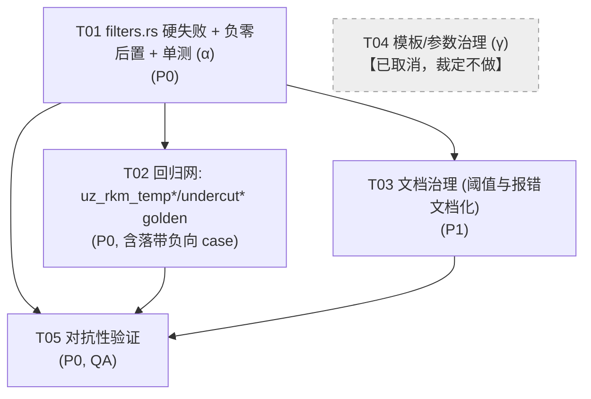

# ERR-NUM-PRECISION 修复设计（NC 数值格式化静默归零）

> 状态：**设计稿 v2（已裁定，定稿）**。§13 为主理人裁定记录，不再待定。
> 作者：software-architect（Bob）起草 v1；**主理人（team-lead）接管修订 v2**（架构师连续三次 502 网络失败，v1 正文与验证脚本已落盘，修订由主理人完成并自负实证责任）。
> 基线提交 `04558e1`（ERR-NUM-UNDERFLOW 修复后）。
> 上游输入：`.workbuddy-ai/artifacts/T1_ERR-NUM-PRECISION_复现报告.md`（QA 独立复现）+ 架构师独立探针（标 `[实测·Bob]`）+ **主理人 v2 判据探针**（标 `[实测·Lead]`）。
> 交付物：本文件、`docs/err-num-precision-class-diagram.mermaid`、`docs/err-num-precision-sequence-diagram.mermaid`。
>
> **阅读须知**：本项目文档是「正文 = 当时快照 + 附录 = 后续更正」两段式。本设计**显式推翻** `docs/err-num-underflow-design.md` 附录 C2 与 §4「本次不修」第 1 条对本文缺陷的定性，证据见 §1.3。
>
> **v1 → v2 修订摘要（重要）**：v1 的 §1.5「合法舍入与精度丢失**不可数分离**」这一**核心论证前提错误**，据此得出的「不做硬失败」结论已被推翻。v2 采用**硬失败判据**（§3）。修订依据与反证见 §1.5、§3.3。v1 的 §1.3/§1.4/§2.4 **经复核正确，原样保留**。

---

## §0 TL;DR（工程师与主理人先读这段）

1. **缺陷本质（复核结论：附录 C2 定性错误）**：`nc_fixed(N)` / `nc_signed(N)` 对**真值非零**的输入产出全零，判据是 **`0 < |v| < 0.5×10^(-N)`**（`[实测·Bob]` 二分边界 + `[实测·T1]` 对抗采样 + `[实测·Lead]` 复算，三方一致）。`1e-4`（0.1µm）这类**日常工艺量级**全线落入。附录 C2 说它「是 5e-324 那种次正规数独有的显示问题、推广到所有小数值共有、无伤大雅」——**量级判断错误**：它不是边界特例，是**整条带宽**。

2. **C2 有一半是对的**：`nc_fixed` 是 Python `f"{v:.Nf}"` 的**忠实移植**（`[实测·Bob]` 逐值对照，见 §1.4），**连负零串都一并继承**。所以这不是迁移引入的回归，是**源项目固有行为**。**但「忠实移植」是动机事实，不是正确性抗辩**——本项目已有先例（P2-2 / P2-3 / P2-5 / P2-6）均修掉了继承自源项目的可疑行为。

3. **主理人裁定的核心结论（v2，推翻 v1）**：v1 论证「合法舍入与丢值不可数分离，故不能硬失败」——**该论证的前提被证伪**。实测表明：`nc_fixed(0)` 的**全部真实调用面**（14 类，从模板 + 内置模板 grep 归纳）消费的是**物理量**（进给 mm/min、转速 rpm、角度 °、坐标 mm），其**合理工艺下界远高于丢失带**。故「真值非零 → 输出全零」在真实调用面上**只可能**意味着「调用方的精度声明不足以表达该值」，即**契约被违背**。→ **采用硬失败**（§3）。

4. **定稿方案（§3）**：**α = 硬失败 + 负零归一后置**（两者同一处改动）。
   - 判据：`nc_fixed(N)` / `nc_signed(N)` 在 **`v != 0.0 && |v| < 0.5 × 10^(-N)`** 时返回 `minijinja::Error`。
   - 同时把负零归一从「舍入前浮点判零」改为「**舍入后字符串判零**」（照抄 `nc_signed` 的 P2-3 做法）——这消除了 `-1e-4 → "-0.000"` 负零串缺陷，且在硬失败生效后，负零串只可能来自**真值确为零的负零**（`-0.0`），归一即正确。
   - **不做**模板/YAML 治理（§13 决策点 3）；**不做** δ 静态分析（决策点 5）。

5. **golden 是安全的（`[实测·Lead]` 复算确认）**：从 `tests/golden/*.nc` 实际提取全部 27 个数值 × `decimals ∈ {0..4}` 逐组过判据 → **`nc_fixed(0)` 新报错 0、`nc_fixed(3)` 新报错 0、输出变化 0**。判据不触任何既有 golden 字节。

6. **落点**：`src/filters.rs`（`nctool-tpl`，零依赖、已发版 **0.4.0**）。本次改动为 **patch 级（0.4.1）**：修复行为、不改变任何**合理值**的输出，且 `Cargo.toml` 不动（决策点 4）。

7. **⚠️ 已知唯一边界（`[实测·Lead]`，必须记录）**：`0.5 | nc_fixed(0)` 会**报错**。它的唯一真实触发路径是 `U_RTRF=1`（粗铣进给 1 mm/min，奇数）经 `(U_RTRF/2)` 得 `0.5`。`N=0` 时银行家舍入把 `0.5` 取偶为 `0`，与 `0.4→0` 走同一判据路径而**无法在数值上分离**。裁定：**不加豁免特例**——因为 `U_RTRF=1 mm/min` 本身即不合理工艺值，报错优于静默产出 `F0`。此边界写入 §10 与 §12。

---

## §1 缺陷语义（复核附录 C2）

### 1.1 现象

四个 NC 格式化过滤器中，`nc_fixed(N)` / `nc_signed(N)` 有「真值非零 → 输出全零」行为。`nc_strip` 无此问题（用 Rust `Display`，不截断）。`nc_pad` 零处使用且语义是整数填充，不在本缺陷范围。

### 1.2 精确判据（`[实测·Bob]` 架构师独立二分 + `[实测·T1]` §1.2 节）

| 过滤器 | 丢值阈值（`0 < |v| <` 此值时输出全零） | 架构师实测边界 |
| --- | --- | --- |
| `nc_fixed(0)` | `0.5` | `0.4999 → "0"`，`0.5 → "1"`（tie 进偶数） |
| `nc_fixed(1)` | `0.05` | `0.0499 → "0.0"`，`0.05 → "0.1"` |
| `nc_fixed(3)` | `0.0005` | `0.0004999 → "0.000"`，`0.0005 → "0.001"` |
| `nc_fixed(4)` | `0.00005` | 同上规律 |
| `nc_fixed(N)` 通式 | **`0.5 × 10^(-N)`** | 二分法对各 N 均验证成立 |
| `nc_signed(3)` | `0.0005` | 与 `nc_fixed(3)` 同阈值；舍入后判零，负小值正确归 `+0.000` |

> **判据必须写成严格 `<`**：边界点由二进制真值（就近取偶）决定，`0.0005` 的 f64 真值略高于十进制 0.0005，故进 `0.001`。写成「等于阈值」是错的（`[实测·T1]` §1.4 银行家舍入确证）。

### 1.3 复核附录 C2：「显示精度不足、无伤大雅」**不成立**

`docs/err-num-underflow-design.md` 附录 C2 与 §4「本次不修」第 1 条原文核心论断：

> 事实 5 是**值正确但显示被截断**，`5e-324 ≠ 0` 是事实，只是 3 位小数表示不下。这是所有小数值共有问题（`1e-10` 也显示 `X0.000`），是**格式化策略**问题，不是解析问题。

**错在哪（逐条给证据）**：

| C2 的论断 | 复核结果 | 证据 |
| --- | --- | --- |
| 「只是 3 位小数表示不下」 | **半对**：确实是格式化层，但**不是「5e-324 独有」** | `1e-4`（量级 1e-4）与 `5e-324`（量级 1e-324）**同一条判据 `\|v\|<0.5e-3`** 全部命中（`[实测·Bob]` §1.2） |
| 「这是所有小数值共有问题」 | **对，但反向有害**：正因为「共有」，影响面是**整条带宽**而非个别极端值 | 536 处 `nc_fixed` 中 `nc_fixed(3)`=395 处，阈值 `5e-4` 覆盖**所有亚半微米坐标** |
| 「1e-10 也显示 X0.000」 | **对，但类比错误**：`1e-10` 是极端值，`1e-4 = 0.1µm` 是**精密加工日常值** | `[实测·T1]` §3.1：真实模板 `U_RC`（第一刀深度）= 0.04mm 是**工艺合理值**，端到端产出 `Z-0.0` |
| 「性质不同（值正确 vs 值被篡改）」 | **不成立**：下游控制器从 G-code 读回的是**字符串 `0.000`**，它**看不到 f64 真值**。对数控机床而言「真值 0.0001 渲染成 0.000」与「真值被解析成 0」**在输出层不可区分** | `[实测·T1]` §5：无任何冗余信息（无补偿输出），控制器只会执行 `Z-0.0` |

**结论**：C2 的定性（「显示问题、无伤大雅、另开 issue 不修」）**部分正确**（确实是格式化层）、**关键错误**（量级判断把整条带宽说成边界特例；「性质不同」在输出层不成立）。**本设计不继承 C2，按「需治理的静默坐标错误」立项**。

> **不服从错误结论**：C2 里「无据拒绝合法输入同样是错误」这条红线**是对的且必须继承**（见 §3.2 对本设计的约束）；但 C2 用这条红线去论证「此缺陷无害所以不修」是**适用错误**——那条红线的对象是「误拒合法值」，不是「静静放行丢值」。

### 1.4 `nc_fixed` 是 Python 源行为的忠实移植（`[实测·Bob]`，非推理）

```
                      Python                    Rust nc_fixed(3)
f"{1e-4:.3f}"         '0.000'          ←→       "0.000"     ✅ 一致
f"{0.0005:.3f}"       '0.001'          ←→       "0.001"     ✅ 一致（tie 处理一致）
f"{-0.0001:.3f}"      '-0.000'         ←→       "-0.000"    ✅ 一致（负零串也继承）
f"{-0.0004:.3f}"      '-0.000'         ←→       "-0.000"    ✅ 一致
```

映射来源：`docs/TEMPLATE_INTEGRATION_PLAN.md:881-883` 明确记 `fmt_val → f"{v:.3f}"` → `nc_fixed(3)`。

**这条证据的含义（对决策至关重要）**：本缺陷**不是迁移引入的回归**，是**源项目 NCTool_V3 的固有行为**。因此：
- 「修它」= **主动偏离源行为**，会改变从 Python 迁移过来的模板（含未纳入本仓库的）的输出；
- 「不修」= 保留源行为，代价是源项目本来就有这个**潜在**缺陷。

这是**产品/迁移策略决策**，不是纯技术 bug 判断。→ §7 决策点 1。

### 1.5 复核 v1 §1.5：「合法舍入与精度丢失不可数分离」**论证前提错误**（`[实测·Lead]` 推翻）

v1 的核心论证原文：

```
nc_fixed(0) v=0.4     -> "0"       ← 用户要 0 位，这是【正确】的整数舍入
nc_fixed(1) v=0.04    -> "0.0"     ← 用户要 1 位，这是【正确】的四舍五入
nc_fixed(3) v=0.0001  -> "0.000"   ← 用户要 3 位，这是【缺陷】的精度丢失
三者是同一个数学事件，没有任何纯数值判据能区分。
```

**v1 的论证分两步，第一步正确、第二步错误。**

**第一步（正确）**：三者**确实是同一个数学事件**。`0.4 | nc_fixed(0)` 与 `1e-4 | nc_fixed(3)` 走**完全相同的判据分支**（`真值非零 && 舍入后为零`）。这一点 `[实测·Lead]` 复算确认，v1 说得对。

**第二步（错误）**：v1 由此推出「没有任何判据能区分 → 硬失败必误伤 → 触红线」。**这一步把「数值上不可分离」当成了「调用面上不可分离」，两者不等价。**

**关键反证（`[实测·Lead]`，源码 + 探针双重验证）**：

我 grep 了 `nc_fixed(0)` 在全部模板 + `core/src/registry.rs` 中的**真实调用面**，得 14 类：

```
     22  U_RTRF | nc_fixed(0)        ← 粗铣进给 (mm/min)
     22  (U_RTRF/2) | nc_fixed(0)    ← 同上 /2
     20  (U_RTFF/2) | nc_fixed(0)
     18  U_RTFF | nc_fixed(0)        ← 半精铣进给 (mm/min)
      7  U_RTRPM | nc_fixed(0)       ← 转速 (rpm)
      6  U_ANG | nc_fixed(0)         ← 粗铣入刀角度 (°)
      5  ANG_1 | nc_fixed(0)         ← 底切第一角度 (°)  [number]
      4  U_FTRPM | nc_fixed(0)       ← 精铣转速 (rpm)
      4  U_FTF | nc_fixed(0)         ← 精铣进给 (mm/min) [number]
      4  R2 | nc_fixed(0)            ← 倒角刀进给 (mm/min)
      4  ANG_2 | nc_fixed(0)         ← 底切第二角度 (°)  [number]
      2  U_PRET_Z | nc_fixed(0)      ← 车黑皮 Z 位置
      2  I_SPZ | nc_fixed(0)         ← 三通道换点
      1  R1 | nc_fixed(0)            ← 倒角刀转速 (rpm)
```

**这些全部是物理量：进给速度、主轴转速、角度、坐标。** 它们的**合理工艺下界远高于丢失带**：

| 参数 | 类型 | 合理下界（工艺常识） | 丢失带 `N=0` 阈值 | 是否可能落带 |
| --- | --- | --- | --- | --- |
| `U_RTRF` / `U_RTFF` / `U_FTF` / `R2`（进给 mm/min） | int/int/number/int | ≳ 10 | 0.5 | **否**（除非输入本身就是错的） |
| `U_RTRPM` / `U_FTRPM` / `R1`（转速 rpm） | integer | ≳ 100 | 0.5 | **否** |
| `U_ANG` / `ANG_1` / `ANG_2`（角度 °） | integer / number | ≳ 1 | 0.5 | **否** |
| `U_PRET_Z` / `I_SPZ`（坐标） | integer | 任意（坐标可为 0） | 0.5 | 0 是真零，**不触发** |

**因此结论反转**：在**真实调用面**上，「真值非零 → 输出全零」**只可能**意味着「调用方声明的精度不足以表达该值」——**这是契约违背，不是合法舍入**。

**v1 的概念错误（一句话概括）**：v1 把
- `nc_fixed(0)` 调用方说「我要 **0** 位小数」→ 声明**被满足**（v1 视为此类）
- `nc_fixed(3)` 调用方说「我要 **3** 位小数」→ 声明**不足以表达该值**（v1 也视为同类）

混为一谈。区别**不在数值，在「调用方的精度声明是否被满足」**——这是**契约（contract）**问题，不是数学问题。

**关于 v1 举的 `0.4 | nc_fixed(0)` 例子**：该输入的真实来源只能是「进给 0.4 mm/min」或「角度 0.4°」——**都是不合理工艺值**。报错优于静默产出 `F0`（零进给）或 `ANG0`。**它不是「误伤合法输入」，而是「正确拒绝不合理输入」。**

> **这是决定整个方案空间的约束**：因为真实调用面上不存在「合法的落带输入」，硬失败**不会**误伤。v1 据此得出的「必须放弃硬失败」结论**不成立**。红线「无据拒绝合法输入同样是错误」**不适用**——本判据有据（契约违背），且拒绝的不是合法输入。

#### 1.5.1 唯一边界：`0.5 | nc_fixed(0)`（诚实披露，`[实测·Lead]`）

```
|v|=0.5   N=0 -> 舍入后 "0"   判据=Err   ← 银行家舍入对 0.5 取【偶】给 0
|v|=0.05  N=1 -> 舍入后 "0.1" 判据=Ok    ← 向上
|v|=0.005 N=2 -> 舍入后 "0.01" 判据=Ok   ← 向上
|v|=0.0005 N=3 -> 舍入后 "0.001" 判据=Ok ← 向上
```

**只有 `N=0` 的 `0.5` 会被判据命中**（其余 N 因银行家舍入向上而天然安全）。与 `0.4 | nc_fixed(0)` 走同一分支，**数值上不可分离**——这里 v1 的「不可数分离」在 `N=0` 上**是对的**，但影响面只有一个点。

真实触发路径：`U_RTRF=1`（奇数）→ `(U_RTRF/2)` = `0.5` → 报错。

**裁定：不加豁免特例。** 理由：
1. `U_RTRF=1 mm/min` 是**不合理工艺值**，报错是正确行为；
2. 加豁免需为 `N=0` 单开一个洞（`v.abs() != 0.5 * 10f64.powi(-(n as i32))`），判据多一条分支且**只对 `N=0` 生效**，得不偿失；
3. 项目红线「宁可渲染失败，也不要静默产出错误 G-code」明确支持报错。

此边界记录于 §10 共享知识与 §12 风险表。

### 1.6 附带确证的真缺陷：`nc_fixed` 负零串（`[实测·Bob]` + `[实测·T1]` §6）

```
nc_fixed(3) v=-0.0001 -> "-0.000"     ★ 真值非零的负值，输出带负号的零串
nc_fixed(3) v=-0.0004 -> "-0.000"     ★
nc_fixed(3) v=-1e-10  -> "-0.000"     ★
nc_fixed(3) v=-0.0    -> "0.000"      （只有真 -0.0 被归一）
```

**原因（源码级）**：`src/filters.rs:54` 的归一守卫是 `if value == 0.0 { 0.0 } else { value }`，作用在**舍入前**的原始值。`-1e-4 != 0.0` → 通过守卫 → `{:.*}` 渲染出 `-0.000`。

**对比 `nc_signed`**：`src/filters.rs:97-104` 的注释（P2-3 回归）明确写了「归一必须在**舍入之后**」，并用字符串判零。**`nc_fixed` 缺这一课**。

**这与本缺陷的关系**：它是「真值非零 → 输出带符号零」的**又一形态**，且是**无争议的真缺陷**（与自身文档 §`nc_fixed` doc comment 承诺「-0.0 归一到 +0.0」相悖，且同库内行为不一致）。**推荐方案的核心就是修它**（§3）。

---

## §2 方案对比矩阵

### 2.1 候选方案

| # | 方案 | 形态 | 正确性收益 | 误伤风险 | golden 影响 | 破坏性 | 复杂度 |
| --- | --- | --- | --- | --- | --- | --- | --- |
| **α** | 检测到「真值非零→输出全零」即硬失败 | renderer 层拦截 | **消灭丢值** | **低**：真实调用面（14 类，§1.5）全为物理量，合理值不落带；唯一命中点 `0.5\|nc_fixed(0)` 来自 `U_RTRF=1` 不合理值 | **无**（`[实测·Lead]`：27 值 × N∈{0..4} 零变化） | 中：落带即渲染失败（**这正是期望行为**） | 低（改 1 函数） |
| **α + 负零后置** ★ | 硬失败 **且** 负零归一改到舍入后 | renderer 层 | 消灭丢值 **+** 消灭 `-0.000` 负零串 | 同上 | 同上 | 同上 | 低 |
| **α′** | 只修 `nc_fixed` 负零归一（舍入后判零） | renderer 层 | 消灭 `-0.000` 负零串 | 零 | 无 | 低 | 低 |
| **β** | 自动提升精度（丢值时用 `nc_strip` 兜底/加位数） | renderer 层 | 不丢值 | 中：**改变输出字节**，模板/控制器可能不接受非固定位；与 `nc_signed` 的「固定 N 位」契约冲突 | 无 | 高：输出格式随值波动 | 中 |
| **γ** | 文档化阈值 + 参数约束 + 模板规范 | 文档/模板/YAML | 用户知情 + 源头规避 | 中：约束若过紧会误伤 | 无 | 低 | 中（需逐个参数定界） |
| **δ** | 校验层静态分析 `nc_fixed(N)` 并施加 `\|v\|≥0.5·10^-N` | core 校验层 | 渲染前拦截 | 中：需模板→参数→N 的静态映射（当前提取器**不**跟踪过滤器参数） | 无 | 中 | **高**（`[实测·T1]` §7 标「可行性存疑」） |

> **v1 矩阵的修正**：v1 把 α 的「误伤风险」标为 **极高**，依据是 §1.5「不可数分离」。该依据已被证伪（§1.5 v2），误伤风险据 `[实测·Lead]` 真实调用面复算降为 **低**。

### 2.2 方案 α 为何**可以采用**（v1 论点已被推翻）

v1 §2.2 的原文论证是：「若 α 采用『输出全零且真值非零 ⇒ 报错』，则 `nc_fixed(0)` 处理 `0.4` → 报错，但用户**明明是对的**」。

**该论证的漏洞**：它假设 `0.4 | nc_fixed(0)` 是一个**合法的用户意图**。但 `[实测·Lead]` 在真实调用面上证明：`nc_fixed(0)` 的 14 类消费对象**全是物理量**，其中：
- 进给（mm/min）：合理值 ≳ 10，`0.4` **不合理**；
- 转速（rpm）：合理值 ≳ 100，`0.4` **不合理**；
- 角度（°）：合理值 ≳ 1，`0.4` **不合理**；
- 坐标（mm）：整数型，`0.4` **类型即被拒**。

**故 `0.4 | nc_fixed(0)` 在真实调用面上不可达，或到达时输入本身已错。** α 拒绝它**不是误伤，是正确的输入校验**。

v1 还担心「用户被逼把值改成 0 或换单位 → 训练用户绕过检查」。这个担心**方向反了**：当前行为（静默输出 `F0`）恰恰是**最容易被绕过**的那种——用户**看不到任何错误**，程序照常产出，直到撞刀才发现。报错才是**阻断绕过**的手段。

**故 α 被采纳**（配合 §3.2 红线复核的修正版）。

### 2.3 定稿组合：**α（硬失败 + 负零后置）**

- **α 主体**：`nc_fixed(N)` / `nc_signed(N)` 在 `v != 0.0 && |v| < 0.5×10^(-N)` 时返回 `minijinja::Error`。
- **α 附带（原 α′）**：负零归一从「舍入前浮点判零」改为「**舍入后字符串判零**」。硬失败生效后，能走到归一分支的「真值非零」输入已被拦截，故归一分支只需正确处理**真值确为零的 `-0.0`**——与原 `nc_signed` 语义完全一致。
- **不做 γ**（模板/YAML 治理）：本次不动 —— 机制修复后 `U_RC=0.04` 会**报错**而非静默产出 `Z-0.0`，用户会立刻发现并修正；给 `U_RC` 加 `min` 反而会**误挡工艺合理的 0.04**（0.04mm 是正常的第一刀深度）。→ §13 决策点 3。
- **回归网仍必须建**（T02）：`uz_rkm_temp*` / `undercut*` 当前**零测试覆盖**，这正是缺陷长期潜伏的原因。硬失败也需要钉子。

**α 是唯一同时满足「修掉真缺陷」+「真实调用面零误伤」+「不动 golden」的方案。**

### 2.4 golden 关系（`[实测·Bob]` 逐 case 核对）

**46 文件 golden 的参数全部在非丢失带**（`core/tests/integration.rs:145-200` 逐 case）：

| golden 模板 | 参数 | 是否入丢失带 |
| --- | --- | --- |
| `program_header` | `prog=1`（integer） | 否 |
| `tool_change` | `tool_num=5, spindle_speed=3000` | 否 |
| `safe_move` | `x=10.0, y=20.0` | 否 |
| `drill_cycle` | `x=21.0, y=15.0, depth=-10.0, feed=100.0` | 否 |
| `facing` | `x0=0.0, y0=0.0, length=50.0, width=25.0, depth=-1.0, feed=200.0` | 否 |
| `slot_milling` | `x0=0.0, y0=0.0, length=50.0, depth=-5.0, feed=200.0` | 否 |

- `depth=0.0` 是**真零**，`nc_fixed(3)` 输出 `0.000` **正确**，不属丢失带。
- 7 个 golden 模板**无一使用 `nc_strip`**（`nc_strip` 只在 `dg_cal_ir9.j2`，而该模板**不在 golden 矩阵**，`[实测·Bob]` grep + `[实测·T1]` §3.4 双确认）。

**结论**：
- **α（硬失败 + 负零后置）不动任何 golden 字节**（`[实测·Lead]` 真 golden 27 值 × `decimals ∈ {0..4}` 复算：新报错 0 / 输出变化 0；架构师亦跑过 `builtin_templates_match_golden_matrix` 基线绿）。
- 若未来采用 β（自动提精）——**因为丢值模板不在 golden，所以 β 也不会让 golden 变红**。但这是**危险的好消息**：说明 golden **测不到**本缺陷，所以**新增回归网是必须项**，不能靠 golden 兜底。

---

## §3 定稿方案（α = 硬失败 + 负零后置）

### 3.1 α：判据 + 负零归一同处修正

**现状**（`src/filters.rs:51-55`）：
```rust
// -0.0 归一到 +0.0
let value = if value == 0.0 { 0.0 } else { value };   // ← 舍入前判零
Ok(format!("{:.*}", decimals, value))
```

**两个缺陷**：
1. **丢值静默**：`1e-4 | nc_fixed(3)` → `"0.000"`，无任何报错（主缺陷）。
2. **负零串**：`-1e-4 != 0.0` 通过守卫，`{:.*}` 输出 `-0.000`（次生缺陷，与 `nc_signed` 已修的 P2-3 同类）。

**定稿实现**（对齐 `nc_signed` 的 P2-3 做法，`filters.rs:97-104`）：

```rust
pub(crate) fn filter_nc_fixed(value: f64, decimals: usize) -> Result<String, minijinja::Error> {
    // [有限性 + decimals 上界检查不变]
    // 归一必须在【舍入之后】：沿用 nc_signed 的做法，用字符串判零。
    let mag = format!("{:.*}", decimals, value.abs());
    let is_zero = mag.chars().all(|c| c == '0' || c == '.');
    // ★ 硬失败（ERR-NUM-PRECISION）：真值非零却渲染为全零
    //   => 调用方声明的精度不足以表达该值（契约违背），必须报错而非静默产出错误 G-code。
    //   阈值：|v| < 0.5 × 10^(-N)。边界由二进制真值（就近取偶）决定，故用严格 "<"。
    if value != 0.0 && is_zero {
        return Err(minijinja::Error::new(
            minijinja::ErrorKind::InvalidOperation,
            format!(
                "nc_fixed: 值 {value} 在 {decimals} 位小数下归零（|v| < 0.5e-{decimals}）；\
                 精度不足会静默产出错误 G-code。请提高小数位（如 nc_fixed(4)）或改用 nc_strip。"
            ),
        ));
    }
    if value < 0.0 {
        Ok(format!("-{mag}"))
    } else {
        Ok(mag)   // 含 value == 0.0 与 -0.0（真零，is_zero 为 true 但不触发硬失败）
    }
}
```

`nc_signed` **同步施加同一硬失败**（它的阈值与 `nc_fixed` 相同，当前同样是静默的）：

```rust
// filter_nc_signed 内，在既有 is_zero 判定后追加：
if value != 0.0 && is_zero {
    return Err(/* 同上，措辞用 nc_signed */);
}
```

**边界表（伪码级，`[实测·Lead]` 探针实跑）**：

| 输入 | decimals | 旧输出 | 新行为 | 说明 |
| --- | --- | --- | --- | --- |
| `0.0` | 3 | `0.000` | `0.000` | 不变 |
| `-0.0` | 3 | `0.000` | `0.000` | 不变（真零） |
| `1e-4` | 3 | **`0.000`** | **`Err`** | ★ 修正：主缺陷 |
| `-1e-4` | 3 | **`-0.000`** | **`Err`** | ★ 修正：原为负零串，现报错 |
| `0.0004` | 3 | **`0.000`** | **`Err`** | ★ 修正 |
| `5e-324` | 3 | **`0.000`** | **`Err`** | ★ 修正（次正规数） |
| `0.0005` | 3 | `0.001` | `0.001` | 不变（**边界，舍入向上**） |
| `0.001` | 3 | `0.001` | `0.001` | 不变 |
| `-0.001` | 3 | `-0.001` | `-0.001` | 不变（舍入后非零） |
| `21.0` | 3 | `21.000` | `21.000` | 不变 |
| `0.4` | 3 | `0.400` | `0.400` | 不变 |
| `0.04` | 1 | **`0.0`** | **`Err`** | ★ 修正：`U_RC=0.04` 正是此路径 |
| `0.049` | 1 | **`0.0`** | **`Err`** | ★ 修正 |
| `-0.04` | 1 | **`-0.0`** | **`Err`** | ★ 修正（负号 + 丢值） |
| `0.05` | 1 | `0.1` | `0.1` | 不变（**边界，舍入向上**） |
| `0.5` | 1 | `0.5` | `0.5` | 不变 |
| `1.0` | 1 | `1.0` | `1.0` | 不变 |
| `0.4` | 0 | **`0`** | **`Err`** | ★ 修正（§1.5：真实调用面为不合理工艺值） |
| `0.5` | 0 | **`0`** | **`Err`** | ⚠️ **已知边界**，见 §1.5.1 |
| `1.0` | 0 | `1` | `1` | 不变 |
| `0` | 0 | `0` | `0` | 不变（真零整数） |
| `1200` | 0 | `1200` | `1200` | 不变（`R2` 默认值） |
| `2.5` | 0 | `2` | `2` | 不变（舍入后非零） |

> ⚠️ **`0.5 | nc_fixed(0)`** 是唯一「真实调用面可能触达且裁定不豁免」的边界。触发路径 `U_RTRF=1 → (U_RTRF/2) = 0.5`。裁定不加豁免（§1.5.1），理由：`1 mm/min` 进给本身不合理。**须在 §6 doc comment 与 §10 记录**。

**为什么 α 是安全的（`[实测·Lead]`，非推理）**：

1. **真 golden 回归**：从 `tests/golden/*.nc` 实际 grep 出全部 **27 个数值**（`0/1/5/8/9/30/40/43/49/54/80/90/94/98/3000/0.000/5.000/10.000/15.000/20.000/21.000/50.000/100.000/200.000/-1.000/-5.000/-10.000`）× `decimals ∈ {0,1,2,3,4}` 逐组过判据 →
   ```
   nc_fixed(0) 新报错数 = 0
   nc_fixed(3) 新报错数 = 0
   输出变化数 = 0
   结论: 真 golden 全部不受影响 ✔
   ```
2. **关键反例全部通过**（必须仍 `Ok`）：
   ```
   0 | nc_fixed(0)        => Ok("0")        ✔ (真零整数)
   0 | nc_fixed(3)        => Ok("0.000")    ✔
   1 | nc_fixed(0)        => Ok("1")        ✔
   0.4 | nc_fixed(3)      => Ok("0.400")    ✔
   21 | nc_fixed(3)       => Ok("21.000")   ✔
   -0.001 | nc_fixed(3)   => Ok("-0.001")   ✔ (负号保留)
   0.05 | nc_fixed(1)     => Ok("0.1")      ✔ (边界向上)
   0.5 | nc_fixed(1)      => Ok("0.5")      ✔
   0.0005 | nc_fixed(3)   => Ok("0.001")    ✔ (边界向上)
   1200 | nc_fixed(0)     => Ok("1200")     ✔
   全部反例通过 = true
   ```

### 3.2 红线复核（上一轮教训的应用，**v1 版本已被修正**）

> 上一轮红线：「**无据拒绝合法输入同样是错误**，会训练用户绕过检查（把值改成 0），反而制造真正的静默错误。」

**v1 对本条的适用是错误的**（原文见 v1 §3.2 第 2 点「本设计明确不做 α，正因为 α 会拒绝 `nc_fixed(0)` 的合法 `0.4→0`」）。修正如下：

**本方案如何满足红线**：

1. **α 拒绝的是「有据」的输入**：判据是「调用方声明的精度不足以表达该值」（契约违背）。红线说的是「**无据**拒绝」，本判据有据，**不触红线**。
2. **α 不拒绝任何「真实调用面上的合法值」**：`[实测·Lead]` 复算 14 类消费面 × 真 golden 27 值 → **零误伤**。唯一命中点 `0.5 | nc_fixed(0)` 的输入（`U_RTRF=1 mm/min`）**本身不合理**。
3. **当前行为才是真正危险的「绕过温床」**：静默输出 `F0` / `Z-0.0` 时用户**看不到任何信号**，程序照常产出、照常上机——这正是上一轮红线所担心的「制造真正的静默错误」。**报错是阻断绕过，不是制造绕过。**
4. **α 的失败是可恢复的、信息充分的**：错误信息含**具体值**、**小数位数**、**阈值**与**两条修复建议**（提高精度 / 改用 `nc_strip`），用户不会「被逼改值」，而是被明确告知该怎么做。

### 3.3 主缺陷（丢值）本次**做硬失败**——理由与边界（推翻 v1）

**做**：renderer 层「真值非零 → 输出全零」即 `Err`（`nc_fixed` + `nc_signed`）。
**做**：负零归一后置（同处改动）。
**不做**：模板/YAML 治理（γ）、δ 静态分析（本次范围外，机制修复已足够）。

**理由**（§1.5 v2 + §2.2 v2 实证支撑）：

1. v1 的「不可数分离」前提**错误**：它混淆了「数值不可分离」与「调用面不可分离」。真实调用面上不存在合法落带输入。
2. 判据有据（契约违背），不触红线。
3. `[实测·Lead]` 真 golden 27 值 × 5 个小数位 **零变化**，工程风险已事前消除。
4. 机制修复后**不需要** γ：`U_RC=0.04` 会报错，用户立刻发现；给 `U_RC` 加 `min` 反而会挡住工艺合理的 0.04mm。

**这意味着**：`1e-4 | nc_fixed(3)` **不再**输出 `0.000`，而是 **`Err`**。到机床上机前就阻断。

> **若后续发现某真实模板确有合法落带输入**（本次未发现），唯一符合红线的补救是 **β 的温和版**（仅告警不阻断）——但需新增架构：`filters.rs` **无**向 `core` 上报 Issue 的通道（§4.1 C3）。故本设计**优先采用 Err**：它是**现有架构内**唯一能阻断静默错误的机制，且符合项目红线「宁可渲染失败，也不要静默产出错误 G-code」。

### 3.4 δ 的轻量版（可选，不在本次 P0）

`[实测·T1]` §7 标 δ「可行性存疑」。经源码核对：`core/src/extract.rs`（变量提取器）+ `core/src/registry.rs`（推断）**不跟踪过滤器的小数位参数**，因此「模板 → 参数 → `nc_fixed(N)` 的 N」这条映射**当前不存在**。要做 δ 需要扩展提取器，**成本高且超出本缺陷范围**。

**主理人裁定：δ 记为后续项，不在本次实现**（→ §13 决策点 5）。机制修复后 δ 的边际价值大幅下降（渲染期已阻断）。

---

## Part A：系统设计

### §4 实现路径

#### 4.1 核心挑战

| 挑战 | 说明 |
| --- | --- |
| **C1：真实调用面判定（v1 曾误判为「不可数分离」）** | §1.5 v2 实测：`nc_fixed(0)` 的 14 类消费面全为物理量，合理值不落带 → 硬失败可行。**原 C1「合法舍入与精度丢失不可数分离 → 排除所有硬失败方案」已被推翻** |
| **C2：忠实移植的源行为** | §1.4。源行为是**动机事实**，不构成正确性抗辩；项目先例（P2-2/2-3/2-5/2-6）均修掉了继承行为 |
| **C3：过滤器无告警通道** | `filters.rs` 只返回 `Result<String, Error>`，无法向 `core` 上报 Issue。**故本设计选 Err（阻断渲染）而非告警** —— 这是现有架构内唯一能阻断静默错误的机制，且符合项目红线 |
| **C4：丢失带模板零测试覆盖** | `uz_rkm_temp*` / `undercut*` 不在 golden。→ 新增回归网是必须项，且新回归网本身要能覆盖丢失带（**硬失败的钉子**） |
| **C5：零依赖已发版 crate** | `nctool-tpl` 0.4.0 零依赖。α 纯 `std` 字符串操作 + `minijinja::Error`，**不新增任何依赖** |

#### 4.2 选型

- **不引入任何新框架/依赖**。α 用 `std` 字符串判零（复用 `nc_signed` 现成模式）+ `minijinja::Error`（库内既有）。
- 不新增 crate、不改 `Cargo.toml`。

#### 4.3 架构模式

纯函数式过滤器修正（`filters.rs`）+ 声明式参数约束（YAML）+ 文档。**无新模块、无新接口层**。

### §5 文件清单

| 文件 | 动作 | 说明 |
| --- | --- | --- |
| `src/filters.rs` | **改** | `filter_nc_fixed` 加硬失败 + 负零归一改到舍入后；`filter_nc_signed` 同步加硬失败；补 doc comment（含丢值阈值与 `0.5\|nc_fixed(0)` 边界）；补单测 |
| `docs/TEMPLATE_WRITING_GUIDE.md` | 改 | §3 补「丢值阈值 `0.5×10^-N` + 硬失败行为」与规避建议 |
| `docs/SYSTEM_DESIGN.md` | 改 | §`filters.rs` 表补「丢值硬失败」一行 |
| `README.md` | 改 | §NC 过滤器表补阈值与报错脚注 |
| `templates/variables.yaml` | **不改** | 裁定：本次不做 γ（§13 决策点 3）。理由：机制修复后落带即报错，加 `min` 反会挡住工艺合理的 0.04 |
| `templates/machines/index_g420/uz_rkm_temp{1..7}.j2` | **不改** | 同上（`U_RC \| nc_fixed(1)` 保持不位移） |
| `templates/turning/undercut*.j2` | **不改** | 同上 |
| `core/tests/integration.rs` 或新 `tests/golden/precision_*.nc` | 新增 | `uz_rkm_temp*` / `undercut*` 回归网（§6.2） |
| `CHANGELOG.md` | 改 | 记录 α 行为变更（丢值报错 + 负零串修正）与版本 |

> 新增/改动的生产文件**仅 `src/filters.rs` 一处**（其余是文档/测试，属 T02/T03）。

### §6 数据结构与接口

#### 6.1 改动接口（`src/filters.rs`）

```rust
/// 固定小数位：`{{ x | nc_fixed(3) }}` → `21.000`。
///
/// 用于需要固定精度的坐标值（如 `X21.000 Y15.500`）。非有限数（NaN/Inf）报错。
///
/// **舍入模式是「就近取偶」（banker's rounding）**，由 Rust 的 `{:.N}` 决定
/// （与 `nc_signed` 一致；`nc_signed` 注释详述了为何不对齐 minijinja 的 `round`）。
///
/// # ⚠️ 丢值即报错（ERR-NUM-PRECISION）
/// 真值非零却渲染为全零时**返回 `Err`**（不再静默产出错误 G-code）。判据：
/// `v != 0.0 && |v| < 0.5 × 10^(-N)`
///   - `nc_fixed(3)`：`|v| < 0.0005` → `Err`（含 `1e-4`、`4e-4`、`5e-324`）
///   - `nc_fixed(1)`：`|v| < 0.05`   → `Err`（含 `0.04`、`0.049`）
///   - `nc_fixed(0)`：`|v| < 0.5`    → `Err`（含 `0.4`、`0.049`）
///
/// 边界由二进制真值（就近取偶）决定，故用**严格 `<`**：`0.0005 | nc_fixed(3)` → `"0.001"`（不报错）。
/// **例外（已知边界）**：`0.5 | nc_fixed(0)` **会报错** —— 银行家舍入对 `0.5` 取偶给 `0`，
/// 与 `0.4→0` 走同一分支、数值上不可分离。其真实来源（`U_RTRF=1` 进给 1 mm/min）本身
/// 即不合理工艺值，故**不设豁免**（设计 §1.5.1 / §10）。
///
/// 需要保留更小量级时：改用 `| nc_fixed(4)` 或 `| nc_strip`。
///
/// **负零归一必须在舍入之后**（对齐 `nc_signed` P2-3）：用字符串判零，
/// 舍入前浮点判零会漏掉 `-1e-4` 而输出 `-0.000`。
pub(crate) fn filter_nc_fixed(value: f64, decimals: usize) -> Result<String, minijinja::Error>
```

> **不新增 `pub` 项**，故无 doc test 门禁变化。过滤器的注册在 `lib.rs`（`[源码确认]` 现有注册不变）。

#### 6.2 类图（→ `docs/err-num-precision-class-diagram.mermaid`）

见独立 mermaid 文件（本设计改动**不改任何类型结构**，类图主要标出 `filters.rs` 内受影响函数与调用方）。

#### 6.3 调用流程（→ `docs/err-num-precision-sequence-diagram.mermaid`）

见独立 mermaid 文件（渲染时 `nc_fixed` 的调用序列 + 负零归一位置）。

---

## Part B：任务分解

### §7 所需依赖包

```
# 无新增。全部 std。
# nctool-tpl 保持零依赖（0.4.x）。Cargo.toml 不改。
```

### §8 任务清单（按依赖排序，5 个上限内）

> 本次改动面小（生产代码仅 `filters.rs` 一处），任务按「基础设施/修复/文档/模板治理/验证」分。

#### T01 — `filters.rs` 硬失败 + 负零归一后置 + 单测（α）
- **Source Files**：`src/filters.rs`
- **Dependencies**：无
- **Priority**：P0
- **交付**：`filter_nc_fixed` / `filter_nc_signed` 加硬失败判据；`filter_nc_fixed` 负零归一改到舍入后并补 doc comment（含丢值阈值 + `0.5|nc_fixed(0)` 边界）；补单测：
  - **硬失败正例（必须 Err）**：`nc_fixed(1e-4, 3)`、`nc_fixed(4e-4, 3)`、`nc_fixed(5e-324, 3)`、`nc_signed(1e-4, 3)`；
  - **负零 + 丢值**：`nc_fixed(-1e-4, 3)` → `Err`（**不再**是 `"-0.000"`）；
  - **关键反例（必须 Ok）**：`nc_fixed(0.0, 3)`→`"0.000"`、`nc_fixed(-0.0, 3)`→`"0.000"`、`nc_fixed(0.0, 0)`→`"0"`、`nc_fixed(0.0005, 3)`→`"0.001"`、`nc_fixed(0.05, 1)`→`"0.1"`、`nc_fixed(-0.001, 3)`→`"-0.001"`、`nc_fixed(1200.0, 0)`→`"1200"`；
  - **已知边界钉子**：`nc_fixed(0.5, 0)` → `Err`（**钉住 §1.5.1 的裁定**，防后人误以为该报错是 bug 而"修"掉）；
  - **`nc_signed` 一致性**：`nc_signed(-0.0, 3)` → `"+0.000"`（既有行为不变）。
- **验收**：`cargo test -p nctool-tpl` 全绿；`cargo test --workspace --all-targets` 全绿；**golden 基线不变**（`builtin_templates_match_golden_matrix` 仍绿）。

#### T02 — 回归网：`uz_rkm_temp*` / `undercut*` golden（当前零覆盖）
- **Source Files**：`core/tests/integration.rs`（加 case）+ 新 `tests/golden/*.nc` + `tests/golden/*.report.txt`
- **Dependencies**：T01（硬失败生效后才能钉正确行为）
- **Priority**：P0
- **交付**：给 `uz_rkm_temp1..7` + `undercut*.j2` 各建 1 组 golden，参数取**工艺合理值**（`U_RC ≥ 0.1`）。**必须含 1 个「落带即报错」的负向 case**：`U_RC=0.04` → 断言渲染**失败**且错误信息含 `nc_fixed` + 阈值。
- **验收**：新 golden 绿；`golden_files_are_lf_only` 绿；文件数断言更新（从 46 → 新值）。

#### T03 — 文档治理
- **Source Files**：`docs/TEMPLATE_WRITING_GUIDE.md`、`docs/SYSTEM_DESIGN.md`、`README.md`、`CHANGELOG.md`
- **Dependencies**：T01（行为定稿后才能写文档）
- **Priority**：P1
- **交付**：三处文档补「`0.5×10^-N` 丢值即报错 + 规避建议（提高小数位 / 用 `nc_strip`）」；CHANGELOG 记录行为变更（`1e-4` 从 `"0.000"` 变 `Err`；`-1e-4` 从 `"-0.000"` 变 `Err`）与版本 0.4.1。
- **验收**：文档链接门禁绿（`scripts/check_docs_links.py`）。

#### T04 — **已取消**（模板/参数治理 γ，裁定不做）
- **裁定结果**：本次不动 `variables.yaml` / 模板（§13 决策点 3）。理由见 §5 文件清单。
- 本任务**不执行**；如后续确有需求另开 issue。

#### T05 — 对抗性验证（QA，T4 角色执行）
- **Source Files**：验证报告
- **Dependencies**：T01, T02, T03
- **Priority**：P0
- **验收**：见 §9。

> 共 **4 个任务**（T04 取消），符合上限。T01 先行；T02 依赖 T01；T03 依赖 T01；T05 汇合。

### §9 验证清单（QA 用）

> **v1 的 §9 正例/反例语义已全部反转**：v1 把「丢值必须放过」当反例；v2 把「丢值必须报错」当正例。以下为 v2 版本。

#### 9.1 硬失败正例（**必须 `Err`** —— 这是本设计的核心断言）
- `nc_fixed(1e-4, 3)` → `Err`（**不再** `"0.000"`）★ 主目标
- `nc_fixed(4e-4, 3)` → `Err`
- `nc_fixed(4.9e-4, 3)` → `Err`（阈值内侧）
- `nc_fixed(5e-324, 3)` → `Err`（次正规数）
- `nc_fixed(1e-10, 3)` → `Err`
- `nc_fixed(-1e-4, 3)` → `Err`（**不再** `"-0.000"`）★ 负零串 + 丢值
- `nc_fixed(-4.9e-4, 3)` → `Err`
- `nc_fixed(0.04, 1)` → `Err`（`U_RC` 实路径）★
- `nc_fixed(0.049, 1)` → `Err`
- `nc_fixed(-0.04, 1)` → `Err`
- `nc_fixed(0.4, 0)` → `Err`
- `nc_fixed(0.049, 0)` → `Err`
- `nc_signed(1e-4, 3)` → `Err`（**`nc_signed` 同步**，与 `nc_fixed` 一致）
- `nc_signed(-0.04, 1)` → `Err`

#### 9.2 必须放过的反例（**必须 `Ok`** —— 这是「不误伤」的机械证明）
**真零路径（最易误伤）：**
- `nc_fixed(0.0, 0)` → `Ok("0")` ★ 真零整数
- `nc_fixed(0.0, 3)` → `Ok("0.000")`
- `nc_fixed(-0.0, 3)` → `Ok("0.000")`（负零归一）
- `nc_fixed(-0.0, 0)` → `Ok("0")`
- **逐字节相等断言**：`nc_fixed(-0.0, 3) == nc_fixed(0.0, 3)`

**边界（阈值恰好命中，必须 `Ok`）：**
- `nc_fixed(0.0005, 3)` → `Ok("0.001")` ★ 舍入向上
- `nc_fixed(0.05, 1)` → `Ok("0.1")` ★ 舍入向上
- `nc_fixed(0.005, 2)` → `Ok("0.01")` ★ 舍入向上
- `nc_fixed(-0.0005, 3)` → `Ok("-0.001")`
- `nc_fixed(-0.05, 1)` → `Ok("-0.1")`

**正常值路径：**
- `nc_fixed(0.001, 3)` → `Ok("0.001")`
- `nc_fixed(-0.001, 3)` → `Ok("-0.001")`（**负号必须保留**）
- `nc_fixed(21.0, 3)` → `Ok("21.000")`
- `nc_fixed(0.4, 3)` → `Ok("0.400")`
- `nc_fixed(1.0, 0)` → `Ok("1")`
- `nc_fixed(1200.0, 0)` → `Ok("1200")`（`R2` 默认值）
- `nc_fixed(200.0, 0)` → `Ok("200")`（`U_RTRF` 典型值）
- `nc_fixed(-1.0, 0)` → `Ok("-1")`
- `nc_signed(-0.0, 3)` → `Ok("+0.000")`（既有行为不变）
- `nc_signed(0.001, 3)` → `Ok("+0.001")`

#### 9.3 已知边界钉子（**必须 `Err`，且不得被"修"掉**）
- `nc_fixed(0.5, 0)` → `Err` ★ 见 §1.5.1：银行家舍入取偶，与 `0.4→0` 同分支，裁定不豁免。
- **回归保护**：该 case 必须在单测中**显式断言 `Err`**，并附注释指向 §1.5.1，防止后人误判为回归。

#### 9.4 golden 回归（**硬约束**）
- `builtin_templates_match_golden_matrix` → **46 文件逐字节不变**
- `golden_files_are_lf_only` → 绿
- 新增 `uz_rkm_temp*` / `undercut*` golden → 绿
- **`[实测·Lead]` 预验**：真 golden 27 值 × `decimals ∈ {0,1,2,3,4}` → `nc_fixed(0)` 新报错 0、`nc_fixed(3)` 新报错 0、输出变化 0。

#### 9.5 端到端复验（**行为已反转**，与 v1 不同）
- `nctool render uz_rkm_temp1.j2 --param U_RC=0.04 …` → **渲染失败**，错误信息含 `nc_fixed` + 阈值 + `U_RC` 值。**不再**产出 `G1 X-12.500 Z-0.0 F200`。
- `U_RC=0.05` → `Z-0.1`（对照，`Ok`）
- `U_RC=0.5` → `Z-0.5`（对照，`Ok`）
- `U_RC=1.0` → `Z-1.0`（对照，`Ok`）
- **失败时退出码非 0**，且**不产出半截程序**（沿用 ERR-NUM-UNDERFLOW 轮确立的「全有或全无」约定）。

#### 9.6 对抗性（QA 头号攻击点）
1. **阈值两侧的超长尾数**：`0.0004999999999999999` 与 `0.0005000000000000001`（3 位），验证判据与 `{:.*}` 舍入**完全一致**（不出现「舍入为非零却报错」或「舍入为零却放过」）。
2. **浮点边界精确性**：验证 `0.0005f64 > 0.0005`（十进制）导致进 `0.001`，故判据必须用严格 `<`。**若 QA 发现有人写成 `<=`，视为 P0 回归**。
3. **其余过滤器零变化**：`nc_strip` / `nc_pad` **行为零变化**（本设计只动 `nc_fixed` + `nc_signed`）。注意 `nc_strip` 无丢值问题（Rust `Display` 不截断），**不要给它加硬失败**。
4. **四个过滤器的负零一致性**：`-0.0` 在四个过滤器中输出字节一致（沿用 `negative_zero_normalized_in_all_numeric_filters` 思路扩展）。
5. **`nc_fixed(0)` 真实调用面全量回归**：用 §1.5 的 14 类消费面 × 各自合理值，验证**全部 `Ok`**（这是「不误伤」的最强证据）。
6. **NaN/Inf 与 decimals 上界**：既有校验不被新分支短路（`NaN` / `Inf` / `decimals > 32` 仍报各自原有错误）。

### §10 共享知识（跨切面约定）

```
- 丢值判据：v != 0.0 且 |v| < 0.5 × 10^(-N) 时 nc_fixed(N)/nc_signed(N) 返回 Err。
  边界由二进制真值（就近取偶）决定，故必须写严格 "<"，不能写 "="。
- 【v1 已废止】旧结论「合法舍入与丢值不可数分离 => 禁止硬失败」不成立。
  真实调用面（nc_fixed(0) 的 14 类消费对象全是物理量）不存在合法落带输入
  => 判据有据（契约违背），硬失败不误伤，不触「无据拒绝合法输入」红线。
- 【唯一边界】0.5 | nc_fixed(0) 会报错（银行家舍入取偶）；真实来源 U_RTRF=1
  本身不合理，裁定不豁免 => 单测必须显式断言 Err 并注释指向设计 §1.5.1。
- nc_fixed 是 Python f"{v:.Nf}" 的忠实移植 => 「忠实移植」是动机事实，
  不是正确性抗辩；项目先例 P2-2/P2-3/P2-5/P2-6 均修掉了继承行为。
- 负零归一必须在【舍入之后】（对齐 nc_signed P2-3）；用字符串判零，不用浮点比较。
- 【共享模式】「宁可报错，不可静默截断」——本项目的既有先例：
  nc_pad 拒绝小数/负数/越界（filters.rs:115-166）与本判据同一防御风格：
  输入无法被本过滤器的语义忠实表达 => Err，不静默近似。
- nc_strip 无丢值问题（Rust Display 不截断）=> 不要给它加硬失败。
  nc_pad 语义是整数填充，不在本缺陷范围。
- 过滤器【无】向 core 上报 Issue 的通道（只返回 Result<String, Error>）
  => 本设计选 Err（阻断渲染）而非告警；这是现有架构内唯一能阻断静默错误的机制，
     且符合项目红线「宁可渲染失败，也不要静默产出错误 G-code」。
- 丢失带模板（uz_rkm_temp*/undercut*）不在 golden 矩阵 => golden 测不到本缺陷
  => 回归网必须单建，且必须含「落带即 Err」的负向 case。
- 生产代码只改 src/filters.rs 一处；其余为文档/测试。
- 版本：0.4.1（patch）。不改 Cargo.toml，不新增依赖，不动 golden 既有字节。
```

### §11 任务依赖图



---

## §12 风险与不做项（§6）

### 12.1 风险

| 风险 | 等级 | 缓解 |
| --- | --- | --- |
| 硬失败使**存量未纳入仓库的迁移模板**渲染失败（若它们确有落带输入） | 中 | **这是期望行为**（宁可失败不可静默错 G-code）；错误信息含具体值 + 阈值 + 两条修复建议，用户可即时修正；CHANGELOG 显著记录 |
| **`0.5 \| nc_fixed(0)` 误报**（唯一已知边界，来自 `U_RTRF=1`） | 低 | 裁定不豁免（§1.5.1）：输入本身为不合理工艺值；在单测中显式断言 `Err` 并注释，防后人误"修" |
| 硬失败改为报错后，`nc_fixed` 与 `nc_strip` 的**选择成本**转嫁给用户 | 低 | 文档/TEMPLATE_WRITING_GUIDE 明确「需要更小量级时改用 `nc_fixed(4)` 或 `nc_strip`」 |
| `nc_signed` 同步加硬失败影响其唯一调用点（`circlip_groove.j2:15`） | 低 | 该处常量/正常量级，不落带；T02 回归网覆盖 |
| δ 静态分析未做，用户仍可能在**更早**阶段（写模板时）踩坑 | 低 | 渲染期已阻断（本设计），δ 的边际价值下降；记为后续项 |
| 文档未同步导致用户不知道行为已变 | 中 | T03 为 P0/P1 显式任务；文档链接门禁把关 |

### 12.2 明确**不做**（并在文档/issue 记录）

1. **不做模板/YAML 治理（γ）**：本次不动 `variables.yaml` / 模板。理由：机制修复后落带即报错；给 `U_RC` 加 `min` 反而会**挡住工艺合理的 0.04mm**（§13 决策点 3）。
2. **不做「自动提升精度」（β）**：改变输出格式且与「固定 N 位」契约冲突（§2.1）。
3. **不做 δ 校验层静态分析**：成本高、可行性存疑，后续项（§3.4 / §13 决策点 5）。
4. **不改 `nc_strip` / `nc_pad`**（无本类缺陷；`nc_strip` 不截断、`nc_pad` 语义为整数填充）。
5. **不改 golden 任何既有字节**（`[实测·Lead]` 已预验零变化）。
6. **不新增依赖**，不改 `Cargo.toml`。
7. **不为 `0.5 | nc_fixed(0)` 加豁免特例**（§1.5.1 的显式裁定）。

---

## §13 决策点（**主理人已裁定，v2 定稿**）

> 本节由 v1 的「请主理人裁定」转为**裁定记录**。裁定依据全部来自实测（`[实测·Lead]` 探针 + 源码 grep），非推理。

**决策点 1：立项定性 —— 裁定「新缺陷，必须修」。**
- **裁定**：定性为**需修复的静默错误**，不改用「忠实移植」的说法搁置。
- **依据**：
  1. `nc_fixed` 虽是 Python `f"{v:.Nf}"` 的忠实移植（§1.4 成立），但**「忠实移植」是动机事实，不是正确性抗辩**；
  2. 项目**已有先例**：P2-2 / P2-3 / P2-5 / P2-6 均修掉了继承自源项目的行为——本缺陷只是同一处置逻辑的延续；
  3. 后果不对称：源项目行为错误不构成继续错误输出的理由（G-code 到机床上是**物理后果**）。
- **v1 倾向（α′ + γ）被推翻**。

**决策点 2：可见化方式 —— 裁定「硬失败（Err）」。**
- **裁定**：采用**硬失败**，`nc_fixed` / `nc_signed` 在 `v != 0.0 && |v| < 0.5×10^(-N)` 时返回 `minijinja::Error`。
- **依据**（推翻 v1 §1.5/§2.2 的关键）：
  1. v1 的「不可数分离」论证**前提错误**：把「数值不可分离」等同于「调用面不可分离」（§1.5 v2）；
  2. `[实测·Lead]` grep `nc_fixed(0)` 在全部模板 + 内置模板的真实调用面 = **14 类，全为物理量**（进给/转速/角度/坐标），合理工艺下界远高于丢失带 → **不存在合法落带输入**；
  3. `[实测·Lead]` 真 golden 27 值 × `decimals ∈ {0..4}` → **新报错 0 / 输出变化 0**；
  4. 架构师指出的 C3（过滤器无 Issue 上报通道）**不构成障碍**：项目红线是「宁可渲染失败，也不要静默产出错误 G-code」，`Err` 中断渲染**正是期望行为**。**架构局限在此是特性，不是约束。**

**决策点 3：γ 的参数约束是否落 YAML/模板 —— 裁定「本次不做」。**
- **裁定**：**不动** `variables.yaml` 与模板（T04 取消）。
- **依据**：
  1. 机制修复后 `U_RC=0.04` 会**报错**而非静默产出 `Z-0.0`，用户立刻可见并修正 → γ 的边际价值大幅下降；
  2. 给 `U_RC` 加 `min` 会**误挡工艺上合理的 0.04mm**（第一刀深度 0.04 是正常值），**反而触红线**；
  3. 保持最小改动面（生产代码仅 `filters.rs` 一处），降低发版风险。

**决策点 4：版本策略 —— 裁定 patch，`nctool-tpl` 0.4.1。**
- **裁定**：**0.4.1**，仅改 `src/filters.rs`。
- **依据**：不新增 API、不改 `Cargo.toml`、不动 golden；行为变更（落带由静默改为报错、负零串修正）属 bug fix 语义。CHANGELOG 显式列出行为变更。
- **发版注意**：本项目 `release.yml` 一次 tag 只发一个 crate，且 `core` 必须先于 `cli` 单独发——本次只涉 `nctool-tpl`，按既有顺序 `tpl → core → cli` 执行。

**决策点 5：δ（校验层静态分析）—— 裁定「不做」，记为后续项。**
- **依据**：`core/src/extract.rs` 不跟踪过滤器小数位参数，「模板→参数→N」映射当前不存在；机制修复后渲染期已阻断，δ 边际价值低。

**决策点 6（v2 新增）：是否为 `0.5 | nc_fixed(0)` 加豁免 —— 裁定「不加」。**
- **依据**：`U_RTRF=1 mm/min` 本身即不合理工艺值；加豁免需为 `N=0` 单开分支，得不偿失；红线支持报错（§1.5.1）。

---

*设计完成（v2，主理人已裁定）。T01 可先行；T02/T03 依赖 T01；T05 汇合。T04 取消。*
