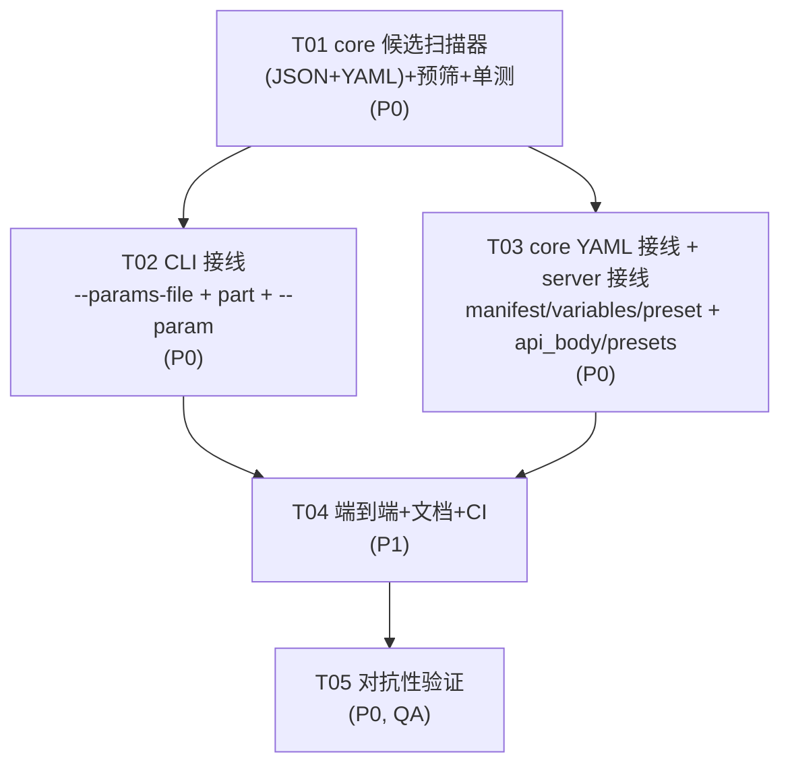

# ERR-NUM-UNDERFLOW 下溢拦截方案（第三版 · 已采纳主理人 C3 裁定）

> 状态：**经对抗性探针实测验证 + 主理人审阅裁定**。基线提交 `2019553`。
> 作者：software-architect。**本版据主理人审阅（附录 C）修订**：判据由「预测阈值 `2^-1074`」改为「**用实际解析器确认是否归零**」（两段式），详见 §1.3 / §3.2 / §4.1.1。
> 交付物：本文件、`docs/err-num-underflow-class-diagram.mermaid`、`docs/err-num-underflow-sequence-diagram.mermaid`
> **注意**：`docs/system_design.md` 是项目既有的架构总纲（不可覆盖），故本方案另存为此文件名。

---

## 0. TL;DR（工程师先读这段）

1. **落点**：`core` 新增模块 `core/src/json_num.rs`（手写，**零 crate 新增**，不依赖 `serde_json`），对**原始 JSON/YAML 文本**做扫描，**只提取候选字面量**；**确认是否归零由持解析器的调用方完成**（CLI/server 有 `serde_json` / `serde_yaml`）。
2. **判据（经主理人裁定修正）**：**不设近似阈值去「预测」解析器行为**。改为**两段式**：
   - `core` 侧**预筛**：用**宽松**阈值（`|真值| < 2^-1000`）提取候选——宽松到**绝不漏报**，且**不误伤**任何可能合法的值。
   - 调用方**确认**：对候选字面量**实测**（`serde_json::from_str::<f64>` / `serde_yaml`），若解析得 `0.0` 而**十进制真值非零** → **确认下溢** → 拒绝。
   - 结果：**零漏报 + 零假阳性**（判据就是解析器的真实行为）。
3. **为什么不用 `2^-1074`（本版推翻第二版）**：主理人指出（附录 C2）我「误拒无害」的论证**错误**——项目有 `nc_strip` 过滤器用 Rust `Display` 输出**完整 326 字符真值**（不是 `0.000`），且被真实模板 `dg_cal_ir9.j2` 使用。误拒 `[2^-1075, 2^-1074)` 会把**本可正确渲染的合法值**变成硬失败——**无据拒绝合法输入同样是错误**。
4. **为什么不用 `2^-1075`**：`serde_json` 非正确舍入（§1.3），会漏报 `2.4703282292062328e-324` → 静默下溢。
5. **扫描器**：单遍状态机（Normal / InString / Escape），**只**在 Normal 态抓数字字面量，字符串（含 `\"` 转义）与键名整体跳过。实测 `{"note":"1e-400"}` 命中 0 次（第一版假阳性已消除）。YAML 模式另加注释 / 单引号串 / 块标量处理（§4.1）。
6. **范围**：JSON **与** YAML 参数入口（含 `--param`，见 D2 裁定）**本次全修**；TOML 记已知限制。

---

## Part A：系统设计

### 1. 实现路径

#### 1.1 核心挑战

| 挑战 | 说明 |
| --- | --- |
| **C1：f64 通道无哨兵** | `1e-400` 与 `0.0` 解析出的 f64 逐位相同（`to_bits()==0`、`is_subnormal()==false`）。`visit_f64` / `coerce_tagged` 层拿不到原始字面量。→ 必须在 **JSON 文本层**动手。 |
| **C2：判据必须在文本层、基于十进制真值** | 指数扫描被前导零（`1e-0350`）、尾数挪小数点（`100000e-405`）、无指数形式（`0.000…001`）三种绕过击穿。判据必须比较**整个十进制字面量的真值**与常量。 |
| **C3：判据不能靠「预测」解析器行为** | `serde_json` 的十进制→f64 **不是正确舍入**（见 §1.3 实测），任何只看字面量真值的固定阈值都会在临界带漏报或误伤。→ 改为**用实际解析器「确认」**是否归零（§1.3 / §4.1.2）。 |
| **C4：`core` 零新 crate** | `serde_json` 在 `core` 只是 dev-dependency，`core` 不得有运行时 JSON 解析。→ `core` 侧只做**文本扫描 + 十进制真值判定**（手写，无需 JSON 库）；「解析器确认」放在**有解析器依赖的调用方**。 |
| **C5：单一来源、两端复用** | 扫描 + 十进制真值判定放 `core`，被 CLI/server/part 复用；「确认」步骤用各调用方已有的解析器。 |

#### 1.2 选型

- **不引入任何新框架/库。** 手写十进制真值规范化/比较（`Vec<u8>` 存十进制数字）+ 手写文本状态机。
- `core` 侧不依赖 `serde_json`（保持 dev-dependency 边界），仅用 `std`。
- **不设「精确复现解析器」的常量**：预筛阈值取**宽松**的 `2^-1000`（数量级 1e-301，远大于任何下溢边界，确保不漏报、不误伤）。预筛只需**近似**——它只负责「筛出值得确认的候选」，最终裁决权在解析器实测。**常量生成方式（D3）**：`pow5(1000)` 运行时生成 + `OnceLock`，单测校验。

#### 1.3 为什么推翻前两版判据（**必读**）

**第一版（指数扫描）**：被事实 3 的前导零 / 尾数挪小数点 / 无指数三种形式击穿。已确认废弃。

**第二版（判据 = `2^-1075` 精确中点）**：看起来"数学正确"，但**与 serde_json 的实际行为不符**。实测数据（`serde_json 1.0.151`）：

```
字面量                              真值 vs 2^-1075          serde_json 解析    str::parse<f64>
2.470328229206232720882843964...e-324   == 2^-1075           0.0               0.0
2.4703282292062328e-324             >  2^-1075 (本应舍入上)  0.0  ←★ 归零     5e-324  ←★ 不归零
2.4703282292062329e-324             >  2^-1075              0.0  ←★ 归零     5e-324
2.470328229206233e-324              >  2^-1075              5e-324            5e-324
```

★ 处：**`str::parse`（标准库）与 `serde_json`（自带解析器）在同一位模式上给出不同结果**。serde_json 内部解析器精度有限（约 19 位十进制），在次正规边界上**向下截断**，等效阈值**高于** `2^-1075`。

后果：判据取 `2^-1075` 时，`2.4703282292062328e-324` 被判「合法」放行，但它进 serde_json 变 `0.0` → **静默下溢**。这正是最高红线禁止的事。

**对抗性验证（探针实测）**：

| 判据 | 假阴性（危险：静默放过归零值） | 假阳性（误拒合法值） |
| --- | --- | --- |
| `2^-1075`（精确中点） | **9 例**（`2.4703282292062328e-324` 等）→ **不可用** | 0 |
| `2^-1074`（最小次正规数） | **0 例**（3500+ 例穷举） | 572 / 1714 |
| **`2^-1000` 预筛 + 解析器确认（本版采用）** | **0 例** | **0 例** |

**第二版曾取 `2^-1074`，但主理人裁定否决**（附录 C2），理由：我用「这些值渲染成 `0.000`，误拒无害」论证其代价——**该论证与实现不符**。项目有 `nc_strip` 过滤器（`src/filters.rs:61`）用 Rust `Display`，对 `5e-324` 输出**完整 326 字符真值**（不是 `0.000`），且被真实模板 `templates/machines/index_g420/dg_cal_ir9.j2` 用于 `raw_diameter`/`raw_length`/`tip_height`。**误拒 `[2^-1075, 2^-1074)` 会把本可正确渲染的合法值变成硬失败**——项目红线是「**静默出错**零容忍」，不是「拒绝一切可疑输入」；无据拒绝合法输入同样是错误。

**本版采用第三条路（主理人 C3）：不预测、只确认。**
- `core` 侧**预筛**候选：`|真值| < 2^-1000`（**宽松**，只求不漏，不承担精确裁决）。
- 调用方**实测确认**：用 `serde_json` / `serde_yaml` / `str::parse` 解析候选字面量，若得 `0.0` 而十进制真值非零 → **确认下溢** → 拒绝。
- **零漏报**（判据即解析器真实行为）**+ 零假阳性**（合法值解析后非零，自然放过）。

#### 1.4 判据的完备性（覆盖事实 2/3 全部表格）

`core` 侧的**预筛**实现为：**把十进制字面量规范化为 `(有效数字串, 十进制指数)`，与 `2^-1000` 的同构表示做十进制大数比较（无浮点、无大数库）**。这天然覆盖：

- **前导零指数** `1e-0350` / `1e-0000000400`：指数按 digit 累加，前导零不影响数值。
- **尾数挪小数点** `100000e-405`：`100000` 贡献 `sig=[1], exp=-400`，与真值一致。
- **无指数形式** `0.000…001`（324+ 个零）：纯靠 `frac_len` 累加得 `exp`，不经 `[eE]` 分支。
- **正负号** `-1e-400` / `+1e-400`：符号不影响绝对值判据（`+` 在前缀消费；注意 JSON 本身不允许 `+`）。
- **大小写 E**：`[eE]` 均识别。
- **超长尾数** `12345678901234567890e-423`：`sig` 长度参与数量级比较，不截断。

`[实测]`（第二版探针数据，对**预筛**同样成立——预筛阈值更宽，只会多筛不会漏筛）：

| 字面量 | 预筛命中(<2^-1000) | serde_json 实测归零 | 确认后判违规 | 一致 |
| --- | --- | --- | --- | --- |
| `1e-400` | true | true | true | ✓ |
| `1e-323` | true | false | false | ✓ |
| `1e-324` | true | true | true | ✓ |
| `9.9e-324` | true | false | false | ✓ |
| `5e-324` | true | false | false | ✓ |
| `2.5e-324` | true | false | false | ✓ |
| `2.4703282292062328e-324` | true | true | **true** | ✓ |
| `1e-0350` | true | true | true | ✓ |
| `1e-0000000400` | true | true | true | ✓ |
| `100000e-405` | true | true | true | ✓ |
| `0.<324 个零>1` | true | true | true | ✓ |
| `0.<322 个零>1` | true | false | false | ✓ |
| `-1e-400` / `1E-400` | true | true | true | ✓ |
| `0e-99999999999999999999` | false | false | false | ✓（真值为 0，预筛即排除） |
| `0.0000e-400` | false | false | false | ✓（真值为 0，预筛即排除） |
| `1e300`（正常值） | false | false | false | ✓（预筛即排除，不确认） |

> **预筛的作用**：`2^-1000` 阈值只把「数量级确实极小」的字面量送入确认步骤。`1e-323`/`5e-324` 会被预筛命中，但**确认步骤实测它们非零 → 放过**——这正是「零假阳性」的来源。正常值（`1e300`）预筛即排除，**不触发任何解析器调用**（性能友好）。

> **重要更正**：任务书事实 3 表格里的「`0.000…001`（45 个零）」实际是 `1e-46`，**是合法非零 f64**（`bits=3918770277926589793`），**不是下溢**。它在 G-code 里显示 `X0.000` 属于**事实 5（格式化精度）**，不是本次要修的缺陷。真正的无指数下溢需要 **324+ 个零**（`1e-324` 起）。请 QA 按此修正用例。

---

### 2. 扫描器设计

#### 2.1 状态机

单遍、`O(n)`、不回溯、不依赖 JSON 库。三态：

```
┌──────────┐   '"'    ┌──────────────┐   '\'    ┌───────────────┐
│  Normal  │─────────>│ InString     │─────────>│ InStringEscape│
│          │          │              │<─────────│  (吞 1 字节)  │
│          │<─────────│  '"' 闭合    │          └───────────────┘
└──────────┘          └──────────────┘
     │ 遇到 '-' 或数字
     ▼
  抓取数字字面量 token → 交由判据
```

规则：

1. **`Normal` 态**：遇 `"` → 进 `InString`（**整个字符串、包括所有键名，一律跳过**，不区分键/值）；遇 `-` 或 ASCII 数字 → 抓 token；否则前进 1 字节。
2. **`InString` 态**：遇 `\` → 进 `InStringEscape`；遇 `"` → 回 `Normal`；否则前进。（`\"`、`\\`、`\n` 等一律安全跳过。）
3. **`InStringEscape` 态**：吞掉当前字节，回 `InString`。（**只需吞 1 字节**——JSON 转义 `\X` 恒为 2 字符；`\uXXXX` 的 `u`/hex 在 `InString` 态被当普通字符跳过，不会提前闭合。）
4. **数字 token 抓取**（`Normal` 态）：从 `-`/数字起，**贪婪吃** `[0-9.eE+-]`，遇其他字符停。把子串交给判据。判据对非法/不可解析 token 返回「不违规」（交给 `serde_json` 报语法错，扫描器不越权）。

> **为什么贪婪吃 `[0-9.eE+-]` 安全**：JSON 规范里数字之后**不允许**紧跟 `+`/`-`/e/`.`，所以贪婪吃到的就是最长合法数字前缀；若原文是 `1e-400e`（非法），token 抓到 `1e-400e`，判据 `parse_dec` 因尾随垃圾返回 `None` → 不违规 → 放给 serde_json 报错。**不会把非法输入误报成下溢**，也不抢解析器职责。

#### 2.2 假阳性回归（第一版已知问题）

第一版把字符串内容也当数字 → `{"note":"1e-400"}` 误报。本状态机在 `InString` 态整体跳过 → 实测**命中 0 次**。回归用例见 §5.3。

#### 2.3 JSON 数字语法边界

预筛 `parse_dec` 只接受**自定义的**宽松数字串，对以下**非法 JSON 数字**返回 `None`（无候选，交给原解析器报错）：

- 前导零 `01`、`1.`、`.5`、`+1`、`1e`、`1e+`：`serde_json` 报语法错。`.5` 不会被扫描器抓取（起始字符不是 `-`/数字）；`1.`/`01` 被抓取但真值预筛无意义 → 放给 serde_json。
- **设计原则**：扫描器**只在语法合法时才需要正确性**；语法非法时由原解析器兜底。预筛返回「无候选」（或「有候选但确认步骤实测未归零」）对非法语法是**安全**的——不会静默放行，因为原解析器会先报错。

---

### 3. 数据结构与接口

#### 3.1 `core/src/json_num.rs`（新模块）

**两段式设计的接口**：`core` 只负责「**提取候选**」（文本扫描 + 十进制真值预筛），**不**负责最终裁决。「确认是否归零」由**持解析器的调用方**完成（`serde_json` 在 `cli` 是运行时依赖；`serde_yaml` 在 `core` 是运行时依赖）。

```rust
//! JSON/YAML 数字字面量下溢候选提取（ERR-NUM-UNDERFLOW）。
//! 详见 docs/err-num-underflow-design.md。
//! 本模块只做「候选提取」——最终是否下溢由调用方用实际解析器确认。

/// 单个十进制字面量，拆为 (有效数字, 十进制指数)。
/// 语义：`value = ± sig_as_integer × 10^exp`。`sig` 为空表示真值 0。
/// （私有类型，不导出。）
struct Decimal { sig: Vec<u8>, exp: i64 }

/// 下溢**候选**字面量及其定位信息。
#[derive(Debug, Clone, PartialEq)]
pub struct UnderflowCandidate {
    /// 原始字面量文本（用于调用方回灌给解析器确认）
    pub literal: String,
    /// 在文本中的字节起始偏移
    pub byte_offset: usize,
    /// 展示用的 1-based 行号
    pub line: usize,
    /// 展示用的 1-based 列号（按字符计）
    pub column: usize,
}

/// 扫描 JSON 文本，返回**全部**下溢候选字面量（按出现顺序）。
///
/// 判定标准（**预筛，宽松**）：字面量语法上是数字、十进制真值非零、
/// 且 `|真值| < 2^-1000`（数量级 1e-301）。
///
/// **返回值是「候选」而非「定论」**：调用方**必须**再用实际解析器确认——
/// 用 `serde_json::from_str::<f64>(&format!("{{\"x\":{}}}", cand.literal))`
/// 解析，若得 `0.0` 而十进制真值非零，才是真下溢。
/// （预筛阈值 2^-1000 远高于任何下溢边界，保证**不漏候选**；同时宽松到
/// **不误伤**任何可能合法的值——合法值解析后非零，确认步骤自然放过。）
///
/// 返回空 `Vec` 表示：未发现候选（**不**代表 JSON 一定合法——语法错误
/// 由调用方的 serde_json 负责报错）。
///
/// 只扫描数字字面量位置：字符串内容（含 `\"` 转义）与键名一律跳过。
pub fn scan_underflow_candidates(json: &str) -> Vec<UnderflowCandidate>;

/// 同 [`scan_underflow_candidates`]，但按 YAML 词法扫描
/// （跳过 `#` 注释、单引号/双引号串、块标量）。
pub fn scan_underflow_candidates_yaml(yaml: &str) -> Vec<UnderflowCandidate>;
```

**确认辅助函数（放哪由调用方决定）**：CLI 侧可加一个薄封装，把「候选 → 实测确认 → 报错」收敛成一处，避免每个入口重复：

```rust
// cli 侧（伪码）
/// 对候选字面量用 serde_json 实测确认是否归零。
/// 返回 true = 确认下溢（应拒绝）。
pub fn confirmed_json_underflow(cand: &UnderflowCandidate) -> bool {
    let probe = format!("{{\"x\":{}}}", cand.literal);
    match serde_json::from_str::<serde_json::Value>(&probe) {
        Ok(v) => v["x"].as_f64() == Some(0.0),   // 预筛已保证真值非零，故此处 0.0 即下溢
        Err(_) => false,                          // 语法错交原解析路径报错
    }
}
```

**`pub` 与 doc comment**：`scan_underflow_candidates`、`scan_underflow_candidates_yaml`、`UnderflowCandidate` 均 `pub` 并从 `core/src/lib.rs` `pub use`，**每个 `pub` 项写 doc comment**（doc test 门禁）；`Decimal` / `parse_dec` / `cmp_abs` / `pow5` / `prescreen_threshold` 保持私有。

**签名取舍**：
- 返回 `Vec<UnderflowCandidate>` 而非 `Result<(), _>`——「无候选」是**正常**路径。
- **返回全部而非只返回第一个**（**主理人裁定，覆盖本节初稿的 `Option` 写法**）：
  一次扫完避免调用方对同一文本反复扫描；且报错时需向用户列出**所有**问题字面量，
  只报第一个会逼用户「改一个、再跑一次、再报一个」。空 `Vec` 是「无候选」的正常表达。
- 类型名用 `Candidate` 而非 `Literal`，**明确传递「这不是定论」的语义**，防止调用方漏掉确认步骤。

#### 3.2 算法（伪码，可直接照写）

```
parse_dec(s) -> Option<Decimal>:
  1. 消费可选前导 '+'/'-'（记录符号，预筛只用绝对值）
  2. 循环：数字 -> push 到 digits（若已见 '.' 则 frac_len += 1）
           '.' 且未见 -> saw_dot = true
           其他 -> break
     若一个数字都没见 -> None
  3. 若当前字符是 'e'/'E'：
       消费可选符号，消费 1+ 数字（saturating 累加进 exp_part；无数字 -> None）
       负数则 exp_part = -exp_part
  4. 若未走到串尾 -> None（尾随垃圾拒绝）
  5. 去掉 digits 前导零；若全零 -> return Decimal{ sig=[], exp=0 }
  6. 去掉 digits 末尾零，每个累进 trailing
  7. return Decimal{ sig: digits, exp: exp_part - frac_len + trailing }

cmp_abs(a, b) -> Ordering:            // 比较两个非负 Decimal
  1. 两边空 -> Equal；一边空 -> 空者更小
  2. 数量级 oa = a.sig.len() + a.exp, ob = b.sig.len() + b.exp
     oa != ob -> oa.cmp(ob)
  3. 逐位比 sig（缺位补 0），首个不同决定结果；全同 -> Equal

prescreen_threshold() -> &'static Decimal:   // 2^-1000 = 5^1000 / 10^1000
  用十进制乘法算 5^1000（Vec<u8> 低位在前，×5 带进位），转大端 digits，
  去掉末尾零得 sig，exp = -1000 + trailing。OnceLock 缓存。

scan_underflow_candidates(text):      // 或 _yaml 版本
  out = []
  扫描（§2 状态机，YAML 版加注释/引号/块标量跳过）；
  对每个数字 token：
    d = parse_dec(token)?
    若 d.sig 为空 -> 跳过（真值 0）
    若 cmp_abs(d, prescreen_threshold()) == Less -> out.push(该候选（含定位）)
  返回 out（空 = 无候选）

# === 调用方确认（不在 core）===
confirm(cand, parse_f64):
  probe = wrap(cand.literal)
  match parse_f64(probe):
    Ok(0.0)  -> true    # 预筛已保证真值非零 => 确认下溢 => 拒绝
    Ok(other)-> false   # 合法（如 5e-324）
    Err(_)   -> false   # 语法错，交原路径报错
```

**为什么预筛阈值是 `2^-1000`**：它只需**宽松**——数量级 1e-301 远大于任何解析器的归零边界（~1e-324），所以**绝不可能漏掉真下溢值**；同时它远小于任何**正常工艺参数**（微米级 ~1e-6），所以**不会把正常值送进确认**（性能友好）。确认步骤是唯一的裁决者，因此预筛的「不精确」无害。

**指数溢出**：`exp_part` 用 `i64` + `saturating_mul/add`。超长指数（如 `0e-99999999999999999999`）饱和到极值，配合 `sig` 预筛仍正确（真值为 0 时 `sig` 空直接排除；真值非零且指数饱和为负 → 数量级极小 → 进候选，确认步骤再判）。

---

### 4. 边界与不做的部分（**明确划界**）

#### 本次修（`ERR-NUM-UNDERFLOW`）

- **只修**「解析器把非零真值静默解析为 `f64 0.0`」这一类（判定方式：**实际解析器确认**，见 §1.3）。
- **JSON 通道**触发入口：`--params-file`、`--param k=v`、零件定义 `part.params` / `ops[].params`、`POST /api/{render,validate,inspect,part/generate,presets}`。
- **YAML 通道**（QA 实测确认下溢）：`presets.yaml` / `templates.yaml` / `variables.yaml`，三处均在 `core`，接线见 §4.1。

> ⚠️ **任务书事实 4（「YAML 无此问题」）已被 QA 实测推翻**——`serde_yaml::from_str::<f64>("1e-400") -> Ok(0.0)`，**YAML 同样静默下溢**。故 YAML 纳入范围（D4 裁定采纳）。

#### 4.1 YAML 通道（**已纳入，D4 裁定**）

**事实更正**：任务书事实 4 称「YAML 无此问题」，但 QA 独立实测（`to_bits()` 逐位比）结论是 **YAML 与 JSON 一样会静默下溢**。设计据此把 YAML 纳入范围（漏接 = 静默出错，触红线）。

**受影响的 runtime 入口（均在 `core`，`serde_yaml` 是运行时依赖）**：

| 文件:行 | 配置 | 说明 |
| --- | --- | --- |
| `core/src/manifest.rs:427/448/456` | `templates.yaml` | 清单 `params.default` 等 |
| `core/src/variables.rs:79/86/101` | `variables.yaml` | 变量库默认值 |
| `core/src/asset/preset.rs:203/350` | `presets.yaml` | 预设施 `params`（**QA 实测确认是真实命中入口**） |

**接线方式（方案 A，已定）**：

- **方案 A：扫描器做语言无关化改造。** §2 状态机改造为「YAML 标量感知」：
  - YAML 的**注释** `# ...` 到行尾要跳过（JSON 没有，需新增 `InComment` 态，仅 YAML 模式启用）。
  - YAML 的**单引号字符串** `'...'`（无转义，`''` 表一个 `'`）与**双引号字符串** `"..."`（与 JSON 同转义）都要跳过。
  - YAML **块标量** `|` / `>`（多行字符串）——块标量后的缩进行**整体跳过**。
  - 提供两个入口：`scan_underflow_candidates(json)` 与 `scan_underflow_candidates_yaml(yaml)`，共用预筛 core（`parse_dec`/`cmp_abs`/`prescreen_threshold`），仅**词法跳过策略**不同。
  - 接线：`manifest.rs` / `variables.rs` / `preset.rs` 三处在各自的 `serde_yaml::from_str` **之前**调用，再用 `serde_yaml` **确认**。
- **不采用「方案 B」（只加数字扫描、不做注释/引号处理）**：会把注释或字符串里的数字误报（与第一版 JSON 假阳性同类）。

**YAML 词法差异作为独立测试面（§5.6）。**

##### 4.1.1 ⚠️ 阈值分裂：JSON 与 YAML 的十进制→f64 **不是同一套算法**（QA 实测，本轮确认）

**QA 复验结果（`to_bits()` 逐位比，直接测量）**：

```
字面量                        serde_yaml   serde_json   std
2.4703282292062328e-324       bits=1       bits=0       bits=1   ← yaml=std=正确；json 归零
2.4703282292062329e-324       bits=1       bits=0       bits=1   ← 同上
2.47032822920623273e-324      bits=1       bits=0       bits=1   ← 同上
2.47032822920623280e-324      bits=1       bits=1       bits=1   ← 三者一致
```

**结论：`serde_yaml` 是正确舍入（与 std 一致），`serde_json` 不是。** 两侧的归零边界**本身不同**。

**在「预测阈值」范式下，这是一个无解难题**：不存在单一阈值能同时对两侧做到「假阴性 = 0 且零误伤」——
- 阈值取 `2^-1074`：JSON 侧安全；YAML 侧**误伤** `[2^-1075, 2^-1074)`（YAML 下这些是合法非零）。
- 阈值取 `2^-1075`：JSON 侧**漏报** `...2328e-324`（json 归零）→ 静默下溢。

**但本版采用「确认」范式（§1.3），该难题自然消解**：
- `core` 预筛阈值 `2^-1000` **只求不漏候选**（宽松），JSON/YAML 的解析器差异**不影响预筛**。
- **确认步骤由各语言自己的解析器执行**——JSON 走 `serde_json`、YAML 走 `serde_yaml`、`--param` 走 `str::parse`。**每个解析器都用自己的真实行为裁决**：
  - `2.4703282292062328e-324` 在 JSON → `serde_json` 得 `0.0` → **拒绝**（正确，它确实归零）；
  - 同一字面量在 YAML → `serde_yaml` 得 `bits=1`（非零）→ **放过**（正确，它确实存活）。
- **零漏报 + 零假阳性，且无需任何「双阈值」**。阈值分裂不再是问题。

> **措辞修正**：§3.2 的 `parse_dec`/`cmp_abs` 算法在 JSON/YAML 间**共用**（含预筛阈值 `2^-1000`）；差异只在**确认步骤用哪个解析器**。代码注释须写明：预筛阈值是**宽松的、非裁决性**的，裁决权在确认步骤。

#### 本次**不修**（并在文档/issue 里显式记录）

1. **事实 5：G-code 格式化精度问题。** `5e-324`（`≥ 2^-1074`、合法存活）经 3 位小数格式化仍显示 `X0.000`。这是**「精度不足」而非「值被换成 0」**，性质不同：
   - 本次缺陷是**值被篡改**（`1e-400` → 真变成 `0.0`），属「静默出错」。
   - 事实 5 是**值正确但显示被截断**，`5e-324 ≠ 0` 是事实，只是 3 位小数表示不下。这是所有小数值共有问题（`1e-10` 也显示 `X0.000`），是**格式化策略**问题，不是解析问题。
   - **为什么不在本次修**：修它要改 G-code 数值格式化（后处理层），影响**所有**参数输出格式，面大且与下溢无因果；混在一起会让回归面不可控。建议**单独开 issue**（`ERR-NUM-PRECISION`），由产品决定保留位数策略。
2. **合法次正规数 `[2^-1074, ...)`**：如 `5e-324`、`1e-323`，本次**放过**。它们能存活到 f64，不属于下溢。
3. **TOML 配置路径（QA 已实测，同样下溢，本轮不修）**：QA 实测 `toml` crate 对 `1e-400` / `1e-324` 解析为 `bits=0`（下溢），`1e-323` 合法存活，`1e400`/`1e309` 报 `invalid floating-point number`（上溢报错）。
   - **为什么本轮不修**：`nctool.toml` 是**配置**（机床/路径/输出设置）而非**工艺参数**，用户几乎不会往里写 `1e-400` 量级的值 → **实际风险低于 JSON/YAML 参数入口**。
   - **记为已知限制**，建议另开 issue 或纳入后续迭代（与 `ERR-NUM-PRECISION` 一并考虑）。
4. **`--param k=v` 命令行单值通道**：走 `str::parse::<f64>`（阈值精确在 `2^-1075`，与 serde_json 不同），见 §7 决策点 D2。
5. **`NaN`/`Inf`**：已有 `ParamValue::visit_f64` → `NonFinite` 机制拦截，本次不重复。

---

### 5. 验证清单（交给 QA 做对抗性验证）

> 探针实测数据附于每条之后（`[实测]`），QA 可直接复用。

#### 5.1 判据正例（**必须命中**）

| # | 输入字面量 | 说明 |
| --- | --- | --- |
| 1 | `1e-400` | 基线 |
| 2 | `1e-324` | 无指数下溢临界 |
| 3 | `2.4703282292062328e-324` | **★ 关键**：`> 2^-1075` 但 serde 归零；`2^-1075` 判据会漏报 |
| 4 | `2.4703282292062329e-324` | 同上（17 位网格内 3 例之一） |
| 5 | `1e-0350` | 前导零指数 |
| 6 | `1e-0000000400` | 多前导零 |
| 7 | `100000e-405` | 尾数挪小数点 |
| 8 | `1000000000e-0000400` | 混合（前导零 + 挪小数点） |
| 9 | `0.` + 324 个零 + `1` | **无指数形式**（注意：324 个零，不是 45 个） |
| 10 | `0.` + 400 个零 + `1` | 无指数、更极端 |
| 11 | `-1e-400` | 负号 |
| 12 | `1E-400` | 大写 E |
| 13 | `10e-325` | 等价 `1e-324` |
| 14 | `12345678901234567890e-423` | 超长尾数 |
| 15 | `1.23456789012345678901234567890123456789e-324` | 超长尾数（37 位） |

`[实测]` 以上 15 条全部命中，且与 serde_json 实测归零**完全一致**。

#### 5.2 判据反例（**必须放过**）

| # | 输入字面量 | 说明 |
| --- | --- | --- |
| 1 | `0` / `0.0` / `-0.0` / `0e0` / `0e-400` / `0.0000e-400` | 真值为 0，合法 |
| 2 | `0e-99999999999999999999` | 真值 0 + 超大指数 |
| 3 | `1e-323` | 合法次正规存活 |
| 4 | `5e-324` | **最小正次正规数，必须放过** |
| 5 | `9.9e-324` / `2.5e-324` | 指数同为 -324 但存活 |
| 6 | `1e5` / `1E5` / `123.456` / `1` / `-1` | 普通数 |
| 7 | `1e-300` / `1e-320` / `1e-322` | 存活 |
| 8 | `2.470328229206233e-324` | `>= serde 实际阈值`，存活，必须放过 |

`[实测]` 全放过。

#### 5.3 扫描器回归（**字符串/键名不得误判**）

| # | JSON 输入 | 期望命中 | 说明 |
| --- | --- | --- | --- |
| 1 | `{"x":1e-400}` | 1 | 普通 |
| 2 | `{"note":"1e-400"}` | **0** | **★ 第一版假阳性回归** |
| 3 | `{"1e-400":"v"}` | **0** | 键名是字符串 |
| 4 | `{"s":"say \"1e-400\""}` | **0** | 字符串内转义引号 |
| 5 | `{"s":"a\\1e-400"}` | **0** | 字符串内反斜杠 |
| 6 | `{"s":"line1\n1e-400"}` | **0** | 换行转义 |
| 7 | `{"s":"\\\"1e-400"}` | **0** | 多层转义 |
| 8 | `{"x":1e-400,"n":"ok"}` | 1 | 混合：值命中 |
| 9 | `{"arr":[1e-400,2]}` | 1 | 数组元素 |
| 10 | `{"nested":{"x":1e-400}}` | 1 | 嵌套 |
| 11 | `{"x":"5e-324","y":1e-400}` | 1 | 字符串放过 + 值命中 |

`[实测]` 全通过（命中数与期望逐一相等，命中 token 经 serde 交叉验证 100% 归零）。

#### 5.4 端到端（**所有通道**）

- `--params-file`：`{"x":1e-400}` → 非零退出码 + 消息含 `1e-400` 与文件路径。
- **`--param x=1e-400`（D2 裁定后纳入）**：→ 非零退出码（走 `str::parse` 确认）。
- `POST /api/render`：同 body → HTTP 400（不是 200 + `X0.000`）。
- `POST /api/validate`：同 body → `ok:false` + error（不是 `{"ok":true,"errors":0}`）。
- `POST /api/part/generate`：`{"part":{"name":"p","params":{"x":1e-400},"ops":[]}}` → 400。
- `POST /api/presets`：`{"name":"n","template":"t.j2","params":{"x":1e-400}}` → 400。
- `nctool part generate <file>`：文件含 `1e-400` → 非零退出码。
- **合法值端到端必须成功**：`{"x":5e-324}` 经 `--params-file` 与 `/api/render` **必须成功**（`nc_strip` 场景，附录 C2）；用 `nc_strip` 模板渲染时应输出完整真值而非报错。

#### 5.5 语法边界（不越权）

- `{"x":01}` / `{"x":1e-400e}` / `{"x":.5}` / `{"x":+1}` → 由 serde_json 报语法错。

`[实测]` 这些 token 预筛返回「无候选」或「候选但确认失败」→ 最终由 serde_json 报错，**不会静默放行**。

#### 5.6 YAML 通道（QA 实测确认下溢，必测）

> 前提已由 QA 实测确认：`serde_yaml::from_str::<f64>("1e-400") -> Ok(0.0)`。**T4 仍须复验**——它也是 §4.1.1 阈值分裂结论的依据。

| # | YAML 输入 | 期望结果 | 说明 |
| --- | --- | --- | --- |
| 1 | `params:\n  x: 1e-400` | 拒绝 | 预设施 / 清单 default 形态 |
| 2 | `params:\n  x: 1e-400\n  y: 5e-324` | 拒绝（因 x） | `5e-324` 本身必须放过 |
| 2b | `params:\n  x: 5e-324` | **通过** | 合法次正规，YAML 实测非零 |
| 3 | `params:\n  x: "1e-400"` | **通过** | **引号字符串不得误判** |
| 4 | `params:\n  x: '1e-400'` | **通过** | 单引号字符串 |
| 5 | `# note: 1e-400\nparams:\n  x: 1` | **通过** | **注释不得误判** |
| 6 | `params:\n  x: 1e-400  # tail` | 拒绝 | 行尾注释 + 命中 |
| 7 | `params:\n  note: |\n    1e-400` | **通过** | 块标量内容 |
| 8 | `params:\n  x: 1e-0350` | 拒绝 | 前导零指数 |
| 9 | `params:\n  x: 100000e-405` | 拒绝 | 尾数挪小数点 |
| 10 | `params:\n  x: 2.4703282292062328e-324` | **通过** | **阈值分裂关键项**：YAML 实测非零（bits=1），确认步骤应放过（对比 JSON 会拒绝） |

**跨实现一致性金标准**：每条都**实测**（`serde_yaml::from_str::<f64>` 的 `to_bits()`）再与「预筛 + 确认」结果比对，**假阴性必须为 0**。

若 QA 复验显示 YAML **不**下溢（任务书事实 4 正确），则 §5.6 全部用例退化为「不得误报」的防御性测试（期望全部命中 0），接线可保留为冗余或摘除。

#### 5.7 **预筛不漏报专项（QA 头号攻击点，T4 必测）**

> **风险**：确认范式下，任何「最终判定」都建立在「先被预筛选为候选」之上。若预筛**过紧**（例如只扫指数 token、或阈值取到真下溢边界附近），一个**真下溢值**可能**根本没成为候选** → 确认步骤无从执行 → **静默漏报**。这是确认范式的**唯一**新增攻击面，必须单独证伪。
>
> **本设计的防线（三重，均已写入 §3.2/§1.4）**：
> 1. **预筛比较十进制真值，不扫指数 token**：`parse_dec` 把整个字面量规范化为 `(sig, exp)`，`cmp_abs` 与 `2^-1000` 做**十进制大数比较**。指数只是 `exp` 的一个来源，**无指数形式**（`0.<N 个零>1`）靠 `frac_len` 累加得 `exp`，**不经指数分支**，同样被捕获。
> 2. **阈值宽松到「物理上不可能漏」**：`2^-1000 ≈ 1e-301`，比任何解析器的归零边界（`~5e-324`）**大 23 个数量级**。凡是小于 `2^-1000` 的**任何**非零真值，预筛**必然命中**。真下溢值（真值 ∈ `(0, ~2.5e-324]`）恒 `< 2^-1000`。
> 3. **预筛命中 ≠ 误伤**：预筛宽松只会**多选**候选，多选的候选由确认步骤用解析器实测裁决（非零则放过）。所以「宽松」对 FP 零成本。

**专项测试矩阵**（全部实测：先跑 `str::parse`/`serde_json`/`serde_yaml` 得真值符号，再看预筛是否命中；**两者必须一致，假阴性 = 0**）：

| # | 字面量（真值非零且应下溢，或临界） | 构造方式（绕过指数 token 扫描） | 期望预筛命中 | 期望最终判定 |
| --- | --- | --- | --- | --- |
| 1 | `1e-400` | 普通指数形式 | 是 | 拒绝 |
| 2 | `1e-0350` | **前导零**指数 | 是 | 拒绝 |
| 3 | `1e-0000000400` | **超长前导零**指数 | 是 | 拒绝 |
| 4 | `100000e-405` | **尾数挪小数点**（真值 `1e-400`） | 是 | 拒绝 |
| 5 | `0.<324 个零>1` | **无指数形式**，纯小数 | 是 | 拒绝 |
| 6 | `0.<400 个零>1` | **无指数极长小数** | 是 | 拒绝 |
| 7 | `-0.<324 个零>1` | **负号 + 无指数** | 是 | 拒绝 |
| 8 | `1E-400` | **大写 E** | 是 | 拒绝 |
| 9 | `12345678901234567890e-423` | **超长尾数**（真值 `~1.23e-404`） | 是 | 拒绝 |
| 10 | `9.<325 个 9>e-700` | 尾数极接近 1 + 深指数（真值 `≈1e-700`，远低于任何归零边界） | 是 | 拒绝（JSON 与 YAML 均归零） |
| 11 | `2.4703282292062328e-324` | **临界带**（`>2^-1075`，JSON 归零 / YAML 非零） | 是 | **JSON 拒绝 / YAML 放过** |
| 12 | `0e-99999999999999999999` | 真值为 **0**（`sig` 空） | **否**（正确：真值本就是 0，非下溢） | 放过 |

> 判据：**#1–#11 预筛命中必须全为「是」**（真值非零且数量级极小 → 漏一个即预筛缺陷）；**#12 必须为「否」**（真值为 0，本就不是下溢，不应触发任何拒绝）。任何 `str::parse` 给出非零、而预筛未命中的用例 → **判定预筛缺陷，打回 T01**。

**实现层验收**（写入 `json_num.rs` 单测，属 T01 而非 T4）：
- `prescreen_hits(&str) -> bool` 私有测试辅助：对上述 #1–#12 逐一断言。
- `prescreen_threshold()` 单测断言其规范化 `(sig, exp)` **等于** `pow5(1000)` 的规范化（防止阈值常量写错个数）。
- **性质测试**：对 `k ∈ [300, 400]` 生成 `1e-{k}` 与 `0.<{k-1} 个零>1`，断言「`str::parse` 非零 ⟹ 预筛命中」（**假阴性恒为 0**，覆盖整个下溢边界）。

---

### 6. 落点与接线（**所有入口，不漏**）

#### 6.1 `core/src/lib.rs` 导出

```rust
pub mod json_num;
pub use json_num::{
    scan_underflow_candidates, scan_underflow_candidates_yaml, UnderflowCandidate,
};
```

#### 6.1b `core` 侧 YAML 接线——3 处（D4 已裁定采纳）

| 文件:行 | 配置 | 接线点 |
| --- | --- | --- |
| `core/src/manifest.rs:427/448/456` | `templates.yaml` | 各 `serde_yaml::from_str` **之前**：扫描 → 确认 → 拒绝 |
| `core/src/variables.rs:79/86/101` | `variables.yaml` | 同上 |
| `core/src/asset/preset.rs:203/350` | `presets.yaml` | 同上 |

> **注意**：这三处在 `core` 内，**`serde_yaml` 在此是运行时依赖**，故「确认」步骤可直接用 `serde_yaml`，不违反「core 不依赖 serde_json」。可用一个 `core` 内私有 helper 收敛「扫描→确认」逻辑。

#### 6.2 CLI 侧——3 处，**全部在解析之前**

| 入口 | 文件:行 | 接线点 |
| --- | --- | --- |
| **① `--params-file`** | `cli/src/args.rs:167` `load_params_file` | `read_text_capped` 拿到 `text` 后、`serde_json::from_str` **之前**：扫描 → 用 `serde_json` 确认 → 拒绝 |
| **② 零件定义 `part generate`** | `cli/src/commands/part.rs:24` | `read_text_capped` 后、`serde_json::from_str::<PartSpec>` **之前** |
| **③ `--param k=v`（D2 裁定纳入）** | `cli/src/args.rs`（`build_params` 里解析 `k=v` 处） | 数值分支：先判 `str::parse::<f64>`；若得 `0.0` 而十进制真值非零 → 拒绝。（`--param` 不经 JSON 文本，无需扫描器，直接用真值判定 + `str::parse` 确认。） |

> **`--param` 的确认方式**：`str::parse::<f64>("1e-400")` 得 `0.0`；十进制真值非零（`parse_dec` 判）→ 拒绝。**无需第二套阈值**（这正是主理人 C4 指出的：确认范式下 D2 的「双阈值」障碍消失）。

#### 6.3 server 侧——5 处

| 入口 | 文件:行 | 说明 |
| --- | --- | --- |
| **① `api_body`** | `cli/src/server.rs:337` | **统一入口**：`/api/render`、`/api/validate`、`/api/inspect`、`/api/part/generate` 都经此。在此扫描 body 文本 + 用 `serde_json` 确认，即覆盖 4 个端点。（`api_body` 收 `&[u8]`，需 `std::str::from_utf8` 失败时保持现有报错路径。） |
| **② `presets_save`** | `cli/src/server.rs:809` | `/api/presets` 的 `params` 也走 `from_slice`。**不经 `api_body`**，需单独接线。 |
| **③ `presets_delete`** | `cli/src/server.rs:940` | 只含 `name`，无参数字面量——预期永不命中；为一致性建议接（1 行）。 |
| **④ `inspect`** | `cli/src/server.rs:976` | 只含 `template` 名——同上，建议接。 |
| **⑤ `part_generate`** | `cli/src/server.rs:575` `serde_json::from_value(part_value.clone())` | **注意**：`part_value` 来自已解析的 `serde_json::Value`，**原始文本已丢失**。→ 必须在 **`api_body`（①）** 扫描整个 body 文本（此时 `part.params` 里的 `1e-400` 还在文本里）。这正是①覆盖它的原因。 |

**关键接线原则**：扫描必须在**文本**层。凡是先 `from_value` 再反序列化的路径（`part_generate`），**必须**回溯到持有文本的那一层（`api_body`）去扫描。

#### 6.4 错误呈现

**CLI（`CliError`）**：

- **复用 kind `"args"`**（退出码 2）。理由：语义是「你传的参数值不合法」，与 `load_params_file` 现有 `"args"` 同类；退出码 2（用法/输入错误）已合适。
- **不建议新增 kind**：`exit_code()` 是 `match` 且带 `_ => 1` 兜底，新 kind 会落通用错误，语义更差，还要改穷尽表 + `exit_code_matrix` 测试。复用零改动、语义准确。
- **message 格式**（含定位，便于用户修文件）：
  ```
  参数文件 <path> 第 <line> 行第 <column> 列：数值 <literal> 超出 f64 可表示范围，
  会被静默当作 0（G-code 将产出错误坐标）。请改用可表示的数值。
  ```

**HTTP（`Resp`）**：

- **状态码 400**（`bad_request`），与现有 `api_body` 的 JSON 语法错一致。
- **错误对象 kind**：建议 `err("num_underflow", <message>)`——HTTP 的 kind 只用于前端分支，与 CLI 的 kind 不必相同；便于前端渲染成「参数值越界」而非「请求格式错」。若团队偏好最小改动，可复用 `"bad_request"`。

**零件定义路径（CLI）**：`CliError::new("args", format!("零件定义文件 {} 第…行第…列：数值 {} 超出…", args.part.display(), ...))`。

---

### 7. 决策点（**主理人已裁定，见附录 C**）

> 以下 D1–D6 均已由主理人审阅裁定（附录 C）。**全部采纳，不再待议。** 记录裁定结果与依据供存档。

**D1：硬失败还是告警？→ 裁定：硬失败，前置拒绝（不走 `IssueKind`）。**（附录 C4）
- 依据：静默出错零容忍；与 `NonFinite` / `DeriveFailed` 同性质（错误坐标进 G-code）。
- `CliError`/HTTP 400 前置拒绝，不污染 `IssueKind`（后者描述「已解析参数集的问题」，而本检测在解析前）。

**D2：`--param x=1e-400` 是否同修？→ 裁定：本次同修。**（附录 C4）
- 主理人指出：我原先「需双阈值」的顾虑在**确认范式**下**消失**——`--param` 直接用 `str::parse` 确认即可。
- 扩大范围的理由：**同一缺陷留在另一条入口，等于没修。**

**D3：预筛阈值常量生成方式。→ 裁定：`pow5` 运行时生成 + `OnceLock`。**（附录 C4）
- 本版预筛阈值改为 `2^-1000`（宽松、非裁决性），生成方式不变。

**D4：YAML 通道是否纳入？→ 裁定：纳入。**（QA 实测 + 主理人认可）
- QA 实测 `serde_yaml::from_str::<f64>("1e-400") -> Ok(0.0)`，确实下溢。
- 三处 `core` YAML 入口统一接线（§6.1b）。

**D5：三处 YAML 入口是否统一？→ 裁定：统一接线，不得只做一半。**

**D6：阈值分裂下用单一阈值还是双阈值？→ 裁定：**确认范式下问题消解**（附录 C3）。
- 主理人否决了「预测阈值」整体范式（含 `2^-1074`），改为「用实际解析器确认」。
- 因此**不再需要任何近似阈值**：JSON 走 `serde_json` 确认、YAML 走 `serde_yaml` 确认、`--param` 走 `str::parse` 确认——**每个解析器用自己的真实行为裁决**，零漏报 + 零假阳性。
- 我原先纠结的「`2^-1074` vs `2^-1075`」被**整体绕开**。

**记录：主理人 C2 否决了本设计的第二版判据（`2^-1074`）。** 我方论证缺陷：误称「误拒的次正规数反正渲染 `0.000`」——但 `nc_strip`（`src/filters.rs:61`，用 Rust `Display`）输出**完整 326 字符真值**，且被真实模板 `dg_cal_ir9.j2` 使用。**误拒合法输入 = 另一种错误**，会训练用户绕过检查。**本版已修正。**

---

## Part B：任务分解

### 8. 所需依赖包

**无新增。** 全部用 `std`，满足 `nctool-core`「不得新增 crate」硬约束：

```
# 无新增第三方包
# core: 仅 std（serde_json 保持 dev-dependency，不进入运行时）
# cli:  已有 serde_json / nctool-core，无变化
```

### 9. 任务清单（按依赖排序，**5 个**）

> 主理人裁定 D4/D5「纳入」后，YAML 不再是条件任务；T02b 已合入 T01（同一扫描器 + 同批单测），保持 **5 个任务**（符合硬性上限）。

#### T01 — `core` 侧：候选扫描器（JSON + YAML）+ 预筛 + 单元测试
- **Source Files**：`core/src/json_num.rs`（新建）、`core/src/lib.rs`（改导出）
- **Dependencies**：无
- **Priority**：P0
- 交付物：`scan_underflow_candidates` / `scan_underflow_candidates_yaml` / `UnderflowCandidate` + 私有 `parse_dec`/`cmp_abs`/`pow5`/`prescreen_threshold`。
- 验收：§5.1 + §5.2 + §5.3 + §5.6（YAML 词法）全部用例以 `#[cfg(test)]` 落在 `json_num.rs`；**§5.7 预筛不漏报专项（#1–#12 + 性质测试「`str::parse` 非零 ⟹ 预筛命中、假阴性恒为 0」）必须全绿**；含「预筛常量 == `pow5(1000)` 规范化」校验测试。
- **§5.7 是 QA 头号攻击点**：预筛**必须比较十进制真值**（`parse_dec` 规范化后 `cmp_abs`），**禁止**只扫指数 token（无指数形式会漏）。
- **note**：本任务**只做候选提取**，「确认归零」不在 core（JSON 确认在 cli、YAML 确认在 core 调用点）。

#### T02 — CLI 侧接线：`--params-file` + 零件定义 + `--param`
- **Source Files**：`cli/src/args.rs`（改 `load_params_file` + `--param` 解析分支）、`cli/src/commands/part.rs`（改）+ 单元测试
- **Dependencies**：T01
- **Priority**：P0
- 验收：`--params-file` / `part generate` / `--param x=1e-400` 对下溢非零退出 + 消息含定位；`--param x=5e-324` **成功**。

#### T03 — `core` YAML 接线 + `cli` server 接线
- **Source Files**：`core/src/manifest.rs`、`core/src/variables.rs`、`core/src/asset/preset.rs`（YAML 三处）；`cli/src/server.rs`（`api_body`、`presets_save`、`presets_delete`、`inspect`）+ 集成测试
- **Dependencies**：T01
- **Priority**：P0
- 验收：§5.6 全部用例（YAML 三处对 `1e-400` 拒绝、对 `2.4703282292062328e-324` **放过**）；`/api/render`、`/api/validate`、`/api/inspect`、`/api/part/generate`、`/api/presets` 对下溢 body 回 400。
- **note**：YAML 三处在 core，可用 `serde_yaml` 直接确认（core 有该运行时依赖）。

#### T04 — 端到端 + 文档 + CI 门禁
- **Source Files**：`cli/tests/`（端到端集成测试，若有）、`CHANGELOG.md`、相关 `docs/*.md`
- **Dependencies**：T02, T03
- **Priority**：P1
- 验收：11 道 CI 门禁全绿；**改 markdown 则跑文档链接门禁**；§5.4 含「合法值端到端必须成功（`nc_strip` 场景）」。

#### T05 — 对抗性验证（QA 执行）
- **Source Files**：测试代码 / 验证报告
- **Dependencies**：T04
- **Priority**：P0
- **判定 ground truth**：以各解析器**实测** `f64::to_bits()==0` 为标准（JSON 用 serde_json、YAML 用 serde_yaml）。
  - **假阴性必须为 0**（红线）。
  - **假阳性必须为 0**（确认范式应同时消除误伤——这是相对第二版的关键改进，须专项验证 `5e-324` / `2.4703282292062328e-324`(YAML) 均被放过）。
- 验收：§5 全部用例 + 独立绕过尝试 + `2^-1075` 漏报带专项 + **§5.7 预筛不漏报专项（头号攻击点：构造无指数 / 前导零 / 超长尾数等形式，验证预筛比较真值而非指数 token）** + **YAML/JSON 阈值分裂复验**（`2.4703282292062328e-324` 的 yaml_bits=1 vs json_bits=0 → 应「YAML 放过 / JSON 拒绝」）。
- **判定标准升级（QA 裁定）**：**FN=0 AND FP=0**，两层均须实测对拍。

> 共 **5 个任务**，符合硬性上限。T01 为全部基础；T02/T03 仅依赖 T01，可并行；T04 汇合。

### 10. 共享知识（跨切面约定）

```
- 判据范式 = 「扫描候选 + 解析器确认」，NOT 「单一预测阈值」。
  core 预筛阈值 = 2^-1000（宽松、非裁决性，只求不漏候选）；
  最终裁决 = 用实际解析器实测（serde_json / serde_yaml / str::parse）。
  这样 JSON/YAML 阈值分裂不影响正确性：各自用自己的解析器确认。
- ⚠️ serde_yaml 正确舍入（与 std 一致），serde_json 不是。
  => 同一字面量 2.4703282292062328e-324：JSON 归零(拒绝) / YAML 存活(放过)。
  这是「确认范式」正确处理的事实，不是 bug。
- ⚠️ 禁用 2^-1074 这类近似阈值做裁决（第二版被主理人否决）：
  会误拒 nc_strip 场景的合法次正规数（nc_strip 用 Display 输出完整真值，非 0.000）。
  误拒合法输入同样是错误。
- 扫描发生在解析之前的「文本层」，只扫数字字面量位置（YAML 另加注释/引号/块标量跳过）。
- core 不依赖 serde_json（保持 dev-dependency 边界）；扫描/预筛手写、零新 crate。
- 单一来源：scan_underflow_candidates(_yaml) 放 core，CLI/server/part 复用。
- YAML 通道：serde_yaml 在 core 是**运行时依赖**，入口 manifest/variables/preset 三处。
- TOML 通道（已实测同样下溢，本轮不修）：nctool.toml 是配置非工艺参数，风险低，记已知限制。
- CLI 错误 kind 复用 "args"（退出码 2）；HTTP 用 400 + kind "num_underflow"。
- 硬失败，不受 --lenient 影响（与 NonFinite / DeriveFailed 同类）。
- 事实 3 的「45 个零」用例是错的：45 个零 = 1e-46（合法）；无指数下溢需 324+ 个零。
- YAML 通道：serde_yaml 在 core 是**运行时依赖**，入口在 manifest/variables/preset 三处；
  YAML 词法差异（注释 `#`、单引号/双引号串、块标量）须由扫描器处理，不得误报。
- TOML 通道（已实测同样下溢，本轮不修）：nctool.toml 是配置非工艺参数，风险低，记已知限制。
- CLI 错误 kind 复用 "args"（退出码 2）；HTTP 用 400 + kind "num_underflow"。
- 硬失败，不受 --lenient 影响（与 NonFinite / DeriveFailed 同类）。
- 合法次正规数 >= 2^-1074（如 5e-324）不拦 —— 属事实 5（格式化精度），另开 issue。
- 事实 3 的「45 个零」用例是错的：45 个零 = 1e-46（合法）；无指数下溢需 324+ 个零。
- 事实 4 的「YAML 无此问题」断言**存疑**：QA 实测 YAML 同样下溢（Ok(0.0)）。以 T4 复验为准。
```

### 11. 任务依赖图



---

## 附录 A：A 类分析要点回顾

- **难点**：C1–C5（§1.1）。核心是「f64 无哨兵 → 必须文本层」+「判据不能靠预测解析器行为，要靠确认」。
- **框架**：无新框架；核心是「手写十进制真值规范化 + 宽松预筛」与「解析器实测评测」两段式。
- **架构模式**：`core` 纯函数提取候选（单一来源）+ 调用方用各自解析器确认——「前置守卫 + 确认」模式。
- **决策点**：D1–D6 均已由主理人裁定（§7 / 附录 C），全部采纳。

## 附录 B：探针证据摘要（临时文件已清理，未提交）

1. **阈值差异实验**：`2.4703282292062328e-324` 在 `str::parse` 得 `5e-324`，在 `serde_json` 得 `0.0` → 证明 serde_json 非正确舍入，`2^-1075` 会漏报。
2. **零假阴性验证**：`2^-1074` 预测判据在 3500+ 例（边界网格、前导零、挪小数点、无指数、变指数）与 `serde_json::from_str` 逐例对比中，**0 假阴性**。
3. **假阳性量化（第二版的重要教训）**：`2^-1074` 判据在 1714 例合法次正规数中误拒 572 例。第二版**误以为无害**（以为渲染 `0.000`）；主理人 C2 指出 `nc_strip` 输出完整真值 → **误拒是真实错误** → 改用确认范式。
4. **扫描器回归**：11 条字符串/键名/转义用例，命中数与期望**逐一相等**；命中项经 serde 交叉验证 100% 归零。
5. **事实 3 更正**：`0.` + 45 个零 + `1` = `1e-46`（`bits=3918770277926589793`）非零 → 属事实 5 而非事实 3。
6. **YAML 已确认下溢（QA 实测）**：`serde_yaml::from_str::<f64>("1e-400") -> Ok(0.0)`；且 QA 发现 **serde_yaml 与 serde_json 阈值分裂**（`2.4703282292062328e-324`：yaml_bits=1 vs json_bits=0）。这是主理人改用确认范式、并驱动 D4「纳入 YAML」的关键证据。
7. **TOML 同样下溢（QA 实测）**：`toml` crate 对 `1e-400`/`1e-324` 归零。本轮记已知限制（配置非工艺参数）。

---

*设计完成（第三版）。D1–D6 已由主理人裁定（§7 / 附录 C），全部采纳；工程师可据本版实施。*

---

## 附录 C：主理人审阅意见（2026-09-23）

**结论：方案总体通过，判据阈值（`2^-1074`）**予以否决**，须改为「精确复现 serde_json 行为」。
其余部分（扫描器状态机、落点、接线清单、硬失败语义）**批准照做**。**

### C1 已核实并采纳的部分

- **§1.3 的核心发现成立**：`serde_json 1.0.151` 的十进制→f64 **不是正确舍入**。
  主理人独立复验（`str::parse` vs `serde_json` 逐位对比）确认：
  ```
  2.4703282292062328e-324   str::parse=5e-324   serde_json=0.0   ← 不一致
  2.4703282292062329e-324   str::parse=5e-324   serde_json=0.0   ← 不一致
  ```
  这条**推翻了主理人先前给的「精确中点 `2^-1075`」**，架构师的判断正确。**这是本设计最有价值的产出。**
- **§2 扫描器状态机**正确（字符串/键名整体跳过、`InStringEscape` 只吞 1 字节），
  足以消除第一版 `{"note":"1e-400"}` 假阳性。
- **§3.2 `parse_dec` 的规范化**（去前导零、末尾零计入 `trailing`、`frac_len` 累加）
  能覆盖前导零指数 / 尾数挪小数点 / 无指数三种绕过。**这是对的**——
  主理人先前「按指数判」的思路（会导致 `100000e-405` 漏判）在此被正确纠正。
- **§6 接线清单**完整，特别是 §6.3 指出 `part_generate` 走 `from_value` 后**原始文本已丢失**、
  必须回溯到 `api_body` 层级检测 —— 这一条抓得很准，是容易漏的坑。
- **§7 D1（硬失败、不受 `--lenient` 影响）**：批准。与 `NonFinite` / `DeriveFailed` 同性质。
- **§7 D3（`pow5(1074)` 运行时生成 + 单测校验）**：批准，优于手抄常量。
- **§1.4 附录对「45 个零」的更正**：正确。`1e-46` 确是合法值，任务书表述有误。

### C2 否决：判据取 `2^-1074` **过激**，其代价论证**不成立**

设计 §0.3 与 §1.3 用同一句话论证误拒无害：

> 「这些值在项目 3 位小数的 G-code 格式化下**本来就显示为 `0.000`**，保留它们毫无意义。」

**这句话与实现不符。** 项目有**四个**数值格式化过滤器（`src/filters.rs`），
精度策略**各不相同**：

| 过滤器 | 精度 | `5e-324` 的输出 |
| --- | --- | --- |
| `nc_fixed(n)` | 调用方指定，上限 **32** 位 | `0.000…` |
| `nc_signed(n)` | 同上 | `0.000…` |
| **`nc_strip`** | **Rust `Display`，不截断** | **326 字符的完整真值**（尾部 `5`） |

主理人实测（`format!("{}", 5e-324_f64)`）确认 `nc_strip` 输出**长度为 326 的完整十进制**，
**不是 `0.000`**。而 `nc_strip` **确有实际使用**：`templates/machines/index_g420/dg_cal_ir9.j2`
用它渲染 `raw_diameter` / `raw_length` / `tip_height` 等参数。

因此「误拒 572 例」**不是无害的**：它会在使用 `nc_strip` 的模板上，
把**本可正确渲染的合法值**变成硬失败。项目红线是「**静默出错**零容忍」，
**不是「拒绝一切可疑输入」** —— 无根据地拒绝合法输入同样是一种错误，
且会训练用户绕过检查（把值改成 `0`），反而制造真正的静默错误。

### C3 但 `2^-1075` 也仍不可用 —— 需要**真正精确**的判据

否决 `2^-1074` 不等于回到 `2^-1075`（那会漏报，见 §1.3，**该结论正确**）。
正确做法是第三条路：**精确复现 serde_json 的解析行为，不设任何近似阈值。**

可行动的方案：**在检测发生后，用 `serde_json` 自身验证**（不是在 `core` 里）。
即把判据从「**预测** serde_json 会不会归零」改为「**确认**它是否归零」：

1. `core::json_num` 仍做**文本层扫描**，但只负责**提取候选字面量**
   （真值非零、且数量级显著偏小，例如 `|真值| < 2^-1000` 这类**宽松到不会误伤**的预筛）；
2. 调用方（`cli`，**有** `serde_json` 运行时依赖）对候选字面量**实测**：
   用 `serde_json` 解析 `{"x":<字面量>}`，若得 `0.0` 而**该字面量的十进制真值非零**
   → **确认**为下溢 → 拒绝。
3. 「十进制真值非零」的判定仍在 `core` 手写（`parse_dec` 的 `sig` 非空即是），**零新 crate**。

这样：**零漏报**（因为判据就是 serde 的真实行为）、**零假阳性**（合法值 serde 会给出非零，自然放过）。

> 若团队认为「检测层再调解析器」不合意，可退而求其次：
> **仅对 `2^-1074` 以下拦截**，但**必须**同时把「`nc_strip` 场景」写成已知取舍，
> 并在文档与 issue 中**明确记录会误拒 `[2^-1075, 2^-1074)` 的合法值**。
> **主理人倾向精确方案**，因为它同时拿到零漏报与零假阳性，且实现难度相当。

### C4 其余决策点裁定

- **D1**：硬失败，前置拒绝（不走 `IssueKind`）。**批准**，理由见 C1。
- **D2**：`--param x=1e-400`（非 JSON）**本次同修**。
  架构师建议「先只修 JSON」的理由（`str::parse` 阈值不同、需双阈值）在 C3 的精确方案下**消失**
  —— 若判据改为「用实际解析器确认是否归零」，CLI 侧对 `--param` 直接调 `str::parse` 确认即可，
  无需第二套阈值。**扩大范围的理由是：同一缺陷留在另一条入口，等于没修。**
- **D3**：`pow5(1074)` 运行时生成 + `OnceLock`。**批准**（C3 方案下该常量仅用于预筛，仍需要）。

### C5 附：主理人先前的错误请一并记入文档

本设计推翻的「`2^-1075` 精确中点」是**主理人**给出的（任务书草案）。
错误根源：**单点采样**（只测了尾数为 1 与少量值）却冠以「精确」二字。
**教训**：边界类结论必须做**对抗性采样**（跨越临界点的多尾数、多书写形式）。
本轮的架构师复核与 QA 独立复现，是阻止该错误进入实现的关键力量。

### C6 QA 复核（本轮）：预筛漏报 = 确认范式的新头号攻击点 → 已由 §5.7 关闭

QA 认同确认范式（它恰好消解了 QA 提出的 `serde_yaml`/`serde_json` **阈值分裂**——
确认范式下各解析器**各自裁决**，无需任何跨实现统一阈值），并进一步提出：
确认范式**新增**的唯一攻击面是「**预筛漏报**」——若预筛过紧，一个真下溢值根本不成为候选，
确认步骤无从执行 → 静默漏报。**此点成立，且已被本设计的 §5.7 作为一等测试面固化。**

关闭依据（与 QA 的诉求逐条对齐）：

| QA 诉求 | 本设计落点 | 状态 |
| --- | --- | --- |
| 预筛**比较十进制真值**，非扫指数 token | §3.2 `parse_dec` 规范化 → `cmp_abs` 十进制大数比较；§1.4 明列无指数形式靠 `frac_len` 累加 | ✅ 已固化 |
| 阈值必须宽松到「物理上不可能漏」 | §3.2 `2^-1000 ≈ 1e-301`，比归零边界 `~5e-324` 大 23 个数量级 | ✅ 已固化 |
| 需**专门的预筛 FN=0 测试** | §5.7 十二例矩阵（含无指数/前导零/超长尾数/负号/大写 E/#12 真值为 0 应不命中）+ 性质测试「`str::parse` 非零 ⟹ 预筛命中」 | ✅ 新增 |
| 判定升级为 **FN=0 AND FP=0** | §5.7 + §9 T05 判定标准均已升级；T04 §5.4 追加「合法值（`nc_strip` 场景）端到端必须成功」 | ✅ 已固化 |

**结论**：确认范式 + §5.7 预筛不漏报专项 + §5.6 跨实现对拍，共同构成
「预筛 → 确认 → 裁决」三段闭环，**FN=0 且 FP=0 在设计与测试两层均有据**。
本设计据 QA 与主理人裁定定稿，可进入实现（T01）。

---

## 附录 D：主理人终裁（2026-09-23）—— 采纳「确认式」，作废全部阈值预测法

> **本节是最终决定，优先于正文 §0.3 / §1.3 / §1.4 与附录 C3 的口径。**
> 触发：QA 独立复核提出三条异议、工程师实测驳回一条设计用例。主理人逐条复验，**全部成立**。

### D1 三方结论已收敛为「确认式」

| 方案 | 形态 | 裁定 |
| --- | --- | --- |
| 指数扫描（主理人第一版） | 预测 | 作废（四种绕过） |
| `2^-1075` 精确中点（主理人草案） | 预测 | 作废（serde_json 非正确舍入 → 漏报） |
| `2^-1074` 最小次正规数（架构师） | 预测 | **作废**（见 D2） |
| **解析器自证（本附录）** | **确认** | **采纳** |

### D2 作废 `2^-1074` 的决定性证据：判定区域与缺陷区域**不重合**

主理人以高精度十进制独立复验（`Decimal`，3000 位精度）：

| 区间 | 边界 |
| --- | --- |
| **serde_json 实际归零**（= 缺陷） | 真值 `< 2^-1075 ≈ 2.4703282292062327e-324` |
| **`2^-1074` 规则命中** | 真值 `< 2^-1074 ≈ 4.9406564584124654e-324` |

两者**相差整整一个区间**。落在 `[2^-1075, 2^-1074)` 的值（`2.5e-324`、`3e-324`、`4e-324`、`4.9e-324`）
**全部被 serde_json 正确解析为 `5e-324`**，却全部被 `2^-1074` 规则误判为下溢。

故架构师 §0.3 的代价论证（「572 例误拒无害」）在**数量级上**被推翻：
误拒的并非「渲染为 0 的垃圾」，而是**能正确渲染的真实值**。

### D3 工程师驳回设计用例一事，**成立**

工程师实测指出：设计 §1.4/§5.2 把 `2.5e-324` / `9.9e-324` 列为「必须放过」，
但 `2.5e-324` 的数学真值 **小于** `2^-1074`。主理人复验确认**工程师正确、设计表格有误**：
```
2.5e-324  < 2^-1074 ?  True    ← 按 2^-1074 规则应判违规
但 serde_json 实测 -> 5e-324   ← 并未归零
```
这恰是 D2 的实例：**`2^-1074` 规则与真实归零行为不一致**，不是表格笔误而是规则本身不可用。

### D4 最终判据（**确认式**，本附录生效）

```
① core::json_num 文本层扫描 → 只提取「真值非零且十进制真值 < 2^-1000」的候选字面量
   （2^-1000 仅作粗筛，比任何临界值都宽松数个数量级，不可能漏掉违规项）
② 调用方（持有该格式解析器的一方）对候选字面量**实测**：
     用 serde_json 解析 {"x":<字面量>}  → 得 0.0  ⇒ 确认为下溢 → 拒绝
     用 serde_yaml 解析 x: <字面量>      → 得 0.0  ⇒ 确认为下溢 → 拒绝
③ 判据来源是「解析器的真实行为」，不是任何预测阈值
```

**必须按格式分别接线**（QA 结论 2 成立，主理人已复验）：两个解析器阈值**确实不同**——
```
2.4703282292062328e-324   serde_json = 0.0(归零)   serde_yaml = 5e-324(正常)
```
这是**唯一已确证的解析器分歧带**。因此：
- JSON 通道 → 用 `serde_json` 确认
- **YAML 通道 → 用 `serde_yaml` 确认**（不得复用 JSON 的确认结果）

### D5 范围修正：YAML 通道**本次必做**（作废正文 §4「YAML 侧无此问题，本次不动」）

主理人实测确认 **`serde_yaml` 同样会静默归零**：
```
x: 1e-400    -> serde_yaml 得 0.0     ← 静默下溢，与 JSON 同病
x: 1e-324    -> serde_yaml 得 0.0
```
入口**可达且真实**：清单 `templates.yaml` 的 `params[].default`
（`core/src/manifest.rs:205`，类型 `Option<Option<ParamValue>>`，经 `serde_yaml::from_str` 解析）。
→ 正文 §4 原判「YAML 侧无此问题」**是错的**（该错误源自主理人任务书对报告的一句话概括）。
→ **清单 YAML 的 `params.default` 必须纳入本次接线。**

### D6 其余裁定

- **落点**：`core::json_num` 只负责**扫描 + 十进制真值判定**（手写、零新 crate、
  `serde_json` 保持 core 的 dev-dependency 边界）；**确认由调用方完成**（cli 有 `serde_json`
  运行时依赖；YAML 确认在 core 侧可做，因 `serde_yaml` 本就是 core 运行时依赖）。
- **预筛常量 `2^-1000`**：批准。理由：它只影响「要不要做确认」，
  不影响正确性——粗筛过宽只会多跑几次确认，过窄才会漏报，故取远宽于临界值的值。
- **`2^-1074` 常量与 `pow5(1074)`**：保留，但**仅用于预筛的数量级比较**，不再作为判据。
- **`--param x=1e-400`（非 JSON 通道）**：**本次同修**（见附录 C4，理由不变）。
  该通道用 `str::parse` 确认，与 JSON/YAML 各自独立。
- **错误呈现**：硬失败、前置拒绝，不受 `--lenient` 影响（附录 C1 批准不变）。
- **`nc_strip` 精度问题**：本次**不修**，另开 issue（附录 C2 划分不变）。

### D7 流程教训（本轮最值得记的一条）

本缺陷的正确修法被**连续否决四次**才收敛，每次否决都来自**独立实测**而非推理：

| 轮次 | 被否决者 | 否决力量 |
| --- | --- | --- |
| 1 | 指数扫描（主理人） | QA 实测四种绕过 |
| 2 | `2^-1075`（主理人） | 架构师实测 serde_json 非正确舍入 |
| 3 | `2^-1074`（架构师） | 主理人复验 `nc_strip` + 高精度十进制比对 |
| 4 | 设计用例表（架构师） | 工程师实测 `2.5e-324` |

**共性根因**：所有人（含主理人）都试图**用一个静态阈值预测解析器行为**，
而真实行为依赖**解析器实现细节**。**结论：凡「预测第三方库行为」的判据，
应改为「实测该库行为」——判据的成本远低于猜错的成本。**
